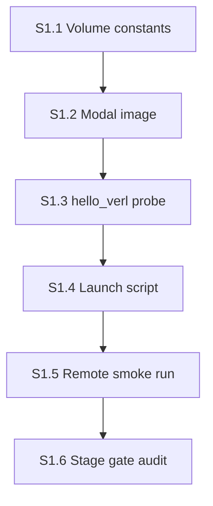

# Stage 1 agent plan — Modal image + maxrl + Ray bring-up

**Stage ID:** `stage-01`  
**Status:** draft (orchestrator-ready skeleton — flesh out before dispatch)  
**Parent runbook:** [`verl_migration_plan.md`](./verl_migration_plan.md) §2 row 1  
**Reference:** [`verl-reference.md`](./verl-reference.md) §6 (B200), §7 (Modal limits)

---

## How to use this doc

Each section below is **self-contained**. An orchestrator should:

1. Dispatch an **executor agent** with the section’s `Executor brief` (+ linked context).
2. When the executor marks done, dispatch an **audit agent** with the same section’s `Audit brief`.
3. Only advance to the next section when audit returns **PASS** (or **PASS WITH NOTES** if notes are non-blocking).
4. Record section outcomes in `main-verl/docs/stage-01-log.md` (create on first run).

**Roles**

| Role | Job |
|------|-----|
| **Orchestrator** | Pick section, enforce DAG order, stop on kill signals, track image rebuild count |
| **Executor** | Implement / run commands; produce artifacts; report logs |
| **Auditor** | Read-only verification against acceptance criteria; no “fix forward” |

**Global constraints (all sections)**

- **Modal profile:** `chicken602` (Nancy) = migration plan §7 **Account A** unless human overrides.
- **GPU:** `B200:1` for Stage 1 smokes.
- **Do not** add training configs, custom objectives, or judge code — Stage 2+.
- **Do not** modify `main/` except reading it as reference.
- **Reuse** HF cache volume + secrets from `main/` (`hf-cache`, `HUGGINGFACE`, `WANDB_API_KEY`).
- **Image rebuild budget:** ≤3 full rebuild cycles for pin churn; on 4th failure → **KILL** per migration plan.
- **Stack:** [tajwarfahim/maxrl](https://github.com/tajwarfahim/maxrl) vendored VeRL — **not** upstream `pip install verl`, **not** `algorithm.adv_estimator=maxrl`.

### Image install model (read before S1.2)

maxRL **ships a copy of VeRL** inside the repo (`verl/`). We do **not** install VeRL from PyPI.

**Image build order (fixed):**

1. `git clone` maxrl → checkout **pinned SHA**
2. Install **our B200 GPU pins** (torch / vLLM / flash-attn / transformers) — from [`main/infra/modal_image.py`](../../main/infra/modal_image.py), **not** maxRL README defaults (torch 2.6, vLLM 0.8.4, cu124)
3. `pip install -e /root/maxrl` — editable install of the **`verl`** package from that clone (registers `import verl`; code stays in the clone)
4. `add_local_dir` for `main-verl/` (our configs/probes — snapshotted at image build)

**When changes take effect:**

| Change | Takes effect |
|--------|----------------|
| torch / vLLM / flash-attn pin | **Image rebuild** (step 2) |
| `pip install -e` / maxrl SHA | **Image rebuild** (steps 1–3) |
| Edit file inside cloned `/root/maxrl/verl/` | **Next run**, same image (editable install) — only if that file is on the worker |
| Edit `main-verl/` locally | **Image rebuild** (step 4 re-snapshots) |

No separate GitHub fork of maxrl required for Stage 1 — clone at image build is enough (matches migration plan §0 **“Fork VeRL first”** = use maxrl’s vendored tree, not upstream PyPI). Fork only if we later commit edits inside their `verl/` tree (Stage 3+).

---

## Stage gate (final)

Stage 1 is **DONE** when all section audits pass and this smoke succeeds on Modal:

```bash
modal run main-verl/probes/hello_verl.py
```

**Smoke success =** (validates image from S1.2 — `pip install -e` is **not** re-run here; it already happened at image build per migration plan §2 row 1)

- Container starts on B200 without import/CUDA errors.
- Ray initializes with `num_gpus=1`.
- `import verl` succeeds (editable install from `/root/maxrl` baked into image).
- Qwen3-1.7B-Base loads and produces **one** decoded rollout string printed to stdout.
- Wall time ≤ ~45 min (mostly image build on first run; subsequent runs ≪).

**Stage kill =** (migration plan §2 row 1: >3 rebuilds; below are operational extensions for Stage 1 dispatch)

- >3 image rebuild cycles without passing smoke.
- Ray cannot see GPU after explicit `num_gpus=1` + Modal `gpu="B200:1"`.
- Image build completed but `import verl` fails with unresolvable dep conflict at smoke time.

---

## Section DAG



| Section | Depends on | Blocks |
|---------|------------|--------|
| S1.1 | — | S1.2 |
| S1.2 | S1.1 | S1.3, S1.5 |
| S1.3 | S1.2 (code can be written in parallel; run needs image) | S1.4, S1.5 |
| S1.4 | S1.3 | S1.5 |
| S1.5 | S1.1–S1.4 | S1.6 |
| S1.6 | S1.5 | Stage 2 |

---

## S1.1 — Volume + secret constants

### Objective

Create shared Modal mount/secret constants for `main-verl/` that align with `main/` so HF weights cache across stacks.

### Executor brief

**Create** `main-verl/infra/modal_volume.py`:

- Re-export or duplicate the same names as [`main/infra/modal_volume.py`](../../main/infra/modal_volume.py):
  - `ARTIFACTS_VOLUME_NAME = "main-artifacts"`
  - `HF_CACHE_VOLUME_NAME = "hf-cache"`
  - `ARTIFACTS_MOUNT = "/vol"`
  - `HF_CACHE_MOUNT = "/root/.cache/huggingface"`
- Add `MAIN_VERL_ROOT = "/root/main-verl"` env constant for remote PYTHONPATH (used in S1.2).

**Do not** call `Volume.from_name` here — only constants (match `main/` pattern).

**Optional:** `main-verl/infra/__init__.py` empty or minimal.

### Audit brief

- [ ] File exists at `main-verl/infra/modal_volume.py`.
- [ ] Volume names **exactly** match `main/infra/modal_volume.py` (shared HF cache).
- [ ] No Modal API calls in this file (constants only).
- [ ] `MAIN_VERL_ROOT` documented in a one-line comment.

### Artifacts

| Path | Action |
|------|--------|
| `main-verl/infra/modal_volume.py` | create |
| `main-verl/infra/__init__.py` | create (optional) |

---

## S1.2 — Modal image (maxrl + B200 pins)

### Objective

Build a Modal image that: clones maxrl at a pinned SHA, installs **B200 GPU pins before** the editable VeRL install, mounts `main-verl/` code, and is deterministic enough to rebuild ≤3 times.

### Executor brief

**Create** `main-verl/infra/modal_image.py`.

**Base pattern:** copy structure from [`main/infra/modal_image.py`](../../main/infra/modal_image.py) for **GPU pins only**; install VeRL from maxrl clone, not from PyPI.

**Required build sequence** (do not reorder):

1. **Base:** `modal.Image.debian_slim(python_version="3.11")`.

2. **System deps:** `.apt_install("git", "build-essential")` at minimum.

3. **Clone maxrl @ pinned SHA** (required — do not float on `main`):
   ```python
   MAXRL_COMMIT = "<sha>"  # document in file header + stage-01-log.md
   .run_commands(
       f"git clone https://github.com/tajwarfahim/maxrl.git /root/maxrl",
       f"cd /root/maxrl && git checkout {MAXRL_COMMIT}",
   )
   ```

4. **Env vars** (minimum):
   ```python
   PYTORCH_CUDA_ALLOC_CONF=expandable_segments:True  <!-- main-verl: OMIT — vLLM CuMemAllocator conflict in VeRL rollout; see stage-02-log S2.5 -->
   PYTHONUNBUFFERED=1
   PYTHONPATH=/root/main-verl
   CS224R_MAIN_VERL_ROOT=/root/main-verl
   VLLM_USE_V1=0
   HF_HOME=/root/.cache/huggingface
   ```

5. **B200 GPU pins** — install **before** `pip install -e` (pins are locked at image build; changing them requires a full rebuild):
   - Source of truth: [`main/infra/modal_image.py`](../../main/infra/modal_image.py) (proven on Modal B200)
   - `vllm==0.9.0` + cu128 torch index
   - `transformers<4.54.0`
   - flash-attn 2.8.3 Blackwell wheel
   - `wandb`, `math-verify`, `ray`, and other runtime deps as needed for smoke
   - **Do not** start from maxRL README pins (torch 2.6 / vLLM 0.8.4 / cu124) unless a deliberate experiment logged in `stage-01-log.md`

6. **Editable VeRL install** — after GPU pins:
   ```python
   .run_commands("cd /root/maxrl && pip install -e .")
   ```
   This registers the **`verl`** package from the clone (`python -m verl.trainer.main_ppo` works). It does **not** replace the torch/vLLM wheels installed in step 5.

7. **Mount local code** (snapshotted at image build — local `main-verl/` edits need rebuild):
   ```python
   .add_local_dir(
       "<repo>/main-verl",
       remote_path="/root/main-verl",
       ignore=["docs", "*.md", "__pycache__", ".pytest_cache", ".DS_Store"],
   )
   ```

8. **Export:** module-level `image` object + `app_name()` helper (mirror `main/`).

**File header must document:** `MAXRL_COMMIT`, final torch/vllm/ray versions used, and any deviation from `main/infra/modal_image.py` pins.

**Flesh-out TODOs for human/orchestrator** (leave `<!-- TODO -->` comments in file):

- Exact maxrl commit SHA to pin (required before first build).
- Ray version pin if smoke fails after GPU stack is stable.

### Audit brief

- [ ] `main-verl/infra/modal_image.py` exists; defines `image`.
- [ ] Build order: clone @ SHA → **B200 pins** → `pip install -e /root/maxrl` → `add_local_dir` (not PyPI `verl`).
- [ ] `MAXRL_COMMIT` documented in file header (not `--depth 1` floating `main`).
- [ ] B200 overlay pins match policy (cu128 vLLM 0.9.0 path unless log documents otherwise).
- [ ] `add_local_dir` mounts `main-verl/` to `/root/main-verl`.
- [ ] B200-relevant env vars present (`VLLM_USE_V1=0`, `HF_HOME`, etc.).
- [ ] No secrets baked into image.
- [ ] Rebuild count noted in `stage-01-log.md` if audit runs after a build attempt.

### Known failure modes

| Symptom | Likely fix |
|---------|------------|
| vLLM/torch version clash on import | Apply B200 overlay pins; rebuild |
| flash-attn missing on Blackwell | Add FA 2.8.3 wheel from `main/infra/modal_image.py` |
| maxrl `setup.py` pulls wrong torch | Ensure torch/vLLM installed in step 5 **before** `pip install -e .` |
| Image build timeout | Split pip layers; use `--no-cache-dir` sparingly |

### Artifacts

| Path | Action |
|------|--------|
| `main-verl/infra/modal_image.py` | create |

---

## S1.3 — `hello_verl.py` smoke probe

### Objective

Modal function that proves Ray + VeRL + vLLM can load Qwen3-1.7B-Base and emit one rollout on B200.

### Executor brief

**Create** `main-verl/probes/hello_verl.py`.

**Pattern:** [`main/infra/hello_modal.py`](../../main/infra/hello_modal.py) for Modal app wiring; **do not** import `main/` trainer code.

**Required structure:**

```python
app = modal.App(app_name())  # from infra.modal_image

@app.function(
    image=image,
    gpu="B200:1",
    timeout=1800,  # first run includes model load
    secrets=[HUGGINGFACE, WANDB_API_KEY],
    volumes={ARTIFACTS_MOUNT: ..., HF_CACHE_MOUNT: ...},
)
def hello_verl() -> None:
    ...
```

**Inside `hello_verl()` — minimum steps:**

1. Print torch/CUDA diagnostics (`torch.cuda.is_available()`, device name, versions).
2. **Ray init:**
   ```python
   import ray
   ray.init(num_gpus=1, ignore_reinit_error=True)
   ```
3. **Import check:**
   ```python
   import verl
   print("verl:", getattr(verl, "__version__", "unknown"))
   ```
4. **Single rollout** — simplest path that works (pick one, document choice in file):
   - **Path A:** vLLM `LLM(model="Qwen/Qwen3-1.7B-Base", enforce_eager=True)` → `generate` one prompt.
   - **Path B:** subprocess `python -m verl.trainer.main_ppo --help` + vLLM load (heavier; defer unless Path A fails).
5. Print decoded output text (first 500 chars is enough).
6. `ray.shutdown()` in finally block.

**Prompt for smoke:** fixed string, no chat template (Base model):
```
Solve: What is 2 + 2? Put your final answer in \\boxed{}.
```

**Create** `main-verl/probes/__init__.py` if missing (empty ok).

### Audit brief

- [ ] File at `main-verl/probes/hello_verl.py`.
- [ ] Uses `gpu="B200:1"` and `enforce_eager=True` if vLLM Path A.
- [ ] Ray init uses explicit `num_gpus=1`.
- [ ] No imports from `main.train` or custom trainer.
- [ ] Has `@app.local_entrypoint()` calling `hello_verl.remote()`.
- [ ] Model ID is `Qwen/Qwen3-1.7B-Base` (not Instruct).
- [ ] Secrets: `HUGGINGFACE` required; W&B optional but wired like `main/`.

### Artifacts

| Path | Action |
|------|--------|
| `main-verl/probes/hello_verl.py` | create |
| `main-verl/probes/__init__.py` | create |

---

## S1.4 — Launch script

### Objective

One documented command for humans and orchestrator to run the smoke locally via Modal CLI.

### Executor brief

**Create** `main-verl/scripts/launch_hello_verl.sh`:

```bash
#!/usr/bin/env bash
set -euo pipefail
export CS224R_APP_NAME="${CS224R_APP_NAME:-cs224r-verl-stage01}"
# Optional: MODAL_PROFILE=chicken602 if not default
modal run main-verl/probes/hello_verl.py "$@"
```

- `chmod +x` the script.
- Script must be runnable from **repo root** (document in header comment).

**Update** [`main-verl/README.md`](../README.md) — add Stage 1 smoke command under a “Bring-up” subsection (3 lines max).

### Audit brief

- [ ] Script exists, executable, `set -euo pipefail`.
- [ ] Default app name set (`cs224r-verl-stage01` or documented alternative).
- [ ] README mentions launch command.
- [ ] No hardcoded API keys.

### Artifacts

| Path | Action |
|------|--------|
| `main-verl/scripts/launch_hello_verl.sh` | create |
| `main-verl/README.md` | patch (minimal) |

---

## S1.5 — Remote smoke execution

### Objective

Run the smoke on Modal B200 and capture logs for audit.

### Executor brief

**Preconditions:** S1.1–S1.4 audits passed.

**Run from repo root:**

```bash
export CS224R_APP_NAME=cs224r-verl-stage01
# export MODAL_PROFILE=chicken602  # if needed
./main-verl/scripts/launch_hello_verl.sh
```

**Capture to** `main-verl/docs/stage-01-log.md`:

- Timestamp (UTC).
- Modal app name + function ID if visible.
- Full stdout/stderr (or path to saved log).
- Image rebuild count this stage.
- Wall time.
- Executor verdict: PASS / FAIL + one-line reason.

**On FAIL:** do not proceed to S1.6. Return to S1.2 with pin fix; increment rebuild counter.

### Audit brief

- [ ] `stage-01-log.md` exists with run record.
- [ ] Log shows B200 GPU detected.
- [ ] Log shows `ray.init` succeeded.
- [ ] Log shows `import verl` succeeded.
- [ ] Log shows non-empty model output text.
- [ ] No unhandled traceback at end of log.
- [ ] Rebuild count ≤ 3 (or stage marked KILL).

### Artifacts

| Path | Action |
|------|--------|
| `main-verl/docs/stage-01-log.md` | create/update |

---

## S1.6 — Stage gate audit (read-only)

### Objective

Confirm Stage 1 meets migration-plan gate and [`STATUS.md`](./STATUS.md) checkbox can flip.

### Auditor brief (no code changes)

Verify **all** of:

1. **Files present:**
   - `main-verl/infra/modal_volume.py`
   - `main-verl/infra/modal_image.py`
   - `main-verl/probes/hello_verl.py`
   - `main-verl/scripts/launch_hello_verl.sh`
   - `main-verl/docs/stage-01-log.md`

2. **S1.5 smoke PASS** criteria met in log.

3. **Scope check:** no new files under `main-verl/train/`, `main-verl/configs/`, `main-verl/judge/` with logic (`.gitkeep` ok).

4. **Cost sanity:** single B200 container, single run (not a training loop).

5. **Handoff notes for Stage 2** recorded in log:
   - Resolved torch/vllm/ray versions that worked.
   - Any pin overrides applied vs fork defaults.
   - Modal app name to reuse for GRPO smokes.

**Output format** (append to `stage-01-log.md`):

```markdown
## S1.6 Stage gate verdict

- **Verdict:** PASS | PASS WITH NOTES | FAIL
- **Auditor:** <agent id or human>
- **Timestamp:** <UTC>
- **Notes:** ...
- **Stage 2 ready:** yes | no
```

### Orchestrator action on PASS

- Update [`STATUS.md`](./STATUS.md) Stage 1 checkbox: ☐ → ☑
- Unlock Stage 2 agent plan dispatch (create `stage-02-agent-plan.md` when ready)

---

## Orchestrator checklist (quick reference)

| Step | Section | Executor | Audit | Stop if |
|------|---------|----------|-------|---------|
| 1 | S1.1 | constants file | file review | volume name mismatch |
| 2 | S1.2 | modal image | pin policy + build | rebuild > 3 |
| 3 | S1.3 | hello_verl.py | code review | imports main trainer |
| 4 | S1.4 | launch script | runnable | — |
| 5 | S1.5 | modal run | log review | smoke fail |
| 6 | S1.6 | — | stage gate | any prior fail |

---

## Open items (human flesh-out)

<!-- Orchestrator: fill before first dispatch -->

- [ ] maxrl commit SHA to pin: _______________ (**required** before first image build)
- [ ] Modal profile confirmed: `chicken602` / other: _______________
- [ ] vLLM path for smoke: Path A (direct vLLM) / Path B (verl trainer): _______________
- [ ] Who approves image rebuild #2 and #3: _______________
- [ ] Stage 2 owner once gate passes: _______________

---

## Related docs

| Doc | Use |
|-----|-----|
| [`verl_migration_plan.md`](./verl_migration_plan.md) | Stage gates, kill criteria, credit allocation (§7 Account A = `chicken602`) |
| [`verl-reference.md`](./verl-reference.md) | B200 knobs, Ray on Modal |
| [`STATUS.md`](./STATUS.md) | Checklist update on pass |
| [`human notes.md`](./human%20notes.md) | Modal accounts, credits |
| [`../../main/infra/modal_image.py`](../../main/infra/modal_image.py) | Proven B200 pin reference |
