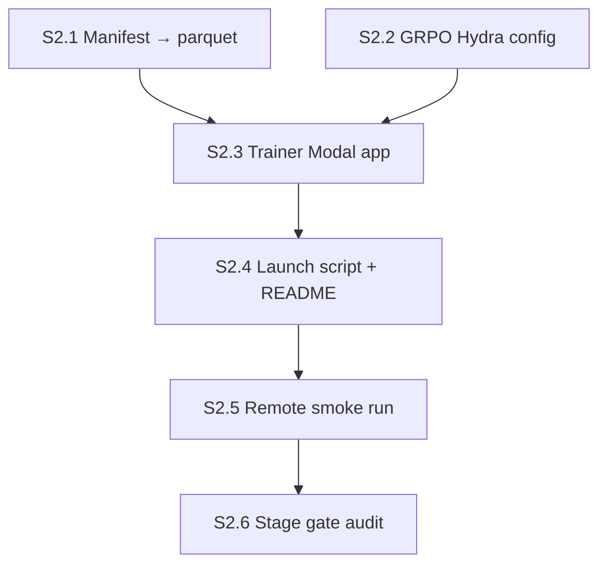

# Stage 2 agent plan — GRPO bring-up smoke (1.7B, MathReward)

**Stage ID:** `stage-02`
**Status:** draft (orchestrator-ready skeleton — flesh out before dispatch)
**Parent runbook:** [`../verl_migration_plan.md`](../verl_migration_plan.md) §2 row 2
**Reference:** [`../verl-reference.md`](../verl-reference.md) §3 (built-ins), §4 (config footguns), §6 (B200 settings), §7 (multi-GPU on Modal), §8 (knob cheat sheet)
**Predecessor:** [`stage-01-agent-plan.md`](./stage-01-agent-plan.md) — Stage 1 PASS WITH NOTES on 2026-05-29; image + `import verl` proven on B200

---

## How to use this doc

Each section below is **self-contained**. An orchestrator should:

1. Dispatch an **executor agent** with the section's `Executor brief` (+ linked context).
2. When the executor marks done, dispatch an **audit agent** with the same section's `Audit brief`.
3. Only advance to the next section when audit returns **PASS** (or **PASS WITH NOTES** if notes are non-blocking).
4. Record section outcomes in `main-verl/docs/build/stage-02-log.md` (create on first run).

**Roles** — same as Stage 1.

| Role | Job |
|------|-----|
| **Orchestrator** | Pick section, enforce DAG order, track image rebuild count + config-fix count |
| **Executor** | Implement / run commands; produce artifacts; report logs |
| **Auditor** | Read-only verification against acceptance criteria; no "fix forward" |

**Global constraints (all sections)**

- **Modal profile:** `chicken602` (Account A) per migration plan §7 — Stage 2 stays on A.
- **GPU:** `B200:4` for the smoke run (single container, single node). Migration plan §7 caps smokes at ≤4× B200; verl-reference §7.1 caps Modal at 8/container.
- **Model:** `Qwen/Qwen3-1.7B-Base` — **Base, not Instruct**. No chat template.
- **Manifest:** Polaris-51K **filtered** — `main/data/polaris_train.jsonl` (51,139 rows; the post-filter set — `polaris_train_labeled.jsonl` at 53,291 rows is pre-filter and is **not** what we use). TA OH 2026-05-28; migration plan §1.
- **Algorithm:** `algorithm.adv_estimator=grpo` — the migration plan baseline arm. **Do not** set `algorithm.adv_estimator=maxrl` (that is the paper's method, not ours; verl-reference §3.2).
- **Reward:** built-in **MathReward** (`verl/utils/reward_score/math.py`, upstream `math_reward.py`) via patched `data_source` routing — see [`reward-decision.md`](../reward-decision.md). **Not** `main/train/reward.py`.
- **Image rebuild budget:** ≤3 full rebuild cycles for pin churn this stage; on 4th failure → **KILL** per migration plan §2.
- **Config-fix budget:** ≤2 config-fix iterations on the 50-step smoke before escalation (migration plan §2 row 2 kill criterion).
- **Stack:** vendored VeRL from [tajwarfahim/maxrl](https://github.com/tajwarfahim/maxrl) — image baked in Stage 1; reuse `MAXRL_COMMIT=7197bbb46a2ecd866da52f6b401ff20a34fe9390` unless Stage 2 needs a bump (then document).
- **Do not** add custom adv estimator code, judge code, or `minority_cot`/`poly_epo_cot` logic — those are Stages 3a / 4 / 5.

### Pre-flight: drop `--no-deps` from the Stage 1 image (read before S2.3)

Stage 1's image used `pip install -e . --no-deps` + a hand-curated dep list (`tensordict`, `hydra-core`, `omegaconf`, `accelerate`, `codetiming`, `peft`, `pyarrow`, `pandas`, `dill`, `packaging`). That set was tuned so `import verl` succeeds — it does **not** guarantee `python -m verl.trainer.main_ppo` succeeds. The trainer entrypoint pulls in significantly more of `verl/` (Hydra resolvers, dataloaders, Ray worker groups, FSDP wrappers, vLLM rollout workers, math reward modules) and is likely to surface missing deps.

**Decision (locked):** **option (a)** — drop `--no-deps`, let `maxrl/setup.py` resolve, then re-pin `torch` / `vllm` / `flash-attn` to the B200 GPU pins **after** the editable install. One extra image rebuild now; less silent drift later.

**Where it lives:** S2.3 includes the `infra/modal_image.py` edit. The plan allows exactly this one edit to a Stage 1 artifact (with rebuild count incremented in `stage-02-log.md`). The post-install re-pin is one extra `.pip_install(...)` layer that restores cu128 torch 2.7, vLLM 0.9.0, FA 2.8.3 in case maxrl's setup.py pulled different wheels.

---

## Stage gate (final)

Stage 2 is **DONE** when all section audits pass and this smoke succeeds on Modal:

```bash
./main-verl/scripts/launch_grpo_smoke.sh
```

**Smoke success =** (50-step GRPO run on Qwen3-1.7B-Base, Polaris-51K filtered, MathReward, ≤4× B200, single Modal container)

- Container starts on `B200:4` with Ray cluster up (`+ray_kwargs.ray_init.num_gpus=4`).
- `verl.trainer.main_ppo` config resolves under Hydra; no missing-key / type errors.
- Parquet loads from artifacts volume; `data_source` routes to MathReward; reward worker initializes.
- vLLM rollout worker starts with `enforce_eager=true`; weight sync to FSDP actor succeeds at least once.
- 50 optimizer steps complete (`trainer.total_training_steps=50`).
- No OOM at the chosen `*_micro_batch_size_per_gpu` ladder.
- W&B (or console) shows non-trivial `critic/score/mean`, `response_length/mean`, and `actor/pg_loss` curves — values, not NaNs / 0s.
- Step time recorded (used as the first VeRL `$/step` prior — migration plan §8).
- Wall time ≤ ~3 B200-hr budget (migration plan §2 row 2).

**Smoke is NOT required to match `main/`'s `grpo_s59`** — different grader, different stack (verl-reference §4.4).

**Stage kill =** (migration plan §2 row 2: cannot complete 50 steps after 2 config fixes — escalate)

- Image build completes but `verl.trainer.main_ppo --help` fails on missing deps after 2 image fixes.
- Manifest preprocessing cannot produce a parquet that verl accepts after 2 schema fixes.
- 50-step run cannot complete after 2 config-fix iterations (OOM ladder, FSDP dtype, etc.).
- Step time so high that 50 steps blows the 3 B200-hr budget by >2× — pause and reassess.

---

## Section DAG



| Section | Depends on | Blocks |
|---------|------------|--------|
| S2.1 | Stage 1 done (HF cache volume exists) | S2.3, S2.5 |
| S2.2 | — (can run in parallel with S2.1) | S2.3 |
| S2.3 | S2.1, S2.2, pre-flight decision | S2.4 |
| S2.4 | S2.3 | S2.5 |
| S2.5 | S2.1–S2.4 | S2.6 |
| S2.6 | S2.5 | Stage 3a |

---

## S2.1 — Manifest → verl parquet

### Objective

Convert the frozen Polaris-51K filtered manifest in `main/data/` to a verl-readable parquet (prompt + ground_truth + data_source), upload to the artifacts volume so any Modal worker can read it, and produce a small held-out val split.

### Executor brief

**Create** `main-verl/data/preprocess_polaris_verl.py`.

**Source:** `main/data/polaris_train.jsonl` (51,139 rows, the post-filter set) — read the path via `main/data/paths.py`. Do **not** re-filter, re-pull from HF, or re-derive `gold` (TA-locked per migration plan §1, §6). Read fields: `problem_id`, `problem`, `gold`, `difficulty_band`.

**Output parquet schema** (verl-reference §3.5; routes to MathReward via patched `data_source` — see [`../reward-decision.md`](../reward-decision.md)):

```python
INSTRUCTION = "\nPlease reason step by step, and put your final answer within \\boxed{}."
{
  "prompt": [
    {"role": "user",
     "content": f"{problem}{INSTRUCTION}"}
  ],
  "data_source": "polaris",              # patched router → math.py (math_reward.py semantics)
  "reward_model": {"ground_truth": gold, "style": "rule"},
  "extra_info": {"problem_id": ..., "difficulty_band": ...},
}
```

**Notes on prompt formatting** (verl-reference §4.3): Qwen3-1.7B-Base is **not** a chat model — verl's default `apply_chat_template` will still wrap with the tokenizer's chat template even for `role=user`. Confirm at S2.1 dev that the resulting prompt string for the Base tokenizer is sensible (no `<|im_start|>` weirdness that the Base model wasn't trained on). If chat template wrapping is wrong, switch to `prompt: <raw text>` and set `data.return_raw_chat=False` in S2.2.

**Why this lines up with MathReward:** raw Polaris problems are **mixed** — some include "put your final answer within `\boxed{}`" in the problem text, most do not. Our wrapper appends the maxrl Polaris suffix unconditionally. `math.py` pulls the last `\boxed{}` from the *model output* and compares with Hendrycks string normalize — mentor-locked stack.

**Splits:**
- `polaris_train.parquet` — full filtered manifest minus val.
- `polaris_val.parquet` — small deterministic split (e.g. 256 rows, fixed seed) for `trainer.test_freq` evals.
- Document the split rule in a one-line file header.

**Upload step:** the parquet must live on the artifacts Modal volume so workers can read it.

- Mount the artifacts volume via a Modal function (`ARTIFACTS_VOLUME_NAME` from `main-verl/infra/modal_volume.py`).
- Target path: `/vol/data/main-verl/polaris_train.parquet`, `/vol/data/main-verl/polaris_val.parquet`.
- A one-shot `python -m main-verl.data.preprocess_polaris_verl --upload` invocation is fine; document the exact command in `stage-02-log.md` so it is reproducible.

**Sanity check** (executor runs locally before upload):

```python
import pandas as pd
df = pd.read_parquet("polaris_train.parquet")
assert "prompt" in df.columns and "reward_model" in df.columns and "data_source" in df.columns
assert df["reward_model"].apply(lambda r: bool(r["ground_truth"])).all()
assert (df["data_source"] == "polaris").all()
```

**Flesh-out TODOs for human/orchestrator** (leave `<!-- TODO -->` in file):

- Confirm 256 is the right val size (smoke-only — used for `trainer.test_freq=25`).
- Router patch must be applied at image build (`infra/patches/maxrl_polaris_math_reward.patch`) — see [`../reward-decision.md`](../reward-decision.md).

### Audit brief

- [ ] File at `main-verl/data/preprocess_polaris_verl.py`.
- [ ] Reads from `main/data/` via `paths.py` (no HF re-pull, no re-filter).
- [ ] Output parquet has columns `prompt`, `data_source`, `reward_model`, `extra_info`.
- [ ] `reward_model.ground_truth` is non-empty for every row.
- [ ] `data_source` is `polaris` (or `math_reward` alias) and router patch documented in [`../reward-decision.md`](../reward-decision.md).
- [ ] Val split is deterministic (fixed seed documented in file).
- [ ] Upload command to artifacts volume documented in `stage-02-log.md`.
- [ ] Row count in log matches input manifest size minus val size.

### Known failure modes

| Symptom | Likely fix |
|---------|------------|
| `apply_chat_template` produces `<|im_start|>` wrap for Base model | Switch prompt to raw string; set `data.return_raw_chat=False` in S2.2 |
| MathReward returns 0 for everything | Prompt/scorer mismatch — confirm patch applied + maxrl prompt suffix; log `has_boxed` on rollouts |
| Parquet rejected by verl loader | Missing `extra_info` or wrong `prompt` structure — check `examples/maxrl_data_preprocess/polaris.py` |
| `NotImplementedError` for `data_source` | Image missing router patch — rebuild with `maxrl_polaris_math_reward.patch` |

### Artifacts

| Path | Action |
|------|--------|
| `main-verl/data/preprocess_polaris_verl.py` | create |
| `/vol/data/main-verl/polaris_train.parquet` | upload (Modal volume) |
| `/vol/data/main-verl/polaris_val.parquet` | upload (Modal volume) |

---

## S2.2 — GRPO Hydra config

### Objective

Hydra config for `verl.trainer.main_ppo` that runs a 50-step GRPO smoke on Qwen3-1.7B-Base + Polaris-51K filtered + MathReward, with B200-correct rollout/FSDP knobs. No custom adv estimator, no custom reward fn.

### Executor brief

**Create** `main-verl/configs/grpo_smoke_1p7b.yaml`.

**Base config:** compose via Hydra `defaults:` from the vendored `verl/trainer/config/ppo_trainer.yaml` inside the maxrl clone — do **not** copy the whole file; only override what we need. Template: `qwen3_experiments/run_qwen3_training.sh` in maxrl (verl-reference §3.1).

**Required overrides** (cheat-sheet sources: verl-reference §6.2, §8.1–§8.5; migration plan §1 Arms row):

```yaml
defaults:
  - ppo_trainer            # from verl/trainer/config/
  - _self_

data:
  train_files: /vol/data/main-verl/polaris_train.parquet
  val_files:   /vol/data/main-verl/polaris_val.parquet
  train_batch_size: 128         # migration plan §1; verl splits across 4 GPUs
  max_prompt_length: 1024
  max_response_length: 4096

actor_rollout_ref:
  model:
    path: Qwen/Qwen3-1.7B-Base   # NOT Instruct
  actor:
    fsdp_config:
      model_dtype: bfloat16      # verl-reference §6.2 — fp32 default breaks FA on B200
    ppo_mini_batch_size: 32
    ppo_epochs: 1                # REINFORCE-with-clip; verl-reference §8.3
    use_kl_loss: false           # GRPO-with-clip baseline; fewer knobs in bring-up — document in stage-02-log.md
    loss_agg_mode: token-mean    # verl-reference §4.3 — document choice
    # micro batch ladder — start safe, tune on first OOM
    ppo_micro_batch_size_per_gpu: 4
  rollout:
    name: vllm
    n: 8                          # locked (migration plan §1)
    enforce_eager: true           # verl-reference §6.2 — required on Blackwell
    gpu_memory_utilization: 0.45  # colocated default; verl-reference §8.2
    tensor_model_parallel_size: 1
  ref:
    fsdp_config:
      model_dtype: bfloat16

algorithm:
  adv_estimator: grpo             # baseline arm — NOT maxrl
  use_kl_in_reward: false         # KL=0 (paired with actor.use_kl_loss=false); GRPO-with-clip baseline
  norm_adv_by_std_in_grpo: true   # verl default; verl-reference §8.3

reward_model:
  enable: false                   # rule-based MathReward via data_source routing
# Do NOT set custom_reward_function.path — built-in scorer is the policy (migration plan §1)

trainer:
  nnodes: 1
  n_gpus_per_node: 4
  total_training_steps: 50        # smoke
  test_freq: 25                   # mid-run eval at step 25 + 50
  save_freq: 50                   # one checkpoint at end
  log_val_generations: 10         # verl-native qualitative inspection (migration plan §5)
  logger: [console, wandb]
  project_name: cs224r-minority-voting   # reuse main/ W&B project for cross-stack comparison
  experiment_name: grpo_smoke_1p7b
  default_local_dir: /vol/checkpoints/main-verl/grpo_smoke_1p7b

# W&B: distinguish verl runs from the main/ custom-trainer history
+trainer.wandb_kwargs:
  entity: 224r-project
  tags: [verl, stage-02, grpo, smoke]   # `verl` tag REQUIRED on every main-verl run

# Explicit GPU count for Modal/Docker (Ray may not auto-detect)
+ray_kwargs:
  ray_init:
    num_gpus: 4
```

**Header comment must document:**

- The KL=0 choice and that it deviates from verl defaults (verl-reference §4.3 footgun). Justify on bring-up grounds (fewer knobs in motion, GRPO-with-clip is well-understood), **not** as `main/` parity — migration plan §0 explicitly rules out `main/` numbers as targets.
- The `loss_agg_mode` choice.
- That `algorithm.adv_estimator=grpo` (not `maxrl`) is intentional.
- Reference to maxrl's `qwen3_experiments/run_qwen3_training.sh` for the override pattern.

**Flesh-out TODOs** (leave `<!-- TODO -->`):

- `ppo_micro_batch_size_per_gpu` — start at 4, tune on first OOM (S2.5 loop).
- W&B `entity` if needed.
- Whether to bump `trainer.test_freq` if val eval is slow on first run.

### Audit brief

- [ ] File at `main-verl/configs/grpo_smoke_1p7b.yaml`.
- [ ] `defaults:` composes from `ppo_trainer` (vendored maxrl config).
- [ ] `algorithm.adv_estimator: grpo` (not `maxrl`, not custom).
- [ ] `reward_model.enable: false` AND no `custom_reward_function.path` (built-in MathReward routes via parquet `data_source`).
- [ ] `actor_rollout_ref.model.path: Qwen/Qwen3-1.7B-Base` (not Instruct).
- [ ] `enforce_eager: true` + `model_dtype: bfloat16` on actor and ref (verl-reference §6.2).
- [ ] `data.train_batch_size: 128`; `actor_rollout_ref.rollout.n: 8`.
- [ ] `trainer.total_training_steps: 50`; `trainer.nnodes: 1`; `trainer.n_gpus_per_node: 4`.
- [ ] `+ray_kwargs.ray_init.num_gpus: 4` present.
- [ ] `trainer.default_local_dir` points under `/vol/` (artifacts volume — persists across containers).
- [ ] KL=0 + `loss_agg_mode` choice documented in the file header.

### Known failure modes

| Symptom | Likely fix |
|---------|------------|
| Hydra `MissingMandatoryValue` on actor/critic config | Override required field or remove critic block (GRPO has no critic) |
| `Qwen3ForCausalLM` not recognized | vLLM < 0.8.5 — already fixed at Stage 1 (we run vLLM 0.9.0) |
| `apply_chat_template` injects Instruct tokens | Set `data.return_raw_chat=False` or switch S2.1 prompt to raw string |
| MathReward = 0 for all rollouts | Prompt/scorer mismatch — confirm router patch + maxrl prompt suffix per [`../reward-decision.md`](../reward-decision.md) |

### Artifacts

| Path | Action |
|------|--------|
| `main-verl/configs/grpo_smoke_1p7b.yaml` | create |

---

## S2.3 — Trainer Modal app

### Objective

Modal function that spins up a `B200:4` container, mounts the artifacts + HF cache volumes, and runs `python -m verl.trainer.main_ppo` against the S2.2 config. Surfaces verl logs to stdout.

### Executor brief

**Create** `main-verl/probes/grpo_smoke.py`.

**Image:** reuse `infra.modal_image.image` from Stage 1, with **one required edit** per the pre-flight decision (option (a), locked):

1. Drop `--no-deps` from the editable install line — change `cd /root/maxrl && pip install -e . --no-deps` to `cd /root/maxrl && pip install -e .`.
2. Remove (or comment out) the hand-curated dep `.pip_install(...)` layer — `maxrl/setup.py` now owns those.
3. **After** the editable install, append a re-pin layer that restores the B200 GPU pins in case `maxrl/setup.py` pulled different wheels:
   ```python
   .pip_install(
       f"vllm=={_VLLM_VERSION}",
       extra_index_url="https://download.pytorch.org/whl/cu128",
   )
   .pip_install("transformers<4.54.0")
   .pip_install(
       "https://github.com/Dao-AILab/flash-attention/releases/download/v2.8.3/"
       "flash_attn-2.8.3+cu12torch2.7cxx11abiFALSE-cp311-cp311-linux_x86_64.whl"
   )
   ```
4. Record the edit + new rebuild count in `stage-02-log.md`. This is the only allowed Stage 2 edit to a Stage 1 artifact.

**Modal function structure:**

```python
import modal
from infra.modal_image import app_name, image
from infra.modal_volume import (
    ARTIFACTS_MOUNT, ARTIFACTS_VOLUME_NAME,
    HF_CACHE_MOUNT, HF_CACHE_VOLUME_NAME,
)

app = modal.App(app_name())  # CS224R_APP_NAME=cs224r-verl-stage02 by default
artifacts_volume = modal.Volume.from_name(ARTIFACTS_VOLUME_NAME, create_if_missing=True)
hf_cache_volume = modal.Volume.from_name(HF_CACHE_VOLUME_NAME, create_if_missing=True)

@app.function(
    image=image,
    gpu="B200:4",
    timeout=3 * 3600,            # 3 B200-hr budget per migration plan §2
    secrets=[
        modal.Secret.from_name("HUGGINGFACE"),
        modal.Secret.from_name("WANDB_API_KEY"),
    ],
    volumes={
        ARTIFACTS_MOUNT: artifacts_volume,
        HF_CACHE_MOUNT: hf_cache_volume,
    },
)
def grpo_smoke() -> None:
    ...
```

**Function body (in order):**

1. Diagnostics: torch / cuda / `torch.cuda.device_count()` (expect 4), `import verl`.
2. **Pre-flight import check:** `from verl.trainer import main_ppo` — fails fast if deps are missing (catches the residual `--no-deps` risk before burning Ray startup time).
3. Launch trainer via subprocess (verl uses Hydra; subprocess is the simplest path):
   ```python
   import subprocess, sys
   subprocess.run(
       [sys.executable, "-m", "verl.trainer.main_ppo",
        "--config-path", "/root/main-verl/configs",
        "--config-name", "grpo_smoke_1p7b"],
       check=True,
   )
   ```
4. After successful return, list `/vol/checkpoints/main-verl/grpo_smoke_1p7b/` to confirm a checkpoint was written.

**`@app.local_entrypoint()`** that calls `grpo_smoke.remote()`.

**Do not:**

- Import or call any code from `main/train/`.
- Add custom reward / advantage logic.
- Loop the trainer (single `subprocess.run`, single 50-step run).

### Audit brief

- [ ] File at `main-verl/probes/grpo_smoke.py`.
- [ ] `gpu="B200:4"`; `timeout=3*3600` (or documented alternative ≤ migration plan §2 budget).
- [ ] Both `ARTIFACTS_MOUNT` and `HF_CACHE_MOUNT` volumes mounted.
- [ ] Secrets: `HUGGINGFACE`, `WANDB_API_KEY` wired.
- [ ] Pre-flight `from verl.trainer import main_ppo` import present (deps fail-fast).
- [ ] Subprocess invokes `python -m verl.trainer.main_ppo` with config-path under `/root/main-verl/configs` and config-name matching S2.2.
- [ ] No imports from `main.train.*`.
- [ ] `@app.local_entrypoint()` calling `grpo_smoke.remote()`.
- [ ] `infra/modal_image.py` edited per pre-flight option (a): `--no-deps` dropped, hand-curated dep layer removed, GPU pins re-applied after `pip install -e .`. Rebuild logged in `stage-02-log.md`.

### Artifacts

| Path | Action |
|------|--------|
| `main-verl/probes/grpo_smoke.py` | create |
| `main-verl/infra/modal_image.py` | edit (pre-flight option (a) — drop `--no-deps`, re-pin GPU wheels) |

---

## S2.4 — Launch script + README patch

### Objective

One documented command to fire the smoke from repo root. Minimal README update.

### Executor brief

**Create** `main-verl/scripts/launch_grpo_smoke.sh`:

```bash
#!/usr/bin/env bash
# Run from repository root (cs224r_finalproject/).
set -euo pipefail
export CS224R_APP_NAME="${CS224R_APP_NAME:-cs224r-verl-stage02}"
# Optional: MODAL_PROFILE=chicken602 if not default
python3 -m modal run main-verl/probes/grpo_smoke.py "$@"
```

- `chmod +x` the script.
- Default app name `cs224r-verl-stage02` so Stage 1 (`stage01`) and Stage 2 logs stay partitioned in the Modal UI.

**Patch** [`main-verl/README.md`](../../README.md) — add one bullet to the **Bring-up** subsection:

> GRPO smoke: `export CS224R_APP_NAME=cs224r-verl-stage02 && ./main-verl/scripts/launch_grpo_smoke.sh`

### Audit brief

- [ ] Script exists, executable, `set -euo pipefail`.
- [ ] Default `CS224R_APP_NAME=cs224r-verl-stage02` (not stage01).
- [ ] README has Stage 2 smoke command under Bring-up.
- [ ] No hardcoded secrets.

### Artifacts

| Path | Action |
|------|--------|
| `main-verl/scripts/launch_grpo_smoke.sh` | create |
| `main-verl/README.md` | patch (minimal) |

---

## S2.5 — Remote smoke execution

### Objective

Run the 50-step GRPO smoke on Modal `B200:4` and capture metrics + a first VeRL `$/step` measurement.

### Executor brief

**Preconditions:** S2.1–S2.4 audits passed; parquet uploaded to `/vol/data/main-verl/`.

**Run from repo root:**

```bash
export CS224R_APP_NAME=cs224r-verl-stage02
# export MODAL_PROFILE=chicken602   # if needed
./main-verl/scripts/launch_grpo_smoke.sh
```

**Capture to** `main-verl/docs/build/stage-02-log.md`:

- Timestamp (UTC).
- Modal app name + function ID + Modal app URL.
- Image rebuild count this stage (carry from Stage 1 if no rebuild needed).
- Config-fix iteration count (start 0).
- Wall time, step time (`steps/sec` from verl log).
- Final step number reached (target 50).
- Final metrics excerpt: `critic/score/mean`, `response_length/mean`, `actor/pg_loss`, `actor/grad_norm`, val metrics from step 25 and 50.
- Verdict: PASS / FAIL + one-line reason.

**On the first failure** (OOM / config / Hydra error):

1. Apply the minimum fix (e.g. drop `ppo_micro_batch_size_per_gpu` from 4 → 2; flip `data_source`).
2. Increment config-fix counter.
3. Re-run. If second attempt also fails → **STOP** per kill criterion (migration plan §2 row 2: "Cannot complete 50 steps after 2 config fixes — escalate").

**Healthy signals to look for** (the verl-native subset of migration plan §5):

- `critic/score/mean` trending up (or at least non-zero variance).
- `response_length/mean` stable — not collapsing to 0, not maxed at `max_response_length`.
- No NaNs in `actor/pg_loss` or `actor/grad_norm`.
- vLLM rollout time visible and bounded (verl-reference §4.2 expects rollout ≈ 70% of step).

**Explicit deferral of the rest of §5:** custom scalars `train/distinct_clusters`, `train/prompts_unlocked`, `train/degenerate_cluster_rollouts` are cluster/judge-dependent and land in Stage 3a (clusters), Stage 4 (judge), Stage 7 (full logging wiring) per migration plan §2 rows 3a/4/7. Stage 2 deliberately ships **only** what verl emits natively; do not add custom logging hooks here.

### Audit brief

- [ ] `stage-02-log.md` exists with run record.
- [ ] Log shows `torch.cuda.device_count() == 4` and `B200`.
- [ ] Log shows `ray.init` succeeded with 4 GPUs.
- [ ] Log shows verl trainer reached step 50 (or documented partial-run reason).
- [ ] No unhandled traceback at end of log.
- [ ] Rebuild count ≤ 3; config-fix count ≤ 2 (or stage marked KILL).
- [ ] At least one checkpoint written under `/vol/checkpoints/main-verl/grpo_smoke_1p7b/`.
- [ ] Step time recorded — used as first VeRL `$/step` prior for migration plan §8.

### Known failure modes

| Symptom | Likely fix | Counts as fix? |
|---------|------------|----------------|
| OOM in FSDP backward | Drop `ppo_micro_batch_size_per_gpu` (4→2→1) | Yes |
| OOM in vLLM rollout | Drop `rollout.gpu_memory_utilization` (0.45→0.35) | Yes |
| MathReward returns 0 everywhere | Flip parquet `data_source` (S2.1 fix) | Yes |
| Hydra `MissingMandatoryValue` | Add missing override; counts as fix | Yes |
| Missing verl dep (deferred from Stage 1 `--no-deps`) | Image rebuild — counts as **rebuild**, not config fix | No (separate budget) |
| Ray cannot see GPUs | Verify `+ray_kwargs.ray_init.num_gpus=4` and Modal `gpu="B200:4"` match | Yes |
| vLLM `Expandable segments are not compatible with memory pool` | Remove `PYTORCH_CUDA_ALLOC_CONF=expandable_segments:True` from `modal_image.py` (main-verl only; `main/` keeps it) | Image env (rebuild) |

### Artifacts

| Path | Action |
|------|--------|
| `main-verl/docs/build/stage-02-log.md` | create/update |

---

## S2.6 — Stage gate audit (read-only)

### Objective

Confirm Stage 2 meets migration-plan gate (§2 row 2) and unlock Stage 3a dispatch.

### Auditor brief (no code changes)

Verify **all** of:

1. **Files present:**
   - `main-verl/data/preprocess_polaris_verl.py`
   - `main-verl/configs/grpo_smoke_1p7b.yaml`
   - `main-verl/probes/grpo_smoke.py`
   - `main-verl/scripts/launch_grpo_smoke.sh`
   - `main-verl/docs/build/stage-02-log.md`
   - `/vol/data/main-verl/polaris_train.parquet`, `polaris_val.parquet` (volume listing in log)

2. **S2.5 smoke PASS** criteria met in log:
   - 50 steps completed.
   - No OOM, no traceback.
   - `critic/score/mean`, `response_length/mean` recorded and sane (non-zero, non-NaN, not at the cap).
   - Step time + total wall time recorded.

3. **Scope check:** no logic added under `main-verl/train/`, `main-verl/judge/` (Stages 3a, 4). No custom `adv_estimator` registered. No `algorithm.adv_estimator=maxrl` anywhere in the config.

4. **Cost sanity:** single Modal container, `B200:4`, single 50-step run (not a multi-epoch training loop). Wall time inside 3 B200-hr budget (or documented overrun).

5. **Handoff notes for Stage 3a** recorded in log (migration plan §3 deep-dive context):
   - Final config knob values that landed (micro batch, `gpu_memory_utilization`, etc.).
   - First VeRL `$/step` measurement (migration plan §8 placeholder → real number).
   - Parquet schema + path that worked.
   - Modal app name for Stage 3a (`cs224r-verl-stage03a` or document reuse decision).
   - Resolved KL / `loss_agg_mode` choices (carry forward to minority_cot).
   - Pre-flight dep decision outcome (option (a) or (b)) and whether trainer surfaced any missing imports.
   - **`@register_adv_est` wiring location** in the resolved maxrl checkout (path to `verl/trainer/ppo/core_algos.py` and the existing `maxrl` estimator's registration call) — Stage 3a uses this as the wiring template for `minority_cot` per migration plan §3 item 2.

**Output format** (append to `stage-02-log.md`):

```markdown
## S2.6 Stage gate verdict

- **Verdict:** PASS | PASS WITH NOTES | FAIL
- **Auditor:** <agent id or human>
- **Timestamp (UTC):** <UTC>
- **Notes:** ...
- **Stage 3a ready:** yes | no
```

### Orchestrator action on PASS

- Update [`../STATUS.md`](../STATUS.md) Stage 2 checkbox: ☐ → ☑.
- **Return to human (Nancy) with the S2.6 verdict + handoff notes — do not auto-dispatch Stage 3a.** Nancy decides when Stage 3a starts.

---

## Orchestrator checklist (quick reference)

| Step | Section | Executor | Audit | Stop if |
|------|---------|----------|-------|---------|
| 1 | S2.1 | preprocess + upload parquet | schema + upload review | parquet schema rejected after 2 tries |
| 2 | S2.2 | Hydra config | knob audit | adv_estimator wrong or custom reward sneaks in |
| 3 | S2.3 | Modal trainer fn | code review | imports from main.train |
| 4 | S2.4 | launch script | runnable | — |
| 5 | S2.5 | modal run | log review | smoke fail after 2 config fixes |
| 6 | S2.6 | — | stage gate | any prior fail |

---

## Open items (resolved 2026-05-29)

- [x] Pre-flight dep decision: **option (a)** — drop `--no-deps`, re-pin GPU wheels after `pip install -e .` (see "Pre-flight" block above and S2.3).
- [x] Manifest source: `main/data/polaris_train.jsonl` (51,139 rows, post-filter).
- [x] `data_source`: `polaris` + router patch → `math.py` (MathReward semantics per [`../reward-decision.md`](../reward-decision.md)).
- [x] W&B: reuse `entity=224r-project`, `project=cs224r-minority-voting` from `main/configs/train_real.yaml`; **all main-verl runs MUST carry the `verl` tag** to distinguish from the legacy custom-trainer history. Stage 2 smoke also adds `stage-02`, `grpo`, `smoke` tags.
- [x] Modal account: A = `chicken602` (migration plan §7).
- [x] Stage 3a handoff: orchestrator returns to Nancy after S2.6; no auto-dispatch.

Remaining flesh-out (in-section TODOs, not open items): val split size, micro-batch ladder starting value — both expected to be tuned during S2.5.

---

## Related docs

| Doc | Use |
|-----|-----|
| [`../reward-decision.md`](../reward-decision.md) | **LOCKED:** MathReward prompt + extract + compare |
| [`../verl_migration_plan.md`](../verl_migration_plan.md) | Stage gates, kill criteria, GPU allocation (§7 Account A), logging requirements (§5) |
| [`../verl-reference.md`](../verl-reference.md) | Built-ins (§3), config footguns (§4), B200 settings (§6), multi-GPU on Modal (§7), knob cheat sheet (§8) |
| [`./stage-01-agent-plan.md`](./stage-01-agent-plan.md) | Image, volume constants, smoke pattern to mirror |
| [`./stage-01-log.md`](./stage-01-log.md) | Stage 1 resolved pin stack, MAXRL_COMMIT, Ray vs vLLM warning |
| [`../STATUS.md`](../STATUS.md) | Checklist update on pass |
| [`../../../main/data/paths.py`](../../../main/data/paths.py) | Frozen filtered Polaris manifest paths |
