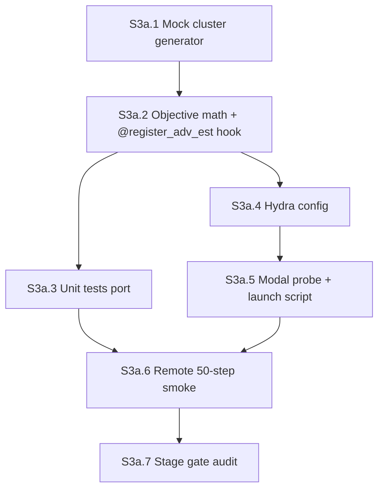

# Stage 3a agent plan — `minority_cot` skeleton with mock cluster IDs

**Stage ID:** `stage-03a`
**Status:** draft (orchestrator-ready skeleton — flesh out before dispatch, after Stage 2 lands)
**Parent runbook:** [`../verl_migration_plan.md`](../verl_migration_plan.md) §2 row 3a + §3 ("Stage 3 deep-dive: `minority_cot`")
**Reference:** [`../verl-reference.md`](../verl-reference.md) §3 (built-ins), §4 (config footguns), §6 (B200 settings), §8 (knob cheat sheet)
**Predecessor:** [`stage-02-agent-plan.md`](./stage-02-agent-plan.md) — Stage 2 GRPO smoke; inherits parquet manifest, image, MathReward router patch, and the `@register_adv_est` wiring location recorded in [`stage-02-log.md`](./stage-02-log.md) S2.6 handoff
**Successor:** Stage 3b (real-judge swap, blocked on Stage 4)

---

## How to use this doc

Each section below is **self-contained**. An orchestrator should:

1. Dispatch an **executor agent** with the section's `Executor brief` (+ linked context).
2. When the executor marks done, dispatch an **audit agent** with the same section's `Audit brief`.
3. Only advance to the next section when audit returns **PASS** (or **PASS WITH NOTES** if notes are non-blocking).
4. Record section outcomes in `main-verl/docs/build/stage-03a-log.md` (create on first run).

**Roles** — same as Stage 1 / Stage 2.

| Role | Job |
|------|-----|
| **Orchestrator** | Pick section, enforce DAG order, track hook iteration count |
| **Executor** | Implement / run commands; produce artifacts; report logs |
| **Auditor** | Read-only verification against acceptance criteria; no "fix forward" |

**Global constraints (all sections)**

- **Modal profile:** `chicken602` (Account A) per migration plan §7 — Stage 3a stays on A; Stage 4 judge bring-up may colocate.
- **GPU:** `B200:4` for the smoke run (single container, single node). Migration plan §7 caps smokes at ≤4× B200; verl-reference §7.1 caps Modal at 8/container.
- **Model:** `Qwen/Qwen3-1.7B-Base` — **Base, not Instruct**. No chat template. Same as Stage 2.
- **Manifest:** Polaris-51K **filtered**, reusing the parquet uploaded in Stage 2 (`/vol/data/main-verl/polaris_train.parquet`, `/vol/data/main-verl/polaris_val.parquet`). **Do not** re-preprocess or re-upload; Stage 3a inherits the schema unchanged.
- **Algorithm:** `algorithm.adv_estimator=minority_cot` — the **new** estimator registered in this stage. **Do not** set `algorithm.adv_estimator=maxrl` (that is the paper's method per migration plan §0 / §10; verl-reference §3.2) and **do not** set `=grpo` (that's Stage 2's baseline).
- **Reward:** built-in **MathReward** via the Stage 2 `data_source=polaris` router patch — unchanged from Stage 2. **Not** `main/train/reward.py`.
- **Hook iteration budget:** **≤2 hook iterations** on the `@register_adv_est` surface before escalation (migration plan §2 row 3a kill criterion: "`adv_estimator` hook cannot register or lacks per-group tensors — redesign hook (see fork's `core_algos.py` examples) or escalate"). One iteration = one patch-and-rebuild attempt that touches `verl/trainer/ppo/core_algos.py` (vendored maxrl).
- **Config-fix budget:** ≤2 config-fix iterations on the 50-step smoke before escalation (same shape as Stage 2's row-2 budget).
- **Image rebuild budget:** ≤2 full rebuild cycles (image already has maxrl + MathReward patch from Stage 2; new rebuilds would only be needed if `core_algos.py` gets a new patch layer).
- **Stack:** vendored VeRL from [tajwarfahim/maxrl](https://github.com/tajwarfahim/maxrl) — reuse `MAXRL_COMMIT=7197bbb46a2ecd866da52f6b401ff20a34fe9390` from Stage 1 / 2. **Do not** bump the SHA in Stage 3a; the migration assumes a single pinned maxrl checkout from bring-up through full retrain.
- **Mock clusters only.** Cluster IDs come from a **deterministic mock** generator (this stage). Real judge wiring is **Stage 3b**, gated on Stage 4 judge service.
- **Forbidden source surfaces:** the executor MUST NOT copy from or port `main/train/trainer.py`, `main/train/reward.py`, `main/train/weight_sync.py`, `main/train/rollout.py`, or `main/train/loss.py`. **Only** `main/train/objective.py` (math reference) and `main/tests/test_objective_minority.py` (fixture reference) may be read. Migration plan §3: "Things to NOT re-implement … use VeRL. If a hook is missing, escalate per §3a kill criterion; do not fall back to porting the custom trainer piecemeal."
- The cluster-ID interface MUST be designed once and reused by `poly_epo_cot` (Stage 5). See §"Mock cluster contract" below.

### Pre-flight: inherit from Stage 2 handoff (read before S3a.1)

Stage 3a starts only after Stage 2 S2.6 records the following in `stage-02-log.md`:

- Final knob values that survived the GRPO smoke (`ppo_micro_batch_size_per_gpu`, `gpu_memory_utilization`, `max_prompt_length`, `data.truncation`, `log_prob_micro_batch_size_per_gpu`, `ray_init.ray_dir`). Stage 3a copies these verbatim into `minority_cot_smoke_1p7b.yaml` — same B200, same model, same parquet → same micro-batch ladder is the right starting point.
- First VeRL `$/step` measurement from the Stage 2 smoke. Stage 3a's 50-step run should land within ~2× of that (mock cluster generation is cheap; the only added compute is the 70-subset marginal-advantage kernel, which runs on the host CPU once per batch).
- **`@register_adv_est` wiring location** in the resolved maxrl checkout — the path to `verl/trainer/ppo/core_algos.py` inside the editable `pip install -e .` tree (likely `/root/maxrl/verl/trainer/ppo/core_algos.py` inside the image), plus the line number / function name of the existing `compute_maxrl_outcome_advantage` registration. This is the template `minority_cot` copies.
- Modal app name for Stage 3a. Default: `cs224r-verl-stage03a` (mirrors `cs224r-verl-stage02`). Document in `stage-03a-log.md` on first run.

If any of these are missing from S2.6, **do not dispatch S3a.1** — return to Nancy / orchestrator with the gap.

---

## Stage gate (final)

Stage 3a is **DONE** when all section audits pass and the following four conditions hold (migration plan §3 "three things must be true after 3a" + §2 row 3a smoke gate):

1. **Correctness against math fixture.** Unit tests in `main-verl/tests/test_objective_minority.py` pass on the ported fixtures from `main/tests/test_objective_minority.py`. The advantage-kernel math (70 size-4 subsets, 35-per-rollout inclusion, `_minority_subset_score` rarest-cluster pick with random tiebreak, marginal-from-fG baseline) produces values bit-identical (atol 1e-6) to `main/train/objective.py` for shared fixtures.
2. **Clean hook.** The `@register_adv_est("minority_cot")` registration applies in ≤2 hook iterations (migration plan §2 row 3a kill criterion). Hydra accepts `algorithm.adv_estimator: minority_cot` with no `MissingMandatoryValue`; the trainer calls our function for advantage computation; no fallback to the reward-fn-returns-advantage pattern was needed (or, if it was, the fallback is documented in `stage-03a-log.md` as the surviving path).
3. **50-step Modal smoke completes** on `B200:4` with `algorithm.adv_estimator: minority_cot`. No OOM, no NaN, no traceback at end of log. `trainer.total_training_steps=50` reached.
4. **Mock clusters produce non-trivial advantage variation.** Two scalars logged per step show the mock path is exercising every code path:
   - `train/mean_advantage` differs from the Stage 2 GRPO baseline at matched step numbers (i.e. the minority-marginal kernel is actually running, not silently returning `r_i − mean(r)`).
   - `train/distinct_clusters` is non-degenerate (median across the smoke window > 1 — i.e. the mock isn't collapsing every prompt to a single cluster, otherwise `keep_mask` would be all-False and the run would be a no-op).

**Stage kill =** (migration plan §2 row 3a)

- `@register_adv_est` cannot register `minority_cot` after 2 patch-and-rebuild attempts (hook iteration budget blown). Escalate to Nancy; consider the reward-fn-returns-advantage fallback explicitly called out in migration plan §3 item 2.
- The verl tensor surface does not expose per-group cluster IDs / per-rollout rewards in a shape the marginal kernel can consume — escalate before piecemeal porting `main/train/trainer.py`.
- 50-step run cannot complete after 2 config-fix iterations.
- `train/mean_advantage` is numerically identical to GRPO across the smoke window (mock cluster path is being short-circuited; correctness condition (4) fails).

---

## Section DAG



| Section | Depends on | Blocks |
|---------|------------|--------|
| S3a.1 | Stage 2 done (S2.6 handoff) | S3a.2 |
| S3a.2 | S3a.1; S2.6 handoff records `core_algos.py` path | S3a.3, S3a.4 |
| S3a.3 | S3a.2 (objective module importable) | S3a.6 |
| S3a.4 | S3a.2 (estimator name registered) | S3a.5 |
| S3a.5 | S3a.4 | S3a.6 |
| S3a.6 | S3a.3, S3a.5 | S3a.7 |
| S3a.7 | S3a.6 | Stage 3b (blocked on Stage 4) |

---

## S3a.1 — Mock cluster generator

### Objective

Implement a deterministic, judge-free cluster-ID source that takes `(problem_id, rollout_idx)` and emits `cluster_id ∈ [0, K)`. The interface — function signature and tensor shapes — is the contract Stage 3b will replace with the real judge HTTP client without touching the objective or the verl hook.

### Executor brief

**Create** `main-verl/train/clusters_mock.py`.

**Public surface** (the only symbols Stage 3a, Stage 3b, and Stage 5 import):

```python
from dataclasses import dataclass

@dataclass(frozen=True)
class ClusterAssignment:
    cluster_ids: "torch.Tensor"   # int64, shape [n_prompts, n_rollouts]
    diagnostics: dict             # keys: distinct_clusters_mean, degenerate_rollouts

def assign_mock_clusters(
    problem_ids: list[int],
    n_rollouts: int,
    n_clusters: int,
    *,
    seed: int,
) -> ClusterAssignment:
    """Deterministic mock cluster IDs for Stage 3a smoke.

    Contract (must match Stage 3b real-judge contract):
      - cluster_ids[p, r] = stable hash of (seed, problem_ids[p], r) % n_clusters.
      - distinct_clusters_mean = mean over p of len(set(cluster_ids[p])).
      - degenerate_rollouts is always 0 in the mock (real judge fills this).
    """
```

**Mock rule** (locked):

```python
import hashlib

def _mock_cluster(seed: int, problem_id: int, rollout_idx: int, K: int) -> int:
    h = hashlib.blake2b(
        f"{seed}|{problem_id}|{rollout_idx}".encode(),
        digest_size=8,
    ).digest()
    return int.from_bytes(h, "big") % K
```

**Why this is a faithful mock for Stage 3b** (justify in the file header):

- **Same shape contract.** `cluster_ids` is `int64 [n_prompts, n_rollouts]` — exactly what the judge will emit (one cluster ID per rollout, grouped by prompt). The marginal-advantage kernel in `objective_minority.py` consumes this shape; it doesn't care where the IDs came from.
- **Same value range.** `cluster_id ∈ [0, K)` with `K` configurable via Hydra (`algorithm.minority_cot.n_clusters`). The judge prompt design in Stage 4 will also emit IDs in a bounded discrete set (TA OH 2026-05-28: free-form vs forced k=2..4 is still open — picking K=4 as the mock default matches the upper end of the forced-k candidate range).
- **Same failure mode is reachable.** When the mock hash happens to map all 8 rollouts of a prompt to the same cluster, `set_based_marginal_advantages` filters that prompt via `keep_mask=False` (math reference: `main/train/objective.py` lines 137–139 — "Collapsed: every subset has one cluster"). This exercises the same `keep_mask` code path the real judge will trigger on the "degenerate cluster" prompts TA called out in migration plan §4.
- **Different**, but **bounded-differently**, in semantics: mock IDs carry no information about CoT content. That means the advantage signal is noise — fine for the bring-up gate, which is **not** asking "does minority voting help training"; it's asking "does the hook plumb tensors through end-to-end without errors and produce non-trivial advantages." That separation is the whole point of the mock-clusters trick (migration plan §3 first paragraph).

**Notes:**

- `seed` should default to `0` and be overridable via Hydra. Reproducibility across runs is required for the unit tests (test_tiebreak_reproducible_same_seed analog).
- `assign_mock_clusters` is pure Python + hashlib — no torch ops on GPU. The verl hook will call it on the host once per batch with `~128 prompts × 8 rollouts = 1,024` IDs. Cost is negligible compared to rollout.
- Do **not** import anything from `main.train.*` here. The judge-call interface prompt design (the future Stage 3b body of this file) may reference `main/probes/group_a_rollout_judge.py` per migration plan §3 item 1 — but that's deferred to Stage 3b.

**Flesh-out TODOs for human/orchestrator** (leave `<!-- TODO -->` in file):

- Confirm `n_clusters=4` is the right Stage 3a default (matches expected upper end of Stage 4 forced-k range).
- Add a `pytest.mark.parametrize` smoke test for the hash function (separate from the objective fixtures — lives in S3a.3 if cheap).

### Audit brief

- [ ] File at `main-verl/train/clusters_mock.py`.
- [ ] Public surface is `ClusterAssignment` + `assign_mock_clusters(problem_ids, n_rollouts, n_clusters, *, seed)` — no other top-level exports that the verl hook reaches into.
- [ ] Mock uses `hashlib.blake2b` (or another stable hash with documented digest size) — **not** Python's built-in `hash()` (which is process-salted and breaks reproducibility across Modal containers).
- [ ] `cluster_ids` is `torch.int64` shape `[n_prompts, n_rollouts]`.
- [ ] Diagnostics dict includes `distinct_clusters_mean` and `degenerate_rollouts` (mock-side value is 0).
- [ ] No imports from `main.train.*`. No imports from `main.probes.*` (Stage 3b scope).
- [ ] File header documents the Stage 3b → judge swap contract (which fields stay, which get replaced).

### Known failure modes

| Symptom | Likely fix |
|---------|------------|
| Different cluster IDs across two Modal container starts at the same `seed` | Replaced `hashlib` with Python `hash()` — switch back to stable digest |
| All prompts collapse to one cluster | `n_clusters` too small for `n_rollouts=8` — bump to 4 or 8 |
| `torch.int64` vs verl's `index` (often `np.ndarray`) shape mismatch in S3a.2 | Convert in the verl adapter, not here — keep this file framework-agnostic |

### Artifacts

| Path | Action |
|------|--------|
| `main-verl/train/clusters_mock.py` | create |

---

## S3a.2 — Objective math + `@register_adv_est` hook

### Objective

Port the minority-CoT advantage math from `main/train/objective.py` into `main-verl/train/objective_minority.py`, then register it under the verl `@register_adv_est` decorator inside the vendored maxrl `verl/trainer/ppo/core_algos.py`. **Math reference only** — no trainer / reward / weight-sync code from `main/`.

### Executor brief

**Create** `main-verl/train/objective_minority.py`. Port these functions from `main/train/objective.py` **verbatim** (math identity is the unit-test gate; do not "improve" the algorithm):

- `N_ROLLOUTS = 8`, `SUBSET_SIZE = 4`, `_SIZE4_SUBSETS`, `_SUBSET_ARR`, `_INCL` (module-level constants).
- `_marginal_from_fG(fG)` — baseline-subtracted marginals (`main/train/objective.py:62-66`).
- `_minority_subset_score(rewards4, clusters4, rng)` — rarest-cluster mean reward, random tiebreak (`main/train/objective.py:69-80`).
- `set_based_marginal_advantages(rewards, clusters, subset_score_fn, *, needs_rng, global_seed, problem_ids)` — the per-prompt loop (`main/train/objective.py:88-173`).
- `_minority_advantages(rewards, clusters, *, global_seed, problem_ids)` — thin wrapper that calls `set_based_marginal_advantages` with `_minority_subset_score` and `needs_rng=True` (`main/train/objective.py:176-190`).
- `AdvantageOut` dataclass (`main/train/objective.py:38-42`).

**Do not** port `_grpo_advantages` (verl owns GRPO); do not port `_poly_epo_subset_score` or `_poly_epo_answer_advantages` (Stage 5 scope).

**Do not** port `compute_advantages` — that's the `main/`-side dispatcher; the verl-side dispatcher is the `@register_adv_est` registry.

**Then patch** `verl/trainer/ppo/core_algos.py` inside the vendored maxrl tree to register the new estimator. The S2.6 handoff records the exact file path inside the editable install. Patch layer lives in `main-verl/infra/patches/maxrl_minority_cot_adv_est.patch` and is applied at image build (same pattern as the Stage 2 `maxrl_polaris_math_reward.patch` — see `infra/modal_image.py`).

### `@register_adv_est` wiring template

The maxrl fork's `verl/trainer/ppo/core_algos.py` exposes the estimator registry — verified by WebFetch of [the file at the pinned SHA](https://raw.githubusercontent.com/tajwarfahim/maxrl/7197bbb46a2ecd866da52f6b401ff20a34fe9390/verl/trainer/ppo/core_algos.py). The relevant decorator and the existing `maxrl` estimator registration look like this (copy verbatim into the patch header for traceability):

```python
ADV_ESTIMATOR_REGISTRY = {}

def register_adv_est(name_or_enum):
    """Decorator to register a advantage estimator function with a given name."""
    def decorator(fn):
        name = name_or_enum.value if isinstance(name_or_enum, Enum) else name_or_enum
        if name in ADV_ESTIMATOR_REGISTRY and ADV_ESTIMATOR_REGISTRY[name] != fn:
            raise ValueError(
                f"Adv estimator {name} has already been registered: "
                f"{ADV_ESTIMATOR_REGISTRY[name]} vs {fn}"
            )
        ADV_ESTIMATOR_REGISTRY[name] = fn
        return fn
    return decorator


class AdvantageEstimator(str, Enum):
    GAE = "gae"
    GRPO = "grpo"
    ...
    MAXRL = "maxrl"
    ...


# Existing estimator we mirror — wiring reference only, NOT the algorithm:
@register_adv_est(AdvantageEstimator.MAXRL)
def compute_maxrl_outcome_advantage(
    token_level_rewards: torch.Tensor,
    response_mask: torch.Tensor,
    index: np.ndarray,
    epsilon: float = 1e-6,
    norm_adv_by_std_in_grpo: str = True,
):
    ...
```

`minority_cot` mirrors this exact shape. The patch:

1. Adds `MINORITY_COT = "minority_cot"` to the `AdvantageEstimator` enum (so Hydra accepts the string).
2. Adds a new function `compute_minority_cot_outcome_advantage(...)` decorated with `@register_adv_est(AdvantageEstimator.MINORITY_COT)` that takes the **same** signature as `compute_maxrl_outcome_advantage` (`token_level_rewards`, `response_mask`, `index`, `epsilon`, `norm_adv_by_std_in_grpo`) **plus** the new mock-cluster knobs threaded through `**kwargs` / `config`:
   - `n_clusters: int` (Hydra key `algorithm.minority_cot.n_clusters`)
   - `seed: int` (Hydra key `algorithm.minority_cot.seed`)
   - `global_seed: int` (the trainer's global RNG seed, reused for tiebreak — see `main/train/objective.py:142`)
3. Inside the function body: builds `problem_ids` from verl's `index` tensor (verl groups rollouts by `index[i] == prompt_uid`; convert to a `list[int]`); reshapes `token_level_rewards · response_mask` to a per-rollout scalar reward (sum over response tokens of `token_level_rewards`, then group by `index` into shape `[n_prompts, n_rollouts]`); calls `assign_mock_clusters(problem_ids, n_rollouts, n_clusters, seed=seed)`; calls `_minority_advantages(rewards, clusters, global_seed=global_seed, problem_ids=problem_ids)`; broadcasts the resulting `[n_prompts, n_rollouts]` advantages back to `[batch, response_length]` shape (every response token gets the same per-rollout advantage value — matches verl's GRPO / MaxRL output convention seen in the fork's other estimators).
4. The function returns `(advantages, returns)` matching the existing estimators' tuple shape (most fork estimators return `(advantages, returns)`; `returns` for outcome-advantage estimators is conventionally the same tensor as `advantages` broadcast to the token grid — verify against the `compute_maxrl_outcome_advantage` body before committing).

**Adapter helpers** (write inside `main-verl/train/objective_minority.py`, not the patch, so the patch stays small and review-friendly):

```python
def _group_rewards_by_index(
    token_level_rewards: torch.Tensor,   # [batch, response_length]
    response_mask: torch.Tensor,          # [batch, response_length]
    index: "np.ndarray",                  # [batch] of prompt uids
    n_rollouts: int,
) -> tuple[torch.Tensor, list[int]]:
    """Returns (rewards [n_prompts, n_rollouts], problem_ids [n_prompts])."""

def _scatter_advantages_to_tokens(
    per_rollout_adv: torch.Tensor,        # [n_prompts, n_rollouts]
    index: "np.ndarray",                  # [batch]
    response_mask: torch.Tensor,          # [batch, response_length]
) -> torch.Tensor:                        # [batch, response_length]
    """Broadcasts per-rollout scalar advantage to every response token."""
```

These adapters are the **only** verl-tensor-to-set-RL-math glue — keep them isolated so Stage 5 (`poly_epo_cot`) imports them unchanged.

**Hook iteration counting (orchestrator):**

- Iteration 1 = first patch + first image rebuild + first end-to-end import test (`python -c "from verl.trainer.ppo.core_algos import ADV_ESTIMATOR_REGISTRY; assert 'minority_cot' in ADV_ESTIMATOR_REGISTRY"` inside the Modal container).
- Iteration 2 = patch revision + second image rebuild.
- Iteration 3 = **KILL** per migration plan §2 row 3a; escalate to Nancy and consider the reward-fn-returns-advantage fallback (migration plan §3 item 2).

**Forbidden:**

- Importing or porting from `main/train/trainer.py`, `main/train/reward.py`, `main/train/weight_sync.py`, `main/train/rollout.py`, `main/train/loss.py`.
- Importing `compute_advantages` from `main.train.objective` (use the ported `_minority_advantages` directly inside the verl hook).
- Re-implementing `_grpo_advantages` — verl already has it under `@register_adv_est(AdvantageEstimator.GRPO)`.

### Audit brief

- [ ] File at `main-verl/train/objective_minority.py`.
- [ ] Patch at `main-verl/infra/patches/maxrl_minority_cot_adv_est.patch`.
- [ ] `infra/modal_image.py` applies the new patch at image build (mirror the `maxrl_polaris_math_reward.patch` apply step from Stage 2).
- [ ] Ported math functions are byte-equivalent to `main/train/objective.py` for: `_SIZE4_SUBSETS`, `_INCL`, `_marginal_from_fG`, `_minority_subset_score`, `set_based_marginal_advantages`, `_minority_advantages`, `AdvantageOut`. (Diff-check against the source file; comments may differ, code must match.)
- [ ] `AdvantageEstimator.MINORITY_COT = "minority_cot"` added to the enum in the patched `core_algos.py`.
- [ ] `compute_minority_cot_outcome_advantage` registered via `@register_adv_est(AdvantageEstimator.MINORITY_COT)`.
- [ ] Function signature matches the `compute_maxrl_outcome_advantage` shape (`token_level_rewards`, `response_mask`, `index`, …) with the new `**kwargs` for mock-cluster knobs.
- [ ] Function returns the same `(advantages, returns)` tuple shape as the existing fork estimators (verify by reading `compute_maxrl_outcome_advantage` body in the resolved image).
- [ ] No imports of `main.train.{trainer,reward,weight_sync,rollout,loss}` anywhere under `main-verl/train/`.
- [ ] No `algorithm.adv_estimator=maxrl` anywhere in code or config.
- [ ] Hook iteration count recorded in `stage-03a-log.md` (≤2; KILL if 3 reached).

### Known failure modes

| Symptom | Likely fix | Counts as |
|---------|------------|-----------|
| `KeyError: 'minority_cot'` from `ADV_ESTIMATOR_REGISTRY` | Patch failed to apply at build — re-check `apply` order in `modal_image.py` | Hook iteration |
| `ValueError: Adv estimator minority_cot has already been registered` | Import-time double registration — verify patch only inserts one `@register_adv_est` block | Hook iteration |
| `index` from verl is `torch.Tensor` not `np.ndarray` on some maxrl versions | Add `.cpu().numpy()` conversion in `_group_rewards_by_index` | Config fix |
| `_minority_advantages` raises `ValueError: n_rollouts=...` | Verl's batch shape != 8 per prompt — confirm `actor_rollout_ref.rollout.n=8` in the Hydra config | Config fix |
| `advantages` returned as `[n_prompts, n_rollouts]` but verl expects `[batch, response_length]` | Add `_scatter_advantages_to_tokens` to the hook output path | Hook iteration |
| Hydra `MissingMandatoryValue: algorithm.minority_cot` | Add `minority_cot:` block to S3a.4 config with `n_clusters`, `seed` defaults | Config fix |

### Artifacts

| Path | Action |
|------|--------|
| `main-verl/train/objective_minority.py` | create |
| `main-verl/infra/patches/maxrl_minority_cot_adv_est.patch` | create |
| `main-verl/infra/modal_image.py` | edit (apply new patch at build) |

---

## S3a.3 — Unit tests (math fixture port)

### Objective

Port the algorithm-only fixtures from `main/tests/test_objective_minority.py` to `main-verl/tests/test_objective_minority.py` so that a `pytest` run against the new `main-verl/train/objective_minority.py` reproduces the correctness gate **without** any verl runtime — pure math identity.

### Executor brief

**Create** `main-verl/tests/test_objective_minority.py`. Port these tests verbatim (renaming the import to point at the new module):

- `test_collapsed_cluster_filtered` — `keep_mask=False` and zero advantages when all 8 rollouts share one cluster (`main/tests/test_objective_minority.py:32-45`).
- `test_minority_seven_one_split_signs` — 7-vs-1 cluster split → positive marginal for the lone minority rollout, negative for the other 7, sum ≈ 0 (lines 48-70).
- `test_minority_marginals_match_reference` — kernel output equals an independent numpy reference computed via `_minority_subset_score` over all 70 subsets (lines 73-92).
- `test_tiebreak_reproducible_same_seed` — same `(global_seed, problem_id)` → identical advantages across calls (lines 115-128).
- `test_minority_arm_requires_clusters_and_seed` — required-arg error paths (lines 131-140).
- `test_subset_constants` — `N_ROLLOUTS == 8`, `SUBSET_SIZE == 4` (lines 153-155).

**Rename the arm string in the test calls.** The original tests call `compute_advantages("minority_answer", ...)` because `main/`'s objective uses `minority_answer` and `minority_cot` interchangeably at the math level (`main/train/objective.py:218-230` — both arms share the same `_minority_advantages` body). In the verl-side port, expose a thin `compute_advantages` shim at the top of `main-verl/train/objective_minority.py` that accepts `"minority_cot"` (and only `"minority_cot"` — `minority_answer` is out of scope per migration plan §1) and dispatches to `_minority_advantages`. The test calls become `compute_advantages("minority_cot", rewards, clusters, ...)`.

**Add one new test specific to the mock cluster generator** (S3a.1 surface):

```python
def test_mock_cluster_reproducibility():
    """assign_mock_clusters(seed, problem_ids, n_rollouts, n_clusters) is
    deterministic across calls with the same seed."""
    from train.clusters_mock import assign_mock_clusters
    a = assign_mock_clusters([0, 1, 2], n_rollouts=8, n_clusters=4, seed=42)
    b = assign_mock_clusters([0, 1, 2], n_rollouts=8, n_clusters=4, seed=42)
    assert torch.equal(a.cluster_ids, b.cluster_ids)
    # Different seed should produce different IDs (with high probability).
    c = assign_mock_clusters([0, 1, 2], n_rollouts=8, n_clusters=4, seed=43)
    assert not torch.equal(a.cluster_ids, c.cluster_ids)
```

**Add one bridge test that ties the mock → objective → marginal advantage path together** (catches integration bugs S3a.2's adapters might hide):

```python
def test_mock_clusters_drive_minority_advantages_end_to_end():
    """8 rollouts × 4 mock clusters → keep_mask should be True for at least
    one prompt in a small batch, and sum-of-advantages ≈ 0 per prompt."""
    from train.clusters_mock import assign_mock_clusters
    from train.objective_minority import _minority_advantages
    pids = list(range(16))
    rewards = torch.rand((16, 8))
    asg = assign_mock_clusters(pids, n_rollouts=8, n_clusters=4, seed=0)
    out = _minority_advantages(rewards, asg.cluster_ids, global_seed=0, problem_ids=pids)
    assert out.keep_mask.any().item()
    kept_adv = out.advantages[out.keep_mask]
    assert torch.allclose(kept_adv.sum(dim=1), torch.zeros(kept_adv.shape[0]), atol=1e-5)
```

**Tests intentionally NOT ported:**

- `test_poly_epo_subset_score_hand`, `test_poly_epo_advantages_zero_sum_and_diversity_signal` — Stage 5 (`poly_epo_cot`) scope. Listed in Stage 5's plan, not here.
- `test_grpo_unchanged` — verl owns GRPO; we don't ship a custom GRPO path, so there's nothing to test on the main-verl side.

**Run locally before declaring DONE:**

```bash
cd main-verl
PYTHONPATH=main-verl python3 -m pytest tests/test_objective_minority.py -v
```

All tests must pass on the local Mac (no GPU required — pure CPU math). If any fail, the port is wrong; fix `main-verl/train/objective_minority.py` before continuing to S3a.4.

### Audit brief

- [ ] File at `main-verl/tests/test_objective_minority.py`.
- [ ] All 6 fixtures from `main/tests/test_objective_minority.py` (minus the 2 poly-epo + 1 GRPO tests) are ported.
- [ ] Test arm string is `"minority_cot"`, not `"minority_answer"`.
- [ ] The shim `compute_advantages` in `main-verl/train/objective_minority.py` does NOT accept `"minority_answer"` (out of scope per migration plan §1) or `"poly_epo_*"` (Stage 5 scope).
- [ ] New mock-cluster reproducibility test present (`test_mock_cluster_reproducibility`).
- [ ] New bridge test present (`test_mock_clusters_drive_minority_advantages_end_to_end`).
- [ ] `pytest` output recorded in `stage-03a-log.md` — all green.
- [ ] No imports from `main.train.*` in the test file.

### Known failure modes

| Symptom | Likely fix |
|---------|------------|
| `test_minority_marginals_match_reference` fails by small numeric delta | Mismatch in `np.random.default_rng` seed handling — confirm `global_seed + problem_id` formula matches `main/train/objective.py:142` |
| `test_minority_seven_one_split_signs` fails — adv[0] negative | `_minority_subset_score` rarest-cluster pick logic regressed — diff against `main/train/objective.py:69-80` |
| `test_collapsed_cluster_filtered` fails — `keep_mask=True` | `set_based_marginal_advantages` early-exit (`len(set(c.tolist())) <= 1`) regressed — diff against `main/train/objective.py:137-139` |
| `ImportError: train.clusters_mock` | `PYTHONPATH` doesn't include `main-verl/` — document in test invocation |

### Artifacts

| Path | Action |
|------|--------|
| `main-verl/tests/test_objective_minority.py` | create |
| `main-verl/docs/build/stage-03a-log.md` | append pytest output |

---

## S3a.4 — Hydra config

### Objective

Stage 3a smoke config: same B200 / model / parquet / reward stack as Stage 2's `grpo_smoke_1p7b.yaml`, with the **only** delta being the advantage estimator switch (`grpo → minority_cot`) and a new `algorithm.minority_cot` block carrying mock-cluster knobs.

### Executor brief

**Create** `main-verl/configs/minority_cot_smoke_1p7b.yaml` by **copying** `main-verl/configs/grpo_smoke_1p7b.yaml` verbatim, then applying the following delta. Carry over Stage 2's final knob values from the S2.6 handoff (micro-batch ladder, truncation, ray_dir) — do **not** re-tune.

**Required overrides vs the Stage 2 GRPO config:**

```yaml
algorithm:
  adv_estimator: minority_cot     # was: grpo. NOT maxrl (paper method, out of scope).
  use_kl_in_reward: false          # carry forward from Stage 2
  norm_adv_by_std_in_grpo: true    # carry forward (only consumed by GRPO path; harmless for minority_cot)
  minority_cot:                    # new sub-block read by compute_minority_cot_outcome_advantage
    n_clusters: 4                  # mock cluster count; matches Stage 4 forced-k candidate range upper end
    seed: 0                        # mock hash seed; reproducibility gate for tests
    global_seed: 0                 # rng seed for rarest-cluster tiebreak (see objective.py:142)

trainer:
  experiment_name: minority_cot_smoke_1p7b   # was: grpo_smoke_1p7b
  default_local_dir: /vol/checkpoints/main-verl/minority_cot_smoke_1p7b

+trainer.wandb_kwargs:
  entity: 224r-project
  tags: [verl, stage-03a, minority_cot, smoke, mock_clusters]   # verl tag REQUIRED
```

**Header comment must document:**

- That `adv_estimator: minority_cot` invokes the patched `core_algos.py` registration from S3a.2.
- That `algorithm.minority_cot.n_clusters / seed / global_seed` are **mock-only** knobs — Stage 3b will replace them with a `judge:` block.
- That this is **not** `adv_estimator: maxrl` (still out of scope per migration plan §10).
- That Stage 2 KL=0 + `loss_agg_mode: token-mean` choices carry forward unchanged — only the advantage estimator differs.
- That the parquet path is reused from Stage 2 (no re-upload).
- W&B tag rule: `verl` + `stage-03a` + `minority_cot` + `smoke` + `mock_clusters`. The `mock_clusters` tag is critical — Stage 3b runs (real judge) will use `real_judge` instead, so W&B filters can distinguish them post-hoc.

**Flesh-out TODOs** (leave `<!-- TODO -->`):

- `algorithm.minority_cot.n_clusters` — confirm 4 is the right default once we see `train/distinct_clusters` distribution at step 25.
- `algorithm.minority_cot.global_seed` — bump if we want to spot-check tiebreak sensitivity in a follow-up run.

### Audit brief

- [ ] File at `main-verl/configs/minority_cot_smoke_1p7b.yaml`.
- [ ] `algorithm.adv_estimator: minority_cot` (not `grpo`, not `maxrl`, not custom anywhere else).
- [ ] `algorithm.minority_cot` block present with `n_clusters`, `seed`, `global_seed`.
- [ ] `reward_model.enable: false` AND no `custom_reward_function.path` (MathReward router unchanged from Stage 2).
- [ ] `actor_rollout_ref.model.path: Qwen/Qwen3-1.7B-Base`.
- [ ] `actor_rollout_ref.rollout.n: 8` (math kernel requires N_ROLLOUTS=8).
- [ ] `data.train_files` / `data.val_files` point at Stage 2's uploaded parquet paths (`/vol/data/main-verl/polaris_*.parquet`) — **not** a new file.
- [ ] `trainer.total_training_steps: 50`; `trainer.nnodes: 1`; `trainer.n_gpus_per_node: 4`.
- [ ] Micro-batch / `gpu_memory_utilization` / `max_prompt_length` / `data.truncation` values carried over from Stage 2 final config.
- [ ] `enforce_eager: true` + `model_dtype: bfloat16` on actor and ref.
- [ ] W&B tags include `verl`, `stage-03a`, `minority_cot`, `mock_clusters`.
- [ ] Header comment documents the mock-only nature of the `minority_cot` knobs.

### Known failure modes

| Symptom | Likely fix |
|---------|------------|
| Hydra `MissingMandatoryValue: algorithm.minority_cot.n_clusters` | Block missing or mis-indented in yaml |
| `KeyError: 'minority_cot'` in `ADV_ESTIMATOR_REGISTRY` at trainer start | S3a.2 patch not applied in image — verify image rebuild count incremented |
| Trainer launches but `train/mean_advantage` matches GRPO bit-for-bit | The hook is being short-circuited; mock-cluster path not being exercised — check that `algorithm.minority_cot` block actually reaches the registered function via `config=...` kwarg |

### Artifacts

| Path | Action |
|------|--------|
| `main-verl/configs/minority_cot_smoke_1p7b.yaml` | create |

---

## S3a.5 — Modal probe + launch script

### Objective

Modal function + shell launcher that fires the 50-step `minority_cot` smoke on `B200:4`. Reuses the Stage 2 image (with the S3a.2 patch layer added), volumes, and secrets. One command from repo root.

### Executor brief

**Create** `main-verl/probes/minority_cot_smoke.py` by **copying** `main-verl/probes/grpo_smoke.py` and changing only:

- The function name: `grpo_smoke` → `minority_cot_smoke`.
- The config-name in the trainer subprocess: `grpo_smoke_1p7b` → `minority_cot_smoke_1p7b`.
- The default Modal app name reference: ensure `CS224R_APP_NAME` defaults to `cs224r-verl-stage03a` (overridable). Do this at the launch-script level, not in the probe.
- Add a **pre-flight registry check** right after the existing `from verl.trainer import main_ppo` import:

  ```python
  from verl.trainer.ppo.core_algos import ADV_ESTIMATOR_REGISTRY
  assert "minority_cot" in ADV_ESTIMATOR_REGISTRY, (
      "minority_cot estimator not registered — patch did not apply at image build. "
      "Check infra/patches/maxrl_minority_cot_adv_est.patch and modal_image.py."
  )
  ```

  This fails fast inside the Modal container before Ray spins up, saving ~3 min per failed iteration.

- Keep everything else identical: same volumes (`ARTIFACTS_MOUNT`, `HF_CACHE_MOUNT`), same secrets (`HUGGINGFACE`, `WANDB_API_KEY`), same `gpu="B200:4"`, same `timeout=3*3600` (Stage 3a budget is 2 B200-hr per migration plan §2, but the per-container timeout matches Stage 2's headroom; the orchestrator stops the run earlier if step-time blows the budget — see S3a.6).

**Create** `main-verl/scripts/launch_minority_cot_smoke.sh` by copying `main-verl/scripts/launch_grpo_smoke.sh` and changing only:

```bash
#!/usr/bin/env bash
# Run from repository root (cs224r_finalproject/).
set -euo pipefail
export CS224R_APP_NAME="${CS224R_APP_NAME:-cs224r-verl-stage03a}"
python3 -m modal run main-verl/probes/minority_cot_smoke.py "$@"
```

- `chmod +x` the script.
- Default app name `cs224r-verl-stage03a` so Stage 2 and Stage 3a logs stay partitioned in the Modal UI.

**Patch** [`main-verl/README.md`](../../README.md) — add one bullet to the **Bring-up** subsection under the Stage 2 line:

> minority_cot smoke (Stage 3a, mock clusters): `export CS224R_APP_NAME=cs224r-verl-stage03a && ./main-verl/scripts/launch_minority_cot_smoke.sh`

**Do not:**

- Import or call any code from `main/train/`.
- Add judge-client code (Stage 3b).
- Loop the trainer (single `subprocess.run`, single 50-step run).
- Add a new image — Stage 3a reuses the Stage 2 image with the S3a.2 patch layer appended.

### Audit brief

- [ ] File at `main-verl/probes/minority_cot_smoke.py`.
- [ ] File at `main-verl/scripts/launch_minority_cot_smoke.sh`, executable, `set -euo pipefail`.
- [ ] Pre-flight registry assertion (`"minority_cot" in ADV_ESTIMATOR_REGISTRY`) present in the probe.
- [ ] Subprocess invokes `python -m verl.trainer.main_ppo` with `--config-name minority_cot_smoke_1p7b`.
- [ ] Default `CS224R_APP_NAME=cs224r-verl-stage03a` (not stage02, not stage01).
- [ ] Volumes + secrets match Stage 2 (`ARTIFACTS_MOUNT`, `HF_CACHE_MOUNT`, `HUGGINGFACE`, `WANDB_API_KEY`).
- [ ] No imports from `main.train.*`.
- [ ] No judge / HTTP client code.
- [ ] README bullet added under Bring-up.

### Artifacts

| Path | Action |
|------|--------|
| `main-verl/probes/minority_cot_smoke.py` | create |
| `main-verl/scripts/launch_minority_cot_smoke.sh` | create |
| `main-verl/README.md` | patch (one bullet) |

---

## S3a.6 — Remote 50-step smoke

### Objective

Run the 50-step `minority_cot` smoke on Modal `B200:4`, capture metrics, and verify the four conditions in the stage gate. This is the executable equivalent of the migration plan §2 row 3a smoke gate.

### Executor brief

**Preconditions:** S3a.1–S3a.5 audits passed; patched image built and pushed; pytest green on S3a.3.

**Run from repo root:**

```bash
export CS224R_APP_NAME=cs224r-verl-stage03a
export MODAL_PROFILE=chicken602   # if not default
./main-verl/scripts/launch_minority_cot_smoke.sh 2>&1 | tee /tmp/s3a.6_minority_cot_smoke.log
```

**Capture to** `main-verl/docs/build/stage-03a-log.md`:

- Timestamp (UTC).
- Modal app name + function ID + Modal app URL.
- Image rebuild count this stage (carry from Stage 2).
- Hook iteration count (≤2 budget).
- Config-fix iteration count (start 0).
- Wall time, step time (`steps/sec` from verl log).
- Final step number reached (target 50).
- Final metrics excerpt: `critic/score/mean`, `response_length/mean`, `actor/pg_loss`, `actor/grad_norm`, val metrics from step 25 and 50.
- **Stage-3a-specific metrics:** `train/mean_advantage` per step (compare side-by-side with Stage 2's GRPO smoke at matched steps); `train/distinct_clusters` histogram or per-step mean.
- Verdict: PASS / FAIL + one-line reason.

**On the first failure** (OOM / config / Hydra error / hook miss):

1. Diagnose by category: image / patch / config / runtime.
2. If image or patch — counts as **hook iteration**; budget is 2.
3. If config — counts as **config-fix**; budget is 2.
4. If runtime (e.g. NaN in the marginal kernel) — diagnose against the unit tests; if unit tests still pass but live run NaNs, likely an adapter (`_group_rewards_by_index` / `_scatter_advantages_to_tokens`) bug; fix and counts as config-fix.
5. Re-run. If second attempt also fails on the same category → **STOP** per kill criterion.

**Healthy signals to look for** (per the stage gate):

- `train/mean_advantage` differs from Stage 2 GRPO baseline at the same step number. (Direction doesn't matter — magnitude differing by more than rounding is the gate.)
- `train/distinct_clusters` median across the smoke window > 1. If it collapses to 1 across all prompts, the mock hash + `n_clusters=4` is somehow degenerate — bump `n_clusters` to 8 (config-fix #1) and re-run.
- `critic/score/mean` non-NaN. (Same metric as Stage 2 — the reward stack is unchanged, so reward values should be in the same ballpark as Stage 2's `0.067` at step 26. Major divergence implies the advantage scatter is corrupting the loss.)
- `response_length/mean` stable, not collapsing to 0 or maxing at 4096.
- No NaNs in `actor/pg_loss` or `actor/grad_norm`.

**Explicit deferral:** custom scalars `train/prompts_unlocked` and `train/degenerate_cluster_rollouts` land in Stage 7 (full logging wiring per migration plan §5 / §2 row 7). Stage 3a deliberately ships **only** what's needed to verify the four gate conditions — do not add a full logging hook here.

### Audit brief

- [ ] `stage-03a-log.md` updated with run record.
- [ ] Log shows `torch.cuda.device_count() == 4` and `B200`.
- [ ] Log shows pre-flight registry assertion passed (`"minority_cot" in ADV_ESTIMATOR_REGISTRY`).
- [ ] Log shows verl trainer reached step 50 (or documented partial-run reason).
- [ ] No unhandled traceback at end of log.
- [ ] Hook iteration count ≤ 2; config-fix count ≤ 2 (or stage marked KILL).
- [ ] At least one checkpoint written under `/vol/checkpoints/main-verl/minority_cot_smoke_1p7b/`.
- [ ] `train/mean_advantage` differs from Stage 2 GRPO smoke at matched step numbers (auditor reads both W&B runs side-by-side).
- [ ] `train/distinct_clusters` distribution non-degenerate (median > 1).
- [ ] Step time recorded; within ~2× of Stage 2 GRPO step time (cluster mock + 70-subset kernel is CPU-only, should add <10s/step at batch 128).

### Known failure modes

| Symptom | Likely fix | Counts as |
|---------|------------|-----------|
| Pre-flight assertion fails: `minority_cot not in ADV_ESTIMATOR_REGISTRY` | Patch didn't apply at image build — re-check `modal_image.py` order | Hook iteration |
| Hydra `MissingMandatoryValue: algorithm.minority_cot.n_clusters` | Yaml block missing — fix config | Config fix |
| `_group_rewards_by_index` ValueError on shape mismatch | Verl batch shape != `[n_prompts, n_rollouts]` — confirm `rollout.n=8` and `train_batch_size=128` divisible | Config fix |
| `train/mean_advantage` bit-identical to GRPO | Hook is short-circuiting; check that registered function is actually being called (add a `logger.info` at function entry, count log lines) | Hook iteration |
| `train/distinct_clusters` always 1 | Mock hash collapsing; bump `n_clusters` from 4 → 8 | Config fix |
| All prompts filtered by `keep_mask=False` | Same root cause — clusters collapsing; same fix | Config fix |
| Step time >2× Stage 2 GRPO | Marginal kernel running on GPU instead of CPU host — confirm `.detach().cpu().numpy()` path in `set_based_marginal_advantages` (matches `main/train/objective.py:127-128`) | Config fix |
| OOM at the same micro-batch that Stage 2 survived | Advantage broadcast inflating memory — check `_scatter_advantages_to_tokens` doesn't allocate `[batch, response_length, n_rollouts]` | Config fix |

### Artifacts

| Path | Action |
|------|--------|
| `main-verl/docs/build/stage-03a-log.md` | create/update |

---

## S3a.7 — Stage gate audit (read-only)

### Objective

Confirm Stage 3a meets the migration plan §2 row 3a + §3 gate and unlock Stage 3b prep (which still depends on Stage 4 judge service).

### Auditor brief (no code changes)

Verify **all** of:

1. **Files present:**
   - `main-verl/train/clusters_mock.py`
   - `main-verl/train/objective_minority.py`
   - `main-verl/tests/test_objective_minority.py`
   - `main-verl/infra/patches/maxrl_minority_cot_adv_est.patch`
   - `main-verl/configs/minority_cot_smoke_1p7b.yaml`
   - `main-verl/probes/minority_cot_smoke.py`
   - `main-verl/scripts/launch_minority_cot_smoke.sh`
   - `main-verl/docs/build/stage-03a-log.md`

2. **Unit tests green** (S3a.3): `pytest main-verl/tests/test_objective_minority.py` output in log shows all tests passed.

3. **S3a.6 smoke PASS** criteria met in log:
   - 50 steps completed.
   - No OOM, no traceback, no NaN.
   - `critic/score/mean`, `response_length/mean` sane.
   - `train/mean_advantage` differs from Stage 2 GRPO baseline at matched steps.
   - `train/distinct_clusters` non-degenerate (median > 1).
   - Step time recorded; cost ≈ Stage 2 + cluster-mock overhead.

4. **Scope check (forbidden surfaces):**
   - **No** imports of `main.train.trainer`, `main.train.reward`, `main.train.weight_sync`, `main.train.rollout`, `main.train.loss` anywhere under `main-verl/`.
   - **No** `algorithm.adv_estimator: maxrl` in any config under `main-verl/configs/`.
   - **No** judge-client code (HTTP, async, semaphore) — that's Stage 3b.
   - **No** `poly_epo_*` code — that's Stage 5.

5. **Hook hygiene:**
   - `compute_minority_cot_outcome_advantage` is registered exactly once (no duplicate `@register_adv_est` blocks).
   - Patch is reproducible (re-applying it to a fresh maxrl checkout at `MAXRL_COMMIT=7197bbb46a2ecd866da52f6b401ff20a34fe9390` produces the same result).
   - Hook iteration count in `stage-03a-log.md` ≤ 2.

6. **Cost sanity:** single Modal container, `B200:4`, single 50-step run. Wall time inside 2 B200-hr budget (or documented overrun).

7. **Handoff notes for Stage 3b** recorded in log:
   - Final mock-cluster knob values (`n_clusters`, `seed`, `global_seed`).
   - Step time delta vs Stage 2 GRPO (used as Stage 3b cost prior — the mock is essentially free; the real-judge step time will be Stage 3a step time + judge latency).
   - The cluster-ID interface contract (`ClusterAssignment` dataclass shape) — Stage 3b's `clusters_judge.py` must produce identical output shape so the objective hook doesn't change.
   - The `@register_adv_est("minority_cot")` body — Stage 3b doesn't touch it; only swaps `assign_mock_clusters` → `assign_judge_clusters` inside it.
   - W&B run URL for side-by-side comparison with Stage 3b later.

**Output format** (append to `stage-03a-log.md`):

```markdown
## S3a.7 Stage gate verdict

- **Verdict:** PASS | PASS WITH NOTES | FAIL
- **Auditor:** <agent id or human>
- **Timestamp (UTC):** <UTC>
- **Notes:** ...
- **Stage 3b ready (pending Stage 4 judge service):** yes | no
- **Stage 5 (poly_epo_cot) interface stable:** yes | no — cluster-ID dataclass shape locked
```

### Orchestrator action on PASS

- Update [`../STATUS.md`](../STATUS.md) Stage 3a checkbox: ☐ → ☑.
- **Return to human (Nancy) with the S3a.7 verdict + handoff notes — do not auto-dispatch Stage 3b or Stage 5.** Stage 3b is blocked on Stage 4; Stage 5 is sequenced after 3b lands.

---

## Orchestrator checklist (quick reference)

| Step | Section | Executor | Audit | Stop if |
|------|---------|----------|-------|---------|
| 1 | S3a.1 | mock cluster module | shape + reproducibility | hash function broken |
| 2 | S3a.2 | objective port + patch | math identity + registry check | hook iter > 2 |
| 3 | S3a.3 | unit tests | pytest green | any test red |
| 4 | S3a.4 | Hydra config | knob audit | adv_estimator wrong or mock block missing |
| 5 | S3a.5 | Modal probe + script | code review | imports from main.train |
| 6 | S3a.6 | modal run | log review + side-by-side W&B vs Stage 2 | smoke fail after 2 config fixes OR 2 hook iters |
| 7 | S3a.7 | — | stage gate | any prior fail |

---

## Mock cluster contract

**Why this section exists:** the cluster-ID interface is the **one** part of Stage 3a that Stage 3b, Stage 5, and the full retrain all depend on. Getting the shape and value-range right here saves rewriting the verl hook three times.

**Definition.** A "mock cluster ID" in the rollout DataProto path is:

| Field | Type | Shape | Description |
|-------|------|-------|-------------|
| `cluster_ids` | `torch.int64` | `[n_prompts, n_rollouts]` | Cluster assignment for each rollout. `cluster_ids[p, r] ∈ [0, K)` where K = `algorithm.minority_cot.n_clusters`. |
| `distinct_clusters_mean` | `float` | scalar | Diagnostic: mean over prompts of `len(set(cluster_ids[p]))`. Logged as `train/distinct_clusters`. |
| `degenerate_rollouts` | `int` | scalar | Diagnostic: count of rollouts the judge couldn't cluster cleanly. Always `0` in the mock; real judge fills this. |

**Generator contract** (deterministic mock):

```
cluster_ids[p, r] = blake2b(f"{seed}|{problem_ids[p]}|{r}".encode(), digest_size=8) % K
```

- **Stable.** `hashlib.blake2b` is process-stable across Modal containers and Python versions. Python's built-in `hash()` is **not** (PYTHONHASHSEED randomizes per process) — explicitly forbidden here.
- **Deterministic.** Same `(seed, problem_id, rollout_idx)` → same `cluster_id` across runs.
- **Pseudo-uniform.** Output distribution over `[0, K)` is uniform up to hash quality (blake2b is cryptographically strong; uniformity is fine for the K=4 to K=8 range we care about).

**Why this is a faithful mock for the Stage 3b judge-driven path:**

1. **Same call site.** The verl hook calls `assign_mock_clusters(problem_ids, n_rollouts, n_clusters, seed=seed)`; Stage 3b will call `assign_judge_clusters(problem_ids, rollout_texts, n_rollouts, n_clusters, judge_client=...)`. **The signature changes; the return shape doesn't.** The objective consumes only `cluster_ids` — it never sees the judge prompt or HTTP path.
2. **Same `keep_mask` semantics.** Both mock and judge can land all 8 rollouts of a prompt in one cluster (the mock by hash collision at small K; the judge by genuine CoT homogeneity or by hitting the "degenerate cluster" bucket per migration plan §4). `set_based_marginal_advantages` filters identically in both cases (`keep_mask[p] = False`, marginal = 0).
3. **Same value range bounds.** Stage 4's open decision on cluster-prompt design (k-free vs forced k=2..4 per migration plan §9) maps cleanly onto Stage 3a's `n_clusters` knob: forced-k mode → set `n_clusters` to the forced value; k-free mode → use a large `n_clusters` cap (e.g. 16) and let the judge use only what it needs.
4. **No information leakage.** The mock has *no* correlation with CoT content. That's the point: Stage 3a is a hook-plumbing test, not a science test. Stage 3b is where the information arrives, by which time the entire scaffold is known to work.

**What the mock does NOT simulate** (and Stage 3b must add):

- Per-prompt judge latency (mock is microseconds; judge is hundreds of milliseconds — sets the `>25% step-time inflation` kill criterion in migration plan §2 row 3b).
- Cluster IDs correlated with rollout content (mock IDs are noise — that's why Stage 3a doesn't claim a science result, only a plumbing PASS).
- Judge degeneracy (the "no clear cluster → degenerate bucket" policy from migration plan §4) — surfaces as the `degenerate_rollouts` diagnostic in Stage 3b but is always `0` in the mock.
- Async / semaphore concurrency — mock is sync, single-threaded.

**Why this mock is shared with Stage 5 (`poly_epo_cot`):** the `_poly_epo_subset_score` formula (`mean(r in G) * (distinct cluster ids in G) / k`, see `main/train/objective.py:83-85`) consumes exactly the same `cluster_ids` tensor as `_minority_subset_score`. Stage 5's `objective_poly_epo.py` will import `set_based_marginal_advantages` and the same adapters from Stage 3a; only `subset_score_fn` differs.

---

## Open items

- [ ] **Mock hash function choice.** `hashlib.blake2b` with 8-byte digest is the proposed default — confirm during S3a.1 dev that it's fast enough at batch 128 (negligible, but worth one bench). Alternative: `hashlib.sha256` truncated. Avoid `hash()` (process-salted).
- [ ] **`n_clusters` default.** 4 is the Stage 3a starting value; revisit if `train/distinct_clusters` collapses or if Stage 4's forced-k decision lands on a different number.
- [ ] **`global_seed` vs per-step seed.** Locked to `0` for the smoke; Stage 8 full retrain may want per-run randomization. Decision deferred to Stage 8.
- [ ] **Where the `algorithm.minority_cot.*` config block lives** if maxrl's Hydra root rejects unknown algorithm sub-blocks. Fallback: thread via top-level `+minority_cot:` override and read from `config` inside the registered function. Test this in S3a.2 dev.
- [ ] **Returns tensor shape from `compute_minority_cot_outcome_advantage`.** Most fork estimators return `(advantages, returns)` where `returns == advantages` for outcome-advantage variants — verify by reading the resolved `compute_maxrl_outcome_advantage` body in the image (the WebFetch'd source didn't expose the return statement; only the signature). If the convention differs, document and follow.
- [ ] **Whether to add a `train/keep_mask_fraction` scalar.** Useful diagnostic for both Stage 3a and Stage 3b (high `~keep_mask` rate = many prompts collapsing = signal-poor). Decide during S3a.6 if W&B logging is cheap enough to add inline; otherwise defer to Stage 7.

Remaining flesh-out (in-section TODOs, not open items): adapter shape edge cases for verl's `index` (np vs torch), `n_clusters` micro-tuning during S3a.6 — both expected to be tuned during the live smoke.

---

## Related docs

| Doc | Use |
|-----|-----|
| [`../verl_migration_plan.md`](../verl_migration_plan.md) | Stage gates (§2 row 3a), `minority_cot` deep-dive (§3), GPU allocation (§7 Account A), logging requirements (§5) |
| [`../verl-reference.md`](../verl-reference.md) | Built-ins (§3), config footguns (§4), B200 settings (§6), multi-GPU on Modal (§7), knob cheat sheet (§8) |
| [`./stage-02-agent-plan.md`](./stage-02-agent-plan.md) | Image, volume constants, parquet manifest, MathReward stack — all inherited by Stage 3a |
| [`./stage-02-log.md`](./stage-02-log.md) | S2.6 handoff: final config knobs, $/step prior, `@register_adv_est` wiring location |
| [`../reward-decision.md`](../reward-decision.md) | MathReward stack (unchanged for Stage 3a) |
| [`../STATUS.md`](../STATUS.md) | Checklist update on pass |
| [`../../../main/train/objective.py`](../../../main/train/objective.py) | **Math reference** — `_minority_subset_score`, `_marginal_from_fG`, `set_based_marginal_advantages`, `_minority_advantages` |
| [`../../../main/tests/test_objective_minority.py`](../../../main/tests/test_objective_minority.py) | **Fixture reference** — algorithm tests to port (not trainer mocks) |

**Sources explicitly NOT consulted:** `main/train/trainer.py`, `main/train/reward.py`, `main/train/weight_sync.py`, `main/train/rollout.py`, `main/train/loss.py`. Migration plan §3 forbids piecemeal porting from these; if the verl extension surface is insufficient, escalate per the §2 row 3a kill criterion.
