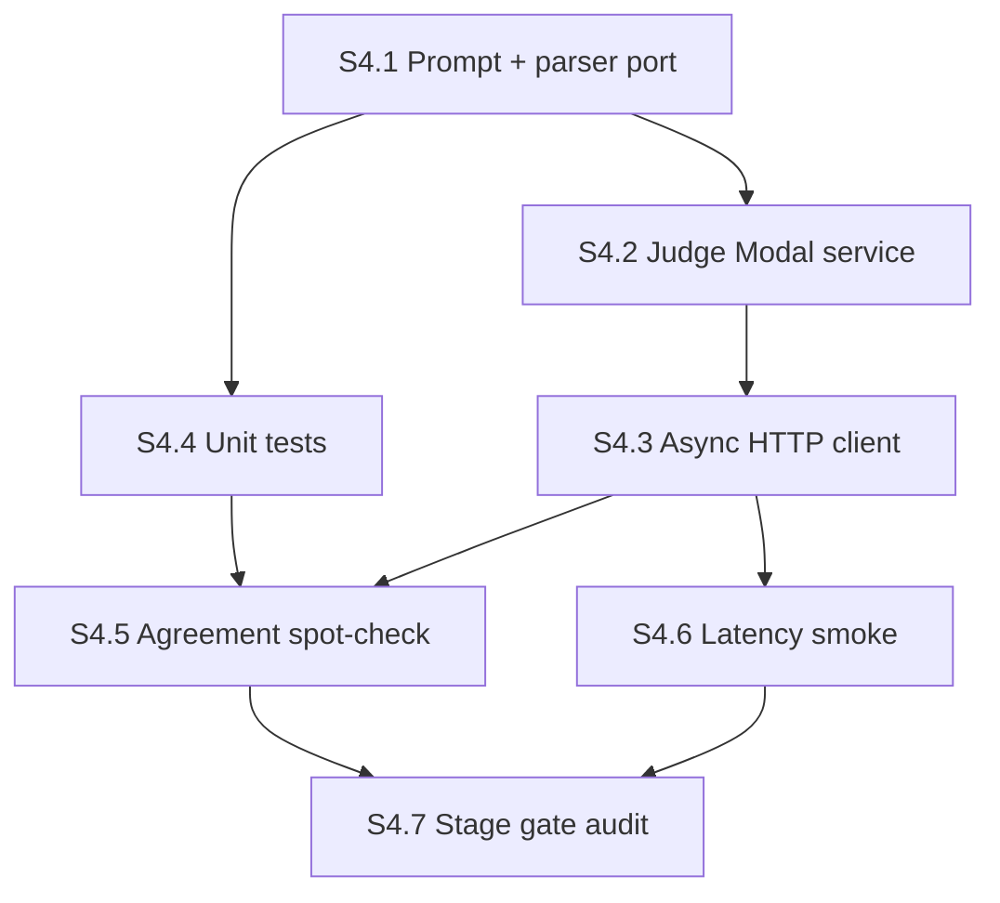

# Stage 4 agent plan — Judge service on Modal

**Stage ID:** `stage-04`
**Status:** draft (orchestrator-ready after plan audit 2026-05-30 — dispatch in parallel with Stage 3a)
**Parent runbook:** [`../verl_migration_plan.md`](../verl_migration_plan.md) §2 row 4 + §4 ("Stage 4 deep-dive: judge service on Modal")
**Reference:** [`../verl-reference.md`](../verl-reference.md) §5.2–5.3 (CoT judge, Modal architecture), §6 (B200 settings)
**Predecessor:** Stage 1 image + HF cache volume (no Stage 2/3a gate — **may run in parallel** with Stage 2 smoke and Stage 3a)
**Successor:** Stage 3b (real-judge swap into `minority_cot`; blocked until **both** Stage 3a hook PASS and Stage 4 S4.7 PASS)
**Interface contract (downstream):** [`main-verl/train/clusters_mock.py`](../../train/clusters_mock.py) `ClusterAssignment` dataclass — Stage 3b's `assign_judge_clusters` must produce identical shapes

---

## How to use this doc

Each section below is **self-contained**. An orchestrator should:

1. Dispatch an **executor agent** with the section's `Executor brief` (+ linked context).
2. When the executor marks done, dispatch an **audit agent** with the same section's `Audit brief`.
3. Only advance to the next section when audit returns **PASS** (or **PASS WITH NOTES** if notes are non-blocking).
4. Record section outcomes in `main-verl/docs/build/stage-04-log.md` (create on first run).

**Roles** — same as Stage 1 / Stage 2 / Stage 3a.

| Role | Job |
|------|-----|
| **Orchestrator** | Pick section, enforce DAG order, track image rebuild count + model-size iteration count |
| **Executor** | Implement / run commands; produce artifacts; report logs |
| **Auditor** | Read-only verification against acceptance criteria; no "fix forward" |

**Global constraints (all sections)**

- **Modal profile:** migration plan §7 allows **Account A or B** for the judge service. **Orchestrator override:** prefer Account B when Account A runs 4× B200 trainer smokes (`chicken602`) to reduce queue contention; fallback Account A if B unavailable. Document chosen account in `stage-04-log.md`.
- **GPU:** `B200:1` for the judge service (single container, single node). Migration plan §4: "One judge instance … on its own B200."
- **Architecture (locked starting point):** **Option A** from verl-reference §5.3 — detached Modal function serving OpenAI-compatible `/v1/chat/completions`; trainer (Stage 3b) calls over HTTP. Do **not** embed the judge inside the VeRL training container in this stage.
- **Scope boundary:** Stage 4 delivers **judge service + client library + smokes**. It does **not** wire the judge into `verl.trainer.main_ppo` — that is Stage 3b. Do **not** modify `core_algos.py`, advantage estimators, or training configs.
- **Cluster unit:** one judge call per `(problem, 8 rollouts)` group — same as `main/probes/group_a_rollout_judge.py` Phase 2 and `objective_minority.N_ROLLOUTS = 8`.
- **Prompt source:** Poly-EPO §A.1 faithful templates from [`main/judge/poly_epo_a1.md`](../../../main/judge/poly_epo_a1.md) + parsing logic from [`main/judge/format.py`](../../../main/judge/format.py). **Read-only reference** — copy into `main-verl/judge/`, do not import from `main.judge.*` at runtime (Modal image mounts `main-verl/` only).
- **Degenerate cluster policy (locked for v1):** judge emits `cluster_id: 100` per paper (see `poly_epo_a1.md`); parser maps `100 → DEGENERATE_CLUSTER_ID` internally. Stage 3b will map degenerate rollouts into `ClusterAssignment.diagnostics["degenerate_rollouts"]` and assign a sentinel cluster index for the tensor path. Stage 4 parser must preserve the raw/degenerate distinction — do not collapse 100 into a normal bucket silently.
- **Forced-k vs k-free (v1 default):** **k-free** — judge picks cluster IDs freely in JSON; downstream reindexing to `[0, K)` happens in Stage 3b. Record the chosen policy in `stage-04-log.md` S4.7 handoff. If agreement spot-check shows unstable ID cardinality, retry with forced-k=4 prompt variant (counts as one model/prompt iteration).
- **Judge model (v1 default):** `Qwen/Qwen2.5-7B-Instruct` — migration plan §9. Step up to `Qwen/Qwen2.5-14B-Instruct` only if S4.5 agreement fails (counts as one model-size iteration).
- **Async client:** `asyncio.Semaphore(64)` default; drop to 32 if judge OOMs at 64-way (document in log). Migration plan §4 kill: median latency >2 s/call at chosen concurrency → resize model or restructure.
- **Image rebuild budget:** ≤2 full rebuild cycles for the **judge-only** image (separate from trainer image budget in Stages 2/3a).
- **Model/prompt iteration budget:** ≤2 (e.g. 7B → 14B, or k-free → forced-k=4) before escalation.
- **Forbidden in Stage 4:** trainer integration, `@register_adv_est` changes, `assign_judge_clusters` (Stage 3b), `poly_epo_cot` objective code (Stage 5), edits to `main/train/*`.

### Pre-flight: inherit from Stage 3a contract (read before S4.1)

Stage 4 **may start before Stage 3a completes**, but S4.1 parser output must be compatible with the locked contract in `clusters_mock.py`:

| Field | Type | Shape | Stage 4 responsibility |
|-------|------|-------|------------------------|
| Per-rollout assignment | `dict[int, int]` | `[n_rollouts]` per prompt | S4.1 parser: 0-based rollout idx → cluster id or `DEGENERATE_CLUSTER_ID` |
| `cluster_ids` | `torch.int64` | `[n_prompts, n_rollouts]` | **Stage 3b only** — reindex k-free judge IDs to `[0, K)` and build tensor |
| `distinct_clusters_mean` | `float` | scalar | **Stage 3b only** — aggregate batch diagnostics for `train/distinct_clusters` |
| `degenerate_rollouts` | `int` | scalar | S4.1 parser counts per-task; **Stage 3b** sums across batch for `ClusterAssignment.diagnostics` |

If Stage 3a later changes `n_clusters` default or `ClusterAssignment` fields, reconcile before S4.7 — but do not block S4.1–S4.4 on 3a smoke completion.

---

## Stage gate (final)

Stage 4 is **DONE** when all section audits pass and:

1. **Judge service is live** — Modal function on `B200:1` exposes OpenAI-compatible `/v1/chat/completions`; health check returns 200.
2. **Parser correctness** — unit tests pass on fixtures derived from `main/judge/format.py` (including degenerate `cluster_id: 100`, JSON fence stripping, 1-indexed Poly-EPO keys).
3. **Agreement spot-check** — 50-example run (held-out rollouts from Phase 1 artifacts or synthetic fixtures): **≥90%** parse-success rate; **≥80%** exact cluster-assignment agreement on re-run at same temperature. Migration plan §4 requires the spot-check but does not fix numeric thresholds — these are **plan-local operational gates**.
4. **Latency smoke** — 64 concurrent in-flight requests (or 32 if documented OOM fallback): **median wall time <1 s/call**, **p95 <2 s/call** (migration plan §2 row 4 smoke gate). Kill if median >2 s after one model-size iteration.
5. **Handoff artifact for Stage 3b** — public judge base URL, auth token secret name, chosen model id, concurrency limit, parser module path, and example `JudgeClusterResult` JSON recorded in `stage-04-log.md` S4.7.

**Stage kill =** (migration plan §2 row 4)

- Judge service cannot start after 2 image rebuilds.
- Median latency >2 s/call at chosen concurrency after 2 model-size / prompt iterations.
- Agreement spot-check **parse-success <80%** after one prompt/model iteration — escalate cluster-prompt design (TA §9).
- Agreement spot-check **assignment agreement <80%** (both parses OK) after one prompt/model iteration — escalate judge model size or prompt design.
- Judge OOM at batch 1 with 7B at reasonable `max_model_len` — escalate hardware or context truncation policy.

---

## Section DAG



| Section | Depends on | Blocks |
|---------|------------|--------|
| S4.1 | — (Stage 1 HF cache helpful but not required) | S4.4 (S4.2 optional — service does not bundle prompt files) |
| S4.2 | S4.1 complete (client/tests need parser; judge image itself does not) | S4.3 |
| S4.3 | S4.2 (service URL) | S4.5, S4.6 |
| S4.4 | S4.1 | S4.5 |
| S4.5 | S4.3, S4.4 | S4.7 |
| S4.6 | S4.3 | S4.7 |
| S4.7 | S4.5, S4.6 | Stage 3b |

**Parallelism note:** S4.1 + S4.4 are local-only and can run while Stage 2 / 3a GPU smokes execute. S4.2+ need GPU on Account B.

---

## S4.1 — Cluster prompt + response parser

### Objective

Port the Poly-EPO judge prompt and JSON parser into `main-verl/judge/` so Stage 3b can call a stable Python API without importing `main/`.

### Executor brief

**Create** the following under `main-verl/judge/`:

| File | Purpose |
|------|---------|
| `prompts/poly_epo_a1.md` | Copy from `main/judge/poly_epo_a1.md` (verbatim templates) |
| `prompt.py` | `build_judge_messages(problem: str, rollouts: list[str]) -> tuple[str, str]` — system + user strings; `{n_responses}`, `{problem}`, `{responses_block}` substitution |
| `parse.py` | Port `_assignment_from_poly_epo_payload`, `_strip_json_fences`, degenerate normalization; public surface below |
| `types.py` | Dataclasses for structured results |

**Public surface** (Stage 3b imports these; keep stable):

```python
# types.py
DEGENERATE_CLUSTER_ID = -1          # normalized from paper's 100
POLY_EPO_DEGENERATE_RAW = 100

@dataclass(frozen=True)
class JudgeClusterResult:
    """One prompt × n_rollouts judge output (pre-tensor)."""
    assignment: dict[int, int]      # rollout_idx (0-based) -> cluster_id or DEGENERATE_CLUSTER_ID
    clusters: list[dict]            # optional metadata for logging
    parse_ok: bool
    raw_response: str | None        # for debugging; truncate in logs if huge

# parse.py — pipeline: json.loads(_strip_json_fences(text)) → _assignment_from_poly_epo_payload → JudgeClusterResult
def parse_judge_response(text: str, *, n_rollouts: int) -> JudgeClusterResult: ...

# types.py
@dataclass(frozen=True)
class JudgeTask:
    """One judge call: problem text + n rollout completions."""
    problem: str
    rollouts: list[str]                   # len == n_rollouts (typically 8)
    problem_id: int | None = None           # optional; for logging only
```

**Rollout input format:** accept `list[str]` completions (not full `main/train` rollout dicts) to keep the interface VeRL-agnostic.

**Reference implementation:** [`main/judge/format.py`](../../../main/judge/format.py) — port logic, do not symlink.

**Do not:**

- Start vLLM or Modal code in this section.
- Import from `main.judge.*` or `main.train.*`.

### Audit brief

- [ ] `main-verl/judge/prompts/poly_epo_a1.md` exists and matches source templates (System + User sections).
- [ ] `build_judge_messages` produces non-empty system/user for 8 rollouts.
- [ ] `parse_judge_response` handles: valid Poly-EPO JSON, markdown fences, `cluster_id: 100` → `DEGENERATE_CLUSTER_ID`, missing keys → `parse_ok=False`.
- [ ] Public symbols exported from `main-verl/judge/__init__.py` or documented import paths.
- [ ] No runtime imports from `main.*`.

### Artifacts

| Path | Action |
|------|--------|
| `main-verl/judge/prompts/poly_epo_a1.md` | create |
| `main-verl/judge/prompt.py` | create |
| `main-verl/judge/parse.py` | create |
| `main-verl/judge/types.py` | create |
| `main-verl/judge/__init__.py` | create (re-export public surface) |
| `main-verl/docs/build/stage-04-log.md` | append S4.1 summary |

---

## S4.2 — Judge Modal service (OpenAI-compatible)

### Objective

Host the judge model as a **long-lived** Modal web function on `B200:1` with an OpenAI-compatible chat-completions API.

### Executor brief

**Create** `main-verl/judge/modal_image.py` — **judge-only** image (do not reuse full `infra/modal_image.py` maxrl stack):

- Base: `modal.Image.debian_slim(python_version="3.11")`
- GPU pins: same B200 stack as trainer (`vllm==0.9.0`, cu128 torch, `transformers<4.54`, flash-attn 2.8.3 wheel) — copy pin versions from [`main-verl/infra/modal_image.py`](../../infra/modal_image.py) but **omit** maxrl clone/patches/verl install.
- Env: `HF_HOME=/root/.cache/huggingface`, `VLLM_USE_V1=0`, `enforce_eager` compatible flags.

**Create** `main-verl/judge/server.py`:

```python
# Modal app: CS224R_APP_NAME default cs224r-verl-stage04-judge
@app.cls(gpu="B200:1", ...)
class JudgeService:
    @modal.enter()
    def load(self):
        # vLLM LLM with enforce_eager=True (Blackwell — verl-reference §6.2)
        ...

    @modal.web_endpoint(method="POST")
    def chat_completions(self, body: dict) -> dict:
        # MUST apply Instruct chat template to incoming messages — NOT raw concat.
        # Accept OpenAI messages: [{role: system|user, content: str}, ...]
        # Use vLLM chat/completions path (or tokenizer.apply_chat_template on messages
        # before generate) — mirror main/probes/group_a_rollout_judge.py:849-852.
        ...
```

**Chat-template contract (locked):**

| Layer | Responsibility |
|-------|----------------|
| **Client** | Sends `messages: [{role, content}, …]` via OpenAI API shape |
| **Server** | Applies model Instruct chat template via vLLM; **forbid** naive `f"{system}\n\n{user}"` unless documented fallback |

Smoke: POST with system+user roles → response `content` is parseable Poly-EPO JSON.

**API contract (minimal OpenAI subset):**

- Route: `POST /v1/chat/completions` (or Modal `@modal.web_endpoint` path documented in log).
- Request: `{ "model": "<judge_model_id>", "messages": [{"role":"system","content":...},{"role":"user","content":...}], "temperature": 0.0, "max_tokens": 2048 }`
- Response: `{ "choices": [{ "message": { "content": "<json string>" } }] }`
- Optional: `GET /health` → `{"status":"ok"}` for smokes.

**Defaults (Hydra-free env vars or constants at top of server.py):**

| Knob | Default |
|------|---------|
| `JUDGE_MODEL` | `Qwen/Qwen2.5-7B-Instruct` |
| `gpu_memory_utilization` | `0.85` |
| `max_model_len` | `16384` (tune down if OOM) |
| `temperature` | `0.0` (agreement spot-check; document if changed) |
| `max_tokens` | `2048` |

**Create** `main-verl/scripts/launch_judge_service.sh`:

```bash
#!/usr/bin/env bash
set -euo pipefail
export CS224R_APP_NAME="${CS224R_APP_NAME:-cs224r-verl-stage04-judge}"
python3 -m modal deploy main-verl/judge/server.py "$@"
```

Use `modal deploy` (not `modal run`) — judge is a **persistent service** per migration plan §4.

**Secrets:** `HUGGINGFACE` Modal secret for model weights. Optional: `JUDGE_AUTH_TOKEN` for bearer auth on requests (recommended — Stage 3b client sends `Authorization: Bearer …`).

**Volumes:** mount `HF_CACHE_VOLUME_NAME` at `HF_CACHE_MOUNT` (same as trainer — reuse cached weights).

**Do not:**

- Install maxrl/verl in the judge image.
- Wire trainer code.

### Audit brief

- [ ] `main-verl/judge/modal_image.py` exists; no maxrl/verl install steps.
- [ ] `main-verl/judge/server.py` requests `gpu="B200:1"`.
- [ ] OpenAI-compatible request/response documented in file header.
- [ ] `launch_judge_service.sh` uses `modal deploy`, default app `cs224r-verl-stage04-judge`.
- [ ] HF cache volume + `HUGGINGFACE` secret configured.
- [ ] B200 settings: `enforce_eager=True` on judge vLLM engine (verl-reference §6.2).
- [ ] Server applies Instruct chat template on incoming `messages` (not raw string concat).
- [ ] Health/smoke POST with system+user roles returns JSON cluster payload.

### Artifacts

| Path | Action |
|------|--------|
| `main-verl/judge/modal_image.py` | create |
| `main-verl/judge/server.py` | create |
| `main-verl/scripts/launch_judge_service.sh` | create, chmod +x |
| `main-verl/docs/build/stage-04-log.md` | append deploy URL + model id |

---

## S4.3 — Async HTTP client library

### Objective

Provide the async batched client Stage 3b will embed in `assign_judge_clusters` — without implementing Stage 3b itself.

### Executor brief

**Create** `main-verl/judge/client.py`:

```python
@dataclass
class JudgeClientConfig:
    base_url: str                   # Modal web endpoint base
    auth_token: str | None
    model: str
    concurrency: int = 64           # semaphore limit
    timeout_s: float = 120.0
    temperature: float = 0.0
    max_tokens: int = 2048

class JudgeClient:
    async def cluster_batch(
        self,
        tasks: list[JudgeTask],      # problem + list[str] rollouts
    ) -> list[JudgeClusterResult]: ...

    @classmethod
    def from_env(cls) -> "JudgeClient": ...  # JUDGE_BASE_URL, JUDGE_AUTH_TOKEN, ...
```

**Implementation notes:**

- Use `httpx.AsyncClient` (add to judge image pip if not present).
- **Concurrency pattern** — per-task semaphore inside `asyncio.gather` (do **not** wrap the whole batch in one `async with sem` — that serializes to concurrency=1):

  ```python
  sem = asyncio.Semaphore(config.concurrency)

  async def _one(task: JudgeTask) -> JudgeClusterResult:
      async with sem:
          messages = [
              {"role": "system", "content": sys},
              {"role": "user", "content": usr},
          ]  # from build_judge_messages(task.problem, task.rollouts)
          resp = await client.post(
              f"{base_url}/v1/chat/completions",
              json={"model": model, "messages": messages, ...},
              headers=headers,
          )
          return parse_judge_response(resp.json()["choices"][0]["message"]["content"], n_rollouts=len(task.rollouts))

  return await asyncio.gather(*[_one(t) for t in tasks])
  ```

- Each task: `build_judge_messages(task.problem, task.rollouts)` → POST → `parse_judge_response`.
- On HTTP error or parse failure: return `JudgeClusterResult(parse_ok=False, assignment={}, ...)` — do not raise per-task (Stage 3b counts degenerate/failed).
- Provide sync wrapper `cluster_batch_sync` for probes/smokes only (uses `asyncio.run`).
- `@classmethod from_env(cls)` reads `JUDGE_BASE_URL`, `JUDGE_AUTH_TOKEN`, `JUDGE_MODEL`, `JUDGE_CONCURRENCY`.

**Do not:**

- Import verl or touch trainer code.
- Implement `ClusterAssignment` tensor conversion (Stage 3b).

### Audit brief

- [ ] `JudgeClient.cluster_batch` uses per-task `async with sem` inside `asyncio.gather` (not serial).
- [ ] 64-task smoke shows concurrent fan-out (wall time ≪ 64 × median single-call latency).
- [ ] Failed parses return structured failure, not uncaught exceptions.
- [ ] Auth header wired when `auth_token` set.
- [ ] `from_env` reads documented env vars.
- [ ] No imports from `main.*` or `verl.*`.

### Artifacts

| Path | Action |
|------|--------|
| `main-verl/judge/client.py` | create |
| `main-verl/docs/build/stage-04-log.md` | append env var table |

---

## S4.4 — Unit tests (local, no GPU)

### Objective

Lock parser correctness before spending GPU hours on smokes.

### Executor brief

**Create** `main-verl/tests/test_judge_parse.py`:

| Test | Source |
|------|--------|
| Valid 8-rollout Poly-EPO JSON | Port cases from exercising `main/judge/format.py` |
| 1-indexed keys `"1"`…`"8"` | `format.py::_assignment_from_poly_epo_payload` |
| `cluster_id: 100` → `DEGENERATE_CLUSTER_ID` | `format.py::_normalize_cluster_id` |
| Markdown ```json fences | `_strip_json_fences` |
| Missing rollout key → `parse_ok=False` | error path |
| `build_judge_messages` length / placeholders | smoke |

Run locally:

```bash
pytest main-verl/tests/test_judge_parse.py -v
```

**Optional:** `test_judge_client.py` with `httpx.MockTransport` — recommended if cheap.

**Do not** require GPU or live Modal endpoint for this section.

### Audit brief

- [ ] `pytest main-verl/tests/test_judge_parse.py` all green — output in log.
- [ ] At least one degenerate-100 case and one fence-stripping case.
- [ ] No tests import `main.judge.*`.

### Artifacts

| Path | Action |
|------|--------|
| `main-verl/tests/test_judge_parse.py` | create |
| `main-verl/docs/build/stage-04-log.md` | append pytest output |

---

## S4.5 — Agreement spot-check (50 examples)

### Objective

Validate judge clustering stability before Stage 3b spends trainer GPU hours.

### Executor brief

**Create** `main-verl/probes/judge_agreement_smoke.py`:

1. **Deploy** judge service if not already running (S4.2).
2. Load **50 tasks** — priority order:
   - (a) Join Phase 1 manifest + rollout JSONL from artifacts volume under `probes/05-24/group_a/` (problem text from manifest, completions from rollouts — mirror `group_a_rollout_judge.py:844`);
   - (b) Else synthesize 50 problems × 8 dummy completions with varied math-like text (document fallback in log).
3. Skip or flag tasks where tokenized judge input exceeds `max_model_len` (mirror Phase 2 truncation policy in `group_a_rollout_judge.py:857-866`).
4. For each task, call judge **twice** at `temperature=0.0` via `JudgeClient`.
5. Record per task: `parse_ok`, assignment match (exact dict equality on 0-based indices), `cluster_100_hits`, wall-clock.
6. Log aggregates to stdout + W&B run: `entity=224r-project`, tags `[verl, stage-04, judge, agreement]` (mandatory `verl` tag per Stage 2/3a convention).

**Pass criteria:**

- Parse success ≥ **90%** (both runs).
- Assignment agreement ≥ **80%** on tasks where both parses succeeded.

**Create** `main-verl/scripts/launch_judge_agreement.sh` mirroring other launch scripts.

**Budget:** ~0.5 B200-hr (50 × 2 calls — negligible vs training).

If FAIL: one prompt iteration (forced-k variant) or model bump 7B→14B — counts against iteration budget; document before retry.

### Audit brief

- [ ] Probe runs against **live** deployed judge URL (not mocked).
- [ ] 50 tasks executed; metrics in log.
- [ ] Pass/fail against 90%/80% thresholds recorded.
- [ ] W&B uses `entity=224r-project` and tags include `verl`, `stage-04`.
- [ ] Log includes `json_parse_ok_rate`, `cluster_100_hits` aggregate if applicable.

### Artifacts

| Path | Action |
|------|--------|
| `main-verl/probes/judge_agreement_smoke.py` | create |
| `main-verl/scripts/launch_judge_agreement.sh` | create |
| `main-verl/docs/build/stage-04-log.md` | append agreement metrics |

---

## S4.6 — Latency smoke (64-way fan-out)

### Objective

Measure judge latency at production concurrency — migration plan §2 row 4 gate.

### Executor brief

**Create** `main-verl/probes/judge_latency_smoke.py`:

1. Build **64** (or **32** if S4.5 showed OOM at 64) synthetic tasks — real judge calls, diverse completion lengths.
2. Fire all tasks through `JudgeClient.cluster_batch` with `concurrency=64` (or 32).
3. Record per-call wall times; compute median, p95, max, estimated `$/call` (for migration plan §8 judge cost prior).
4. Log GPU memory snapshot if available.
5. Optional W&B: `entity=224r-project`, tags `[verl, stage-04, judge, latency]`.

**Pass criteria:**

- Median **<1 s/call**
- p95 **<2 s/call**

**Create** `main-verl/scripts/launch_judge_latency.sh`.

If median >2 s: document; one model-size iteration allowed; else FAIL per kill criterion.

### Audit brief

- [ ] Concurrency matches production default (64 or documented 32).
- [ ] Median and p95 recorded in log.
- [ ] Pass/fail vs thresholds explicit.
- [ ] Total wall time within ~2 B200-hr stage budget.

### Artifacts

| Path | Action |
|------|--------|
| `main-verl/probes/judge_latency_smoke.py` | create |
| `main-verl/scripts/launch_judge_latency.sh` | create |
| `main-verl/docs/build/stage-04-log.md` | append latency histogram summary |

---

## S4.7 — Stage gate audit (read-only)

### Objective

Confirm Stage 4 meets migration plan §2 row 4 + §4 gate and unlock Stage 3b dispatch.

### Auditor brief (no code changes)

Verify **all** of:

1. **Files present:**
   - `main-verl/judge/prompts/poly_epo_a1.md`
   - `main-verl/judge/prompt.py`, `parse.py`, `types.py`, `client.py`
   - `main-verl/judge/modal_image.py`, `server.py`
   - `main-verl/tests/test_judge_parse.py`
   - `main-verl/probes/judge_agreement_smoke.py`, `judge_latency_smoke.py`
   - `main-verl/scripts/launch_judge_service.sh`, `launch_judge_agreement.sh`, `launch_judge_latency.sh`
   - `main-verl/docs/build/stage-04-log.md`

2. **Unit tests green** (S4.4): pytest output in log.

3. **S4.5 agreement PASS** — thresholds met or documented override.

4. **S4.6 latency PASS** — median <1 s, p95 <2 s (or documented override with Nancy authorization).

5. **Scope check:**
   - **No** verl trainer integration, no `@register_adv_est` edits, no `assign_judge_clusters`.
   - **No** imports from `main.train.*` under `main-verl/judge/`.
   - Judge image does **not** install maxrl/verl.

6. **Cost sanity:** judge service on `B200:1`; smokes within ~2 B200-hr budget; image rebuild count ≤2.

7. **Handoff notes for Stage 3b** recorded in log:
   - Deployed judge base URL + auth secret name + chosen Modal account (A or B).
   - Model id, `max_model_len`, concurrency limit (64 or 32).
   - Parser module path + `JudgeClusterResult` / `JudgeTask` shapes (must include `problem: str`).
   - Example task JSON: `{problem, rollouts[8], problem_id}`.
   - Forced-k vs k-free decision + degenerate mapping policy.
   - Median/p95 latency + estimated `$/call` and judge B200-hr burn (migration plan §8).
   - Agreement metrics (parse rate, re-run agreement).

**Output format** (append to `stage-04-log.md`):

```markdown
## S4.7 Stage gate verdict

- **Verdict:** PASS | PASS WITH NOTES | FAIL
- **Auditor:** <agent id or human>
- **Timestamp (UTC):** <UTC>
- **Notes:** ...
- **Stage 3b ready (pending Stage 3a hook PASS):** yes | no
```

### Orchestrator action on PASS

- Update [`../STATUS.md`](../STATUS.md) Stage 4 checkbox: ☐ → ☑.
- **Return to human (Nancy) with S4.7 verdict + handoff notes — do not auto-dispatch Stage 3b.** Stage 3b requires Stage 3a S3a.7 PASS in addition to Stage 4.

---

## Orchestrator checklist (quick reference)

| Step | Section | Executor | Audit | Stop if |
|------|---------|----------|-------|---------|
| 1 | S4.1 | prompt + parser port | contract review | imports from main.judge at runtime |
| 2 | S4.4 | unit tests (local) | pytest green | any red |
| 3 | S4.2 | Modal judge service | deploy + health | image rebuild >2 |
| 4 | S4.3 | async client | code review | serial semaphore bug |
| 5 | S4.5 | agreement smoke | threshold check | agreement fail after 2 iterations |
| 6 | S4.6 | latency smoke | p95 check | median >2s after iteration |
| 7 | S4.7 | — | stage gate | any prior fail |

---

## Stage 3b handoff preview (do not implement in Stage 4)

Stage 3b will add `main-verl/train/clusters_judge.py`:

```python
def assign_judge_clusters(
    problem_ids: list[int],
    problems: list[str],               # [n_prompts] — parallel to problem_ids; required for judge prompt
    rollout_texts: list[list[str]],   # [n_prompts][n_rollouts]
    n_rollouts: int,
    n_clusters: int,
    *,
    judge_client: JudgeClient,
) -> ClusterAssignment: ...
```

Mapping rules (document now, implement in 3b):

1. Build `list[JudgeTask(problem=..., rollouts=..., problem_id=...)]` and call `judge_client.cluster_batch` (batched async).
2. Reindex non-degenerate cluster IDs to `[0, K)` per prompt (k-free judge output).
3. Count `degenerate_rollouts` from `DEGENERATE_CLUSTER_ID` assignments.
4. Return `ClusterAssignment` identical to mock shape.

---

## Known failure modes (quick reference)

| Section | Symptom | Likely fix | Counts as |
|---------|---------|------------|-----------|
| S4.2 | Judge OOM at load | Lower `max_model_len` or `gpu_memory_utilization` | config fix |
| S4.2 | Raw concat instead of chat template → garbage JSON | Use vLLM chat API / `apply_chat_template` | hook fix |
| S4.3 | Latency smoke wall time ≈ N × single-call | Semaphore serializing batch — fix gather pattern | code fix |
| S4.5 | Low parse rate | Check chat template, temperature=0, prompt copy | prompt iteration |
| S4.5 | Low agreement at temp=0 | Bump 7B→14B | model iteration |
| S4.6 | p95 >2s at 64-way | Drop concurrency to 32 or resize model | model/config iteration |

---

## Related docs

| Doc | Role |
|-----|------|
| [`stage-04-log.md`](./stage-04-log.md) | Run record |
| [`stage-03a-agent-plan.md`](./stage-03a-agent-plan.md) | Upstream cluster-ID contract |
| [`../verl_migration_plan.md`](../verl_migration_plan.md) | §4 judge deep-dive |
| [`../verl-reference.md`](../verl-reference.md) | §5.2–5.3 architecture |
| [`../../../main/judge/format.py`](../../../main/judge/format.py) | Parser reference |
| [`../../../main/probes/group_a_rollout_judge.py`](../../../main/probes/group_a_rollout_judge.py) | Phase 2 probe reference |

**README:** add bring-up bullets under Stage 4 for `launch_judge_service.sh`, `launch_judge_agreement.sh`, `launch_judge_latency.sh` (mirror Stage 2/3a pattern).

---

## Open items

- [ ] **Account B Modal profile name** — confirm env / token profile for non-`chicken602` account before S4.2 deploy.
- [ ] **Auth token strategy** — Modal web endpoints are public URLs; bearer token required for production Stage 8.
- [ ] **Forced-k prompt variant** — draft only if S4.5 agreement fails; do not maintain two prompts unless needed.
- [ ] **Stage 3b agent plan** — draft after S4.7 PASS (thin plan; most work is here in Stage 4).
