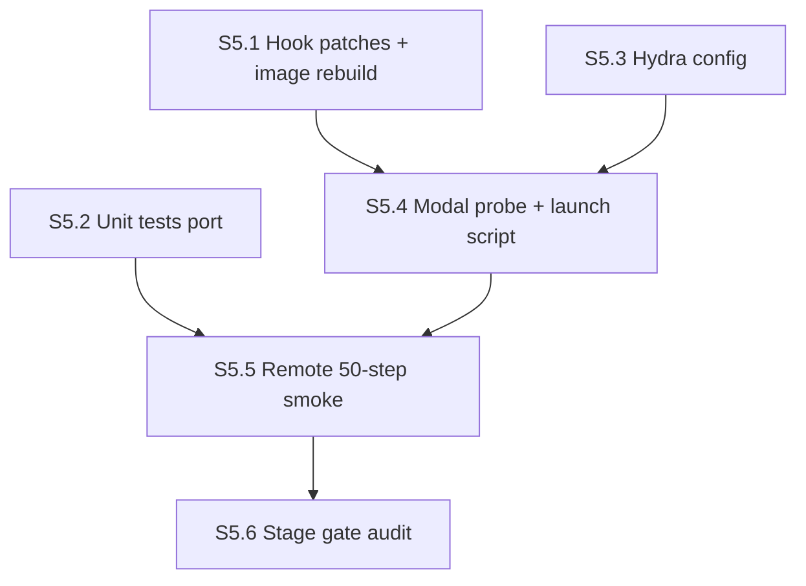

# Stage 5 agent plan — `poly_epo_cot`

**Stage ID:** `stage-05`
**Status:** draft (orchestrator-ready — reconciled 2026-05-30; chicken602 for all smokes)
**Parent runbook:** [`../verl_migration_plan.md`](../verl_migration_plan.md) §2 row 5 + §3 ("Stage 5 compatible" cluster-ID interface)
**Reference:** [`../verl-reference.md`](../verl-reference.md) §3 (built-ins / `@register_adv_est`), [`stage-03a-agent-plan.md`](./stage-03a-agent-plan.md) (mock-cluster contract), [`stage-04-agent-plan.md`](./stage-04-agent-plan.md) (judge handoff — optional path only)
**Predecessor:** Stage 3a PASS (mock clusters + shared adapters), Stage 3b PASS (judge cluster routing validated on `minority_cot`; transitively requires Stage 4 judge service)
**Successor:** Stage 6 (4B fit check) — Stage 5 does **not** block Stage 7 logging work in parallel, but Stage 8 needs all three arms registered

---

## How to use this doc

Each section below is **self-contained**. An orchestrator should:

1. Dispatch an **executor agent** with the section's `Executor brief` (+ linked context).
2. When the executor marks done, dispatch an **audit agent** with the same section's `Audit brief`.
3. Only advance to the next section when audit returns **PASS** (or **PASS WITH NOTES** if notes are non-blocking).
4. Record section outcomes in `main-verl/docs/build/stage-05-log.md` (create on first run).

**Roles** — same as Stage 1–4.

| Role | Job |
|------|-----|
| **Orchestrator** | Pick section, enforce DAG order, track hook iteration + image rebuild count |
| **Executor** | Implement / run commands; produce artifacts; report logs |
| **Auditor** | Read-only verification against acceptance criteria; no "fix forward" |

**Global constraints (all sections)**

- **Modal profile:** `chicken602` (Nancy's workspace) for **all** Stage 5 smokes and image rebuilds. Migration plan §7's "Account B" tier is Emma/Anastasia — relevant only for **Stage 8 parallel full retrains**, not bring-up. Rationale (same as Stage 3b): Nancy can monitor spend on her dashboard; Stage 5 smokes are ~2 B200-hr (~$50-scale) and belong on `chicken602` per [`human notes.md`](../human%20notes.md). Do **not** switch accounts for Stage 5 unless Nancy explicitly redirects.
- **GPU:** `B200:4` for the smoke run (single container, single node).
- **Model:** `Qwen/Qwen3-1.7B-Base` — same as Stages 2 / 3a / 3b smokes. Stage 6 retargets to 4B.
- **Manifest:** Polaris-51K **filtered**, reusing Stage 2 parquet on the artifacts volume. **Do not** re-preprocess or re-upload.
- **Algorithm:** `algorithm.adv_estimator=poly_epo_cot` — the **new** estimator registered in this stage. **Do not** set `=maxrl` (paper method) or `=grpo` / `=minority_cot`.
- **Reward:** built-in **MathReward** via the Stage 2 `data_source=polaris` router patch — unchanged.
- **Cluster source for smoke gate:** **`mock`** (deterministic hash via `assign_clusters_from_arm_config`). Judge wiring is already validated on `minority_cot` in Stage 3b; Stage 5's gate is the **poly-EPO subset scorer + hook**, not a second judge bring-up. Optional judge smoke is **out of scope** for the stage gate (see §Optional follow-up).
- **Pre-staged scaffolding (do not rewrite from scratch):**
  - `main-verl/train/objective_poly_epo.py` — math + cluster hook already present.
  - `main-verl/infra/patches/maxrl_poly_epo_cot_adv_est.patch` — `@register_adv_est("poly_epo_cot")` body.
  - `main-verl/infra/patches/maxrl_poly_epo_cot_ray_trainer.patch` — critic-disabled allowlist entry.
  - Shared adapters + cluster routing in `main-verl/train/objective_minority.py` (`set_based_marginal_advantages`, `assign_clusters_from_arm_config`, `_group_rewards_by_index`, `_scatter_advantages_to_tokens`).
- **Hook iteration budget:** ≤2 patch-and-rebuild attempts on the `@register_adv_est` surface before escalation (migration plan §2 row 5 kill: "Same hook constraint as 3a").
- **Config-fix budget:** ≤2 config-fix iterations on the 50-step smoke before escalation.
- **Image rebuild budget:** ≤2 full rebuild cycles for Stage 5 (applies the two pre-staged patches on top of image rebuild 5 from Stage 3b).
- **Stack:** vendored VeRL from maxrl @ `MAXRL_COMMIT=7197bbb46a2ecd866da52f6b401ff20a34fe9390`. **Do not** bump SHA.
- **Forbidden source surfaces:** do **not** copy from or port `main/train/{trainer,reward,weight_sync,rollout,loss}.py`. **Only** `main/train/objective.py` (math reference for `_poly_epo_subset_score`) and `main/tests/test_objective_minority.py` (poly-EPO fixture lines) may be read.

### Modal freshness gate (mandatory before any GPU smoke)

**Every** Modal GPU run must use artifacts built from **current** repo state. Do not assume a prior deploy or image is still valid.

| What changed | Required action before S5.5 |
|---|---|
| New/edited patch under `infra/patches/` | Image rebuild (touches `modal_image.py` apply step) — bumps rebuild count in log |
| Edited `infra/modal_image.py` | Image rebuild |
| Edited any file under `main-verl/` snapshotted into the trainer image | Image rebuild |
| Edited `main-verl/judge/*` (not needed for Stage 5 mock gate) | N/A for S5.5 mock smoke |

**Pre-smoke checklist (executor, S5.5):**

1. Confirm S5.1 image rebuild **completed successfully** after the latest patch/code diff (check Modal build logs — not just "we ran it once yesterday").
2. In-container registry assert: `"poly_epo_cot" in ADV_ESTIMATOR_REGISTRY` (S5.4 probe pre-flight).
3. Record image rebuild count + git diff summary in `stage-05-log.md` so the next agent knows what's baked.

If local code and Modal image diverge, **stop** — rebuild first, then smoke. Running against stale Modal state is a plan FAIL, not a "maybe it'll work."

### Pre-flight: inherit from Stage 3a / 3b handoff (read before S5.1)

Stage 5 starts only after Stage 3a S3a.7 and Stage 3b close-out record:

- Image rebuild count ≥5 with `maxrl_minority_cot_adv_est.patch`, `maxrl_minority_cot_ray_trainer.patch`, and `maxrl_expose_data_to_adv_est.patch` applied (`infra/modal_image.py`).
- Stage 2 final knob values (`ppo_micro_batch_size_per_gpu`, `gpu_memory_utilization`, `max_prompt_length`, `data.truncation`, `log_prob_micro_batch_size_per_gpu`, `ray_init.ray_dir`) — copy verbatim into `poly_epo_cot_smoke_1p7b.yaml`.
- Stage 3a mock-smoke W&B run id + per-step `train/mean_advantage` excerpt (for cross-arm comparison at S5.5).
- Cluster-ID contract locked: `ClusterAssignment` from `clusters_mock.py` / `clusters_judge.py` — Stage 5 consumes the same shape; **no** new cluster fields.

If Stage 3b changed shared routing (`assign_clusters_from_arm_config`, `_group_rollouts_for_judge`), Stage 5 inherits those fixes automatically — do **not** fork a poly-epo-specific judge path.

---

## Stage gate (final)

Stage 5 is **DONE** when all section audits pass and:

1. **Correctness against math fixture.** Unit tests in `main-verl/tests/test_objective_poly_epo.py` pass on fixtures ported from `main/tests/test_objective_minority.py` (`test_poly_epo_subset_score_hand`, `test_poly_epo_advantages_zero_sum_and_diversity_signal`). `_poly_epo_subset_score` and marginal kernel output are bit-identical (atol 1e-6) to `main/train/objective.py` for shared inputs.
2. **Clean hook.** `@register_adv_est("poly_epo_cot")` applies in ≤2 hook iterations. Hydra accepts `algorithm.adv_estimator: poly_epo_cot`; trainer calls our function; `POLY_EPO_COT` is in the ray_trainer critic-disabled allowlist.
3. **50-step Modal smoke completes** on `B200:4` with `algorithm.adv_estimator: poly_epo_cot` and `algorithm.poly_epo_cot.cluster_source: mock`. No OOM, no NaN, no traceback. `trainer.total_training_steps=50` reached.
4. **Distinct advantage profile from `minority_cot`.** On **identical** `(rewards, clusters)` fixtures, `poly_epo_cot` advantages differ from `minority_cot` (unit test gate). On the **live smoke**, `train/mean_advantage` at matched step numbers differs from the Stage 3a `minority_cot` mock-smoke baseline (magnitude difference beyond float rounding — direction irrelevant).

**Stage kill =** (migration plan §2 row 5)

- `@register_adv_est` cannot register `poly_epo_cot` after 2 patch-and-rebuild attempts.
- Verl tensor surface cannot feed the shared marginal kernel — escalate; do **not** piecemeal-port `main/train/trainer.py`.
- 50-step run cannot complete after 2 config-fix iterations.
- `train/mean_advantage` is numerically identical to Stage 3a `minority_cot` across the smoke window **and** the unit-test cross-arm diff fails — hook is running the wrong scorer or short-circuiting to minority math.

---

## Section DAG



| Section | Depends on | Blocks |
|---------|------------|--------|
| S5.1 | Stage 3b image (rebuild ≥5) | S5.4 |
| S5.2 | `objective_poly_epo.py` importable (already present) | S5.5 |
| S5.3 | — | S5.4 |
| S5.4 | S5.1, S5.3 | S5.5 |
| S5.5 | S5.2, S5.4 | S5.6 |
| S5.6 | S5.5 | Stage 6 |

**Parallelism note:** S5.2 + S5.3 are local-only and can run while S5.1 image rebuild bakes. S5.5 needs GPU.

---

## S5.1 — Apply pre-staged `@register_adv_est` patches + image rebuild

### Objective

Wire `poly_epo_cot` into the vendored maxrl tree via the two pre-staged patches and one `modal_image.py` edit. Fail fast with dry-run apply before spending GPU hours.

### Executor brief

**Verify** pre-staged files exist and are coherent:

| File | Purpose |
|------|---------|
| `main-verl/train/objective_poly_epo.py` | `_poly_epo_subset_score`, `_poly_epo_cot_advantages`, `assign_clusters_for_poly_epo_cot_hook` |
| `main-verl/infra/patches/maxrl_poly_epo_cot_adv_est.patch` | Enum + `compute_poly_epo_cot_outcome_advantage` |
| `main-verl/infra/patches/maxrl_poly_epo_cot_ray_trainer.patch` | `POLY_EPO_COT` in critic-disabled allowlist |

**Dry-run apply** (local, against a fresh maxrl checkout at pinned SHA):

```bash
git clone https://github.com/tajwarfahim/maxrl.git /tmp/maxrl-stage05
cd /tmp/maxrl-stage05 && git checkout 7197bbb46a2ecd866da52f6b401ff20a34fe9390
# Apply patches in image order through Stage 3b, then Stage 5:
for p in maxrl_polaris_math_reward maxrl_minority_cot_adv_est maxrl_minority_cot_ray_trainer maxrl_expose_data_to_adv_est maxrl_poly_epo_cot_adv_est maxrl_poly_epo_cot_ray_trainer; do
  patch -p1 --dry-run < /path/to/main-verl/infra/patches/${p}.patch || exit 1
done
```

If `maxrl_poly_epo_cot_adv_est.patch` fails dry-run (context drift after Stage 3b hook rewrite), **regenerate** the patch against the post-3b tree — do not hand-edit `core_algos.py` inside the image without updating the patch file in-repo.

**Edit** `main-verl/infra/modal_image.py` — append **two** new `.run_commands` layers **after** the existing `maxrl_expose_data_to_adv_est.patch` step:

```python
.run_commands(
    # Stage 5 (S5.1): register AdvantageEstimator.POLY_EPO_COT +
    # compute_poly_epo_cot_outcome_advantage. Additive — Stage 2 GRPO and
    # Stage 3a/3b minority_cot paths untouched unless adv_estimator switched.
    "cd /root/maxrl && patch -p1 < /root/main-verl/infra/patches/maxrl_poly_epo_cot_adv_est.patch",
)
.run_commands(
    # Stage 5 (S5.1): ray_trainer critic-disabled allowlist — mirrors S3a ray_trainer patch.
    "cd /root/maxrl && patch -p1 < /root/main-verl/infra/patches/maxrl_poly_epo_cot_ray_trainer.patch",
)
```

Document new image rebuild count in `stage-05-log.md` (expect **6** if Stage 3b ended at 5).

**In-container import smoke** (after rebuild, before S5.5):

```python
from verl.trainer.ppo.core_algos import ADV_ESTIMATOR_REGISTRY, AdvantageEstimator
assert "poly_epo_cot" in ADV_ESTIMATOR_REGISTRY
assert AdvantageEstimator.POLY_EPO_COT.value == "poly_epo_cot"
```

**Do not:**

- Modify `compute_minority_cot_outcome_advantage` or shared adapters unless a shared bug is found — fix in `objective_minority.py` and note cross-arm impact in log.
- Bump `MAXRL_COMMIT`.
- Add judge-specific code — cluster routing is shared.

### Audit brief

- [ ] Pre-staged `main-verl/train/objective_poly_epo.py` exists; `PYTHONPATH=main-verl python3 -c "from train.objective_poly_epo import compute_advantages_poly_epo_cot"` succeeds locally.
- [ ] Dry-run apply passes for both poly_epo patches on top of the Stage 3b patch stack.
- [ ] `infra/modal_image.py` applies both patches in separate layers after `maxrl_expose_data_to_adv_est.patch`.
- [ ] Image rebuild count recorded (≤2 Stage-5 rebuilds).
- [ ] In-container registry assert passes for `"poly_epo_cot"`.
- [ ] `AdvantageEstimator.POLY_EPO_COT` present in patched enum.
- [ ] Hook body imports from `train.objective_poly_epo` (not `main.train.*`).
- [ ] Hook iteration count ≤2.

### Known failure modes

| Symptom | Likely fix | Counts as |
|---------|------------|-----------|
| `patch` hunk FAILED on `maxrl_poly_epo_cot_adv_est.patch` | Regenerate patch against post-3b `core_algos.py` | Hook iteration |
| `NotImplementedError` for unknown adv estimator at trainer init | `maxrl_poly_epo_cot_ray_trainer.patch` missing or failed apply | Hook iteration |
| Registry has key but smoke hits minority math | Wrong `adv_estimator` in yaml or patch registers wrong function body | Config fix |

### Artifacts

| Path | Action |
|------|--------|
| `main-verl/infra/modal_image.py` | edit |
| `main-verl/infra/patches/maxrl_poly_epo_cot_adv_est.patch` | verify / regenerate if needed |
| `main-verl/infra/patches/maxrl_poly_epo_cot_ray_trainer.patch` | verify / regenerate if needed |
| `main-verl/docs/build/stage-05-log.md` | append S5.1 dry-run + rebuild count |

---

## S5.2 — Unit tests (poly-EPO fixture port)

### Objective

Port the two poly-EPO algorithm fixtures deferred from Stage 3a and add an explicit cross-arm diff test — pure CPU, no GPU.

### Executor brief

**Create** `main-verl/tests/test_objective_poly_epo.py`.

**Port verbatim** from `main/tests/test_objective_minority.py`:

- `test_poly_epo_subset_score_hand` — `rewards=[1,1,0,0], clusters=[0,0,1,1] → 0.25` (`main/train/objective.py:83-85`).
- `test_poly_epo_advantages_zero_sum_and_diversity_signal` — all-ones rewards, 7+1 cluster split → rollout 7 positive marginal, others negative, sum ≈ 0.

**Rename imports / arm strings:**

- Import `_poly_epo_subset_score` and `compute_advantages_poly_epo_cot` from `train.objective_poly_epo`.
- Replace `compute_advantages("poly_epo_answer", ...)` with `compute_advantages_poly_epo_cot(rewards, clusters)`.

**Add new tests (Stage-5-specific):**

```python
def test_poly_epo_differs_from_minority_on_same_fixture():
    """Same (rewards, clusters) -> different advantages (migration plan row-5 gate)."""
    rewards = torch.tensor([[1, 1, 0, 0, 1, 0, 1, 0]], dtype=torch.float32)
    clusters = torch.tensor([[0, 0, 1, 1, 2, 2, 3, 3]], dtype=torch.long)
    from train.objective_minority import compute_advantages as minority_adv
    from train.objective_poly_epo import compute_advantages_poly_epo_cot
    m = minority_adv("minority_cot", rewards, clusters, global_seed=0, problem_ids=[0])
    p = compute_advantages_poly_epo_cot(rewards, clusters)
    assert not torch.allclose(m.advantages, p.advantages, atol=1e-6)


def test_poly_epo_mock_cluster_end_to_end():
    """Mock clusters -> poly_epo kernel -> keep_mask + zero-sum per prompt."""
    from train.clusters_mock import assign_mock_clusters
    from train.objective_poly_epo import compute_advantages_poly_epo_cot
    pids = list(range(16))
    rewards = torch.rand((16, 8))
    asg = assign_mock_clusters(pids, n_rollouts=8, n_clusters=4, seed=0)
    out = compute_advantages_poly_epo_cot(rewards, asg.cluster_ids)
    assert out.keep_mask.any().item()
    kept = out.advantages[out.keep_mask]
    assert torch.allclose(kept.sum(dim=1), torch.zeros(kept.shape[0]), atol=1e-5)
```

**Run locally:**

```bash
PYTHONPATH=main-verl python3 -m pytest main-verl/tests/test_objective_poly_epo.py -v
```

Also confirm Stage 3a tests still green (shared kernel untouched):

```bash
PYTHONPATH=main-verl python3 -m pytest main-verl/tests/test_objective_minority.py -v
```

### Audit brief

- [ ] File at `main-verl/tests/test_objective_poly_epo.py`.
- [ ] Both deferred poly-EPO fixtures ported; arm string is `poly_epo_cot` path (not `poly_epo_answer`).
- [ ] `test_poly_epo_differs_from_minority_on_same_fixture` present and green.
- [ ] `test_poly_epo_mock_cluster_end_to_end` present and green.
- [ ] `pytest` output recorded in `stage-05-log.md` — all green.
- [ ] No imports from `main.train.*`.
- [ ] Re-run of `test_objective_minority.py` still green (no regression on shared kernel).

### Artifacts

| Path | Action |
|------|--------|
| `main-verl/tests/test_objective_poly_epo.py` | create |
| `main-verl/docs/build/stage-05-log.md` | append pytest output |

---

## S5.3 — Hydra config

### Objective

Smoke config: same B200 / model / parquet / reward stack as `minority_cot_smoke_1p7b.yaml`, with `adv_estimator: poly_epo_cot` and a `algorithm.poly_epo_cot` mock-cluster block.

### Executor brief

**Create** `main-verl/configs/poly_epo_cot_smoke_1p7b.yaml` by copying `main-verl/configs/minority_cot_smoke_1p7b.yaml` (Stage 3a mock config — **not** the judge yaml), then apply:

```yaml
algorithm:
  adv_estimator: poly_epo_cot          # was: minority_cot
  poly_epo_cot:                        # replaces minority_cot block
    cluster_source: mock               # mock for stage gate; judge optional later
    n_clusters: 4
    seed: 0
  # DELETE algorithm.minority_cot block entirely

trainer:
  experiment_name: poly_epo_cot_smoke_1p7b
  default_local_dir: /vol/checkpoints/main-verl/poly_epo_cot_smoke_1p7b
  wandb_kwargs:
    entity: 224r-project
    tags: [verl, stage-05, poly_epo_cot, smoke, mock_clusters]
```

**Header comment must document:**

- `adv_estimator: poly_epo_cot` invokes `compute_poly_epo_cot_outcome_advantage` from S5.1 patch.
- Poly-EPO scorer is deterministic — **no** `global_seed` knob (unlike `minority_cot`).
- Mock-only knobs mirror Stage 3a; judge path reuses Stage 3b env vars (`JUDGE_BASE_URL`, etc.) if ever enabled — not required for stage gate.
- Not `adv_estimator: maxrl`.

**Carry forward unchanged:** all Stage 2/3a trainer knobs (`total_training_steps: 50`, `n_gpus_per_node: 4`, micro-batches, `rollout.n: 8`, parquet paths, MathReward stack).

### Audit brief

- [ ] File at `main-verl/configs/poly_epo_cot_smoke_1p7b.yaml`.
- [ ] `algorithm.adv_estimator: poly_epo_cot` (not `minority_cot`, not `maxrl`).
- [ ] `algorithm.poly_epo_cot.cluster_source: mock` with `n_clusters`, `seed`.
- [ ] No `algorithm.minority_cot` block left over.
- [ ] `actor_rollout_ref.rollout.n: 8`.
- [ ] `trainer.total_training_steps: 50`.
- [ ] W&B tags include `verl`, `stage-05`, `poly_epo_cot`, `mock_clusters`.

### Artifacts

| Path | Action |
|------|--------|
| `main-verl/configs/poly_epo_cot_smoke_1p7b.yaml` | create |

---

## S5.4 — Modal probe + launch script

### Objective

Modal function + shell launcher for the 50-step `poly_epo_cot` mock-cluster smoke. Mirrors Stage 3a probe pattern.

### Executor brief

**Create** `main-verl/probes/poly_epo_cot_smoke.py` by copying `main-verl/probes/minority_cot_smoke.py` and changing:

- Function name → `poly_epo_cot_smoke`.
- Config name → `poly_epo_cot_smoke_1p7b`.
- Pre-flight registry assert:

  ```python
  assert "poly_epo_cot" in ADV_ESTIMATOR_REGISTRY, (
      "poly_epo_cot estimator not registered — S5.1 patch did not apply."
  )
  ```

- Default app via launch script: `cs224r-verl-stage05`.

**Create** `main-verl/scripts/launch_poly_epo_cot_smoke.sh`:

```bash
#!/usr/bin/env bash
set -euo pipefail
export CS224R_APP_NAME="${CS224R_APP_NAME:-cs224r-verl-stage05}"
python3 -m modal run main-verl/probes/poly_epo_cot_smoke.py "$@"
```

`chmod +x` the script.

**Patch** `main-verl/README.md` — add bring-up bullet:

> poly_epo_cot smoke (Stage 5, mock clusters): `export CS224R_APP_NAME=cs224r-verl-stage05 && ./main-verl/scripts/launch_poly_epo_cot_smoke.sh`

**Do not:** add judge client code; loop trainer; new image beyond S5.1 rebuild.

### Audit brief

- [ ] `main-verl/probes/poly_epo_cot_smoke.py` exists.
- [ ] `main-verl/scripts/launch_poly_epo_cot_smoke.sh` executable; default app `cs224r-verl-stage05`.
- [ ] Registry pre-flight for `"poly_epo_cot"`.
- [ ] Subprocess uses `--config-name poly_epo_cot_smoke_1p7b`.
- [ ] Volumes + secrets match Stage 3a probe.
- [ ] README bullet added.
- [ ] S5.5 is blocked until this audit passes — do not dispatch smoke with an unverified probe.

### Artifacts

| Path | Action |
|------|--------|
| `main-verl/probes/poly_epo_cot_smoke.py` | create |
| `main-verl/scripts/launch_poly_epo_cot_smoke.sh` | create |
| `main-verl/README.md` | patch |

---

## S5.5 — Remote 50-step smoke

### Objective

Run the migration plan §2 row 5 smoke gate: 50 steps, distinct `train/mean_advantage` from Stage 3a `minority_cot`.

### Executor brief

**Preconditions:** S5.1–S5.4 audits passed; S5.2 pytest green; image rebuild 6 (or documented Stage-5 rebuild) deployed; **Stage 3a W&B run id** pulled from `stage-03a-log.md` (required for cross-arm `train/mean_advantage` comparison — do not start without it).

**Run from repo root:**

```bash
export CS224R_APP_NAME=cs224r-verl-stage05
export MODAL_PROFILE=chicken602
./main-verl/scripts/launch_poly_epo_cot_smoke.sh 2>&1 | tee /tmp/s5.5_poly_epo_cot_smoke.log
```

**Capture to** `stage-05-log.md`:

- Timestamp (UTC), Modal app URL, image rebuild count, hook/config iteration counts.
- Wall time, steps/sec, final step (target 50).
- Metrics excerpt: `critic/score/mean`, `response_length/mean`, `actor/pg_loss`, `actor/grad_norm`.
- **`train/mean_advantage`** per-step table (or steps 10/25/50).
- **`train/distinct_clusters`** — should match Stage 3a mock run at same steps (same mock source + knobs) — confirms cluster path shared; advantage should still differ.
- **Cross-arm check:** side-by-side `train/mean_advantage` vs Stage 3a W&B run at steps 10, 25, 50. PASS if any matched step differs by >1e-4 absolute.
- Verdict PASS/FAIL.

**Failure handling:** same iteration budgets as Stage 3a (≤2 hook, ≤2 config-fix).

**Healthy signals:**

- `train/mean_advantage` ≠ Stage 3a minority at ≥1 matched step.
- `train/distinct_clusters` median > 1 (mock not collapsed).
- `critic/score/mean` non-NaN, same ballpark as Stage 2/3a (reward stack unchanged).
- `response_length/mean` stable (not all hitting max — note Stage 8 `finish_reason` prereq separately).

**Defer to Stage 7:** `train/prompts_unlocked`, `train/degenerate_cluster_rollouts` custom scalars.

### Audit brief

- [ ] 50/50 steps completed (or documented authorized early stop with PASS rationale — default is full 50).
- [ ] Cross-arm `train/mean_advantage` diff recorded and passes threshold.
- [ ] `train/distinct_clusters` non-degenerate.
- [ ] No NaNs in loss/grad norms.
- [ ] W&B run tagged `verl`, `stage-05`, `poly_epo_cot`, `smoke`, `mock_clusters` (matching S5.3 config).
- [ ] Total GPU burn within ~2 B200-hr stage budget.

### Artifacts

| Path | Action |
|------|--------|
| `main-verl/docs/build/stage-05-log.md` | append smoke metrics + verdict |

---

## S5.6 — Stage gate audit (read-only)

### Objective

Confirm Stage 5 meets migration plan §2 row 5 and unlock Stage 6 dispatch.

### Auditor brief (no code changes)

Verify **all** of:

1. **Files present:**
   - `main-verl/train/objective_poly_epo.py`
   - `main-verl/infra/patches/maxrl_poly_epo_cot_adv_est.patch`, `maxrl_poly_epo_cot_ray_trainer.patch`
   - `main-verl/tests/test_objective_poly_epo.py`
   - `main-verl/configs/poly_epo_cot_smoke_1p7b.yaml`
   - `main-verl/probes/poly_epo_cot_smoke.py`
   - `main-verl/scripts/launch_poly_epo_cot_smoke.sh`
   - `main-verl/docs/build/stage-05-log.md`

2. **Unit tests green** (S5.2): both poly-EPO fixtures + cross-arm diff test.

3. **S5.5 smoke PASS** — 50 steps, distinct advantage profile, non-degenerate clusters.

4. **Scope check:**
   - No edits to `main/train/*`.
   - No `algorithm.adv_estimator=maxrl`.
   - Shared cluster routing not forked per-arm (mock/judge routing stays in `clusters_mock.py`, `clusters_judge.py`, and `objective_minority.py` — no poly-epo-specific copies).

5. **Budget sanity:** hook iterations ≤2; image rebuilds ≤2 for Stage 5; smoke within ~2 B200-hr.

6. **Handoff notes for Stage 6 / 8** recorded in log:
   - `poly_epo_cot` registry confirmed; yaml template path for 4B fork (`poly_epo_cot_smoke_1p7b.yaml` → retarget model path + micro-batches).
   - Cross-arm advantage diff evidence (unit + smoke).
   - Checkpoint dir if saved (`/vol/checkpoints/main-verl/poly_epo_cot_smoke_1p7b/`).

**Output format** (append to `stage-05-log.md`):

```markdown
## S5.6 Stage gate verdict

- **Verdict:** PASS | PASS WITH NOTES | FAIL
- **Auditor:** <agent id or human>
- **Timestamp (UTC):** <UTC>
- **Notes:** ...
- **Stage 6 ready:** yes | no
```

### Orchestrator action on PASS

- Update [`../STATUS.md`](../STATUS.md) Stage 5 checkbox: ☐ → ☑.
- Return S5.6 verdict + handoff notes to Nancy — do **not** auto-dispatch Stage 6 without human ack (4B fit is credit-heavy).

---

## Orchestrator checklist (quick reference)

| Step | Section | Executor | Audit | Stop if | Notes |
|------|---------|----------|-------|---------|-------|
| 1a | S5.2 | unit tests (local) | pytest green | any red | **parallel with 1b/1c** |
| 1b | S5.3 | Hydra config | yaml review | wrong adv_estimator | **parallel with 1a/1c** |
| 1c | S5.1 | patches + image rebuild | dry-run + registry | hook iteration >2 | **parallel with 1a/1b** |
| 2 | S5.4 | probe + launch script | code review | missing pre-flight | after S5.1 + S5.3 |
| 3 | S5.5 | 50-step smoke | cross-arm diff | advantage identical to minority | after S5.2 + S5.4 |
| 4 | S5.6 | — | stage gate | any prior fail | |

---

## Optional follow-up (not gating Stage 5)

| Item | When | Notes |
|------|------|-------|
| `poly_epo_cot_smoke_judge_1p7b.yaml` + 10-step judge smoke | After S5.6 PASS, if time before Stage 8 | Copy `minority_cot_smoke_judge_1p7b.yaml`; swap adv_estimator + block name. Validates shared judge routing on the third arm — **not** required by migration plan row 5. |
| Stage 7 logging scalars | Parallel after S5.2 | `train/prompts_unlocked`, degenerate counts — migration plan row 7 |

---

## Known failure modes (quick reference)

| Section | Symptom | Likely fix | Counts as |
|---------|---------|------------|-----------|
| S5.1 | Patch hunk fail | Regenerate against post-3b tree | Hook iteration |
| S5.1 | `NotImplementedError` at trainer init | Apply ray_trainer allowlist patch | Hook iteration |
| S5.5 | `mean_advantage` matches minority exactly | Wrong hook body or adv_estimator typo | Config fix / hook bug |
| S5.5 | OOM | Copy Stage 3a micro-batch ladder verbatim | Config fix |
| S5.5 | `distinct_clusters` always 1 | Bump `n_clusters` to 8 | Config fix |

---

## Related docs

| Doc | Role |
|-----|------|
| [`stage-05-log.md`](./stage-05-log.md) | Run record (create on first dispatch) |
| [`stage-03a-agent-plan.md`](./stage-03a-agent-plan.md) | Mock cluster contract + marginal kernel |
| [`stage-03b-log.md`](./stage-03b-log.md) | Shared judge routing fixes |
| [`../verl_migration_plan.md`](../verl_migration_plan.md) | §2 row 5 gate |
| [`../../../main/train/objective.py`](../../../main/train/objective.py) | `_poly_epo_subset_score` reference |

**README:** add bring-up bullet for `launch_poly_epo_cot_smoke.sh` (S5.4).

---

## Open items

- [ ] Confirm pre-staged `objective_poly_epo.py` and both poly_epo patches exist and import/apply cleanly (S5.1 dry-run — regenerate patch if hunk fails).
- [ ] Stage 3a W&B run id for cross-arm comparison — hard gate on S5.5 preconditions; pull from `stage-03a-log.md`.
- [ ] Stage 8 yaml fork: document `tokenizer_path` / model path retarget when moving smoke yaml to 4B.

---

## Plan audit record

**Auditor:** isolated agent (migration plan + this doc only), 2026-05-30  
**Initial verdict:** PASS WITH NOTES (1 blocking: wrong Modal account default)  
**Reconciled:** Account B requirement **rejected** for Stage 5 — chicken602 is correct per Stage 3b policy + human notes. Modal freshness gate added. Audit agent was technically aligned with migration plan §7 letter but wrong for operational policy (Nancy monitors chicken602 only; B/C are Emma/Anastasia for Stage 8 parallel retrains only).
