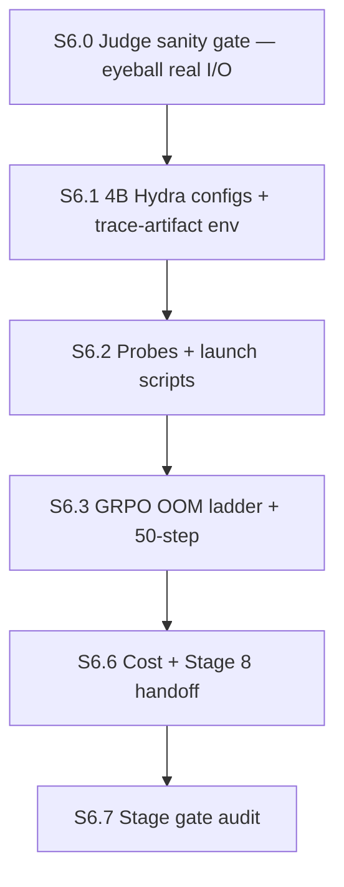

# Stage 6 agent plan — 4B fit check (Path C)

**Stage ID:** `stage-06`
**Status:** **SLIMMED 2026-05-30** — S6.4/S6.5 mock-cluster set-arm smokes dropped; replaced by new **S6.0 judge sanity gate** + Stage-8 trace-artifact wiring. Mock path does not exercise the judge; minority/poly 4B fit is now verified by the first ~5 steps of their Stage 8 production runs instead of a dedicated mock smoke.
**Parent runbook:** [`../verl_migration_plan.md`](../verl_migration_plan.md) §2 row 6 + §8 (4B cost priors)
**Reference:** [`../verl-reference.md`](../verl-reference.md) §6 (B200), §7 (Modal limits), §8 (knob cheat sheet — 4B row)
**Predecessor:** Stage 5 PASS (`poly_epo_cot` registered + smoke); Stages 2–3b infrastructure (MathReward, judge service, all three `@register_adv_est` hooks)
**Successor:** Stage 8 full retrain (Stage 7 logging may run in parallel — not a hard gate for S6 dispatch)

---

## How to use this doc

Each section below is **self-contained**. An orchestrator should:

1. Dispatch an **executor agent** with the section's `Executor brief` (+ linked context).
2. When the executor marks done, dispatch an **audit agent** with the same section's `Audit brief`.
3. Only advance to the next section when audit returns **PASS** (or **PASS WITH NOTES** if notes are non-blocking).
4. Record section outcomes in `main-verl/docs/build/stage-06-log.md` (create on first run).

**Roles** — same as prior stages.

| Role | Job |
|------|-----|
| **Orchestrator** | Pick section, enforce DAG order, track config-fix iteration count + spend |
| **Executor** | Implement / run commands; produce artifacts; report logs |
| **Auditor** | Read-only verification against acceptance criteria; no "fix forward" |

**Global constraints (all sections)**

- **Modal profile:** `chicken602` for all Stage 6 work (same rationale as Stages 2–5 — Nancy monitors spend on her dashboard). Stage 8 parallel retrains on Emma/Anastasia accounts are out of scope here.
- **GPU:** `B200:4`, single container, single node (`trainer.nnodes: 1`, `trainer.n_gpus_per_node: 4`).
- **Model:** `Qwen/Qwen3-4B-Base` — **Base, not Instruct**. No chat template on the policy model.
- **Batch size:** `data.train_batch_size: 128` — locked per migration plan §1 / TA. Do **not** drop batch size to pass the fit check; tune micro-batches and memory knobs instead.
- **Manifest:** Polaris-51K **filtered** parquet from Stage 2 (`/vol/data/main-verl/polaris_*.parquet`). No re-upload.
- **Arms:** one 50-step smoke each for `grpo`, `minority_cot`, `poly_epo_cot` — migration plan §2 row 6.
- **Set-arm cluster source for fit smokes:** **`mock`** (`cluster_source: mock`). Judge routing was validated at 1.7B in Stage 3b; Stage 6 isolates **4B trainer VRAM**. Stage 8 configs fork these yamls with `cluster_source: judge`.
- **Reward:** MathReward via Stage 2 router patch — unchanged.
- **Stack:** maxrl @ `MAXRL_COMMIT=7197bbb46a2ecd866da52f6b401ff20a34fe9390`. Do **not** bump SHA.
- **Config-fix budget:** ≤5 micro-batch / memory **ladder rungs** on **GRPO** (S6.1 table — attempts 1–4 are tuning, attempt 5 is FSDP offload last resort before kill). Once GRPO knobs lock, apply **verbatim** to minority/poly smokes — do not re-tune per arm unless that arm OOMs where GRPO did not.
- **Image rebuild budget:** ≤1 rebuild for Stage 6-specific image changes (expect **none** if only yaml/probe edits — Modal rebuilds automatically when snapshotted `main-verl/` changes on next `modal run`).
- **Spend policy:** [`human notes.md`](../human%20notes.md) — smokes under ~$50 each need no extra approval; **three 50-step 4B smokes will likely exceed ~$50 each**. Orchestrator must get Nancy ack before dispatching S6.4/S6.5 if projected per-run cost >$50. Stage budget ~6 B200-hr total (migration plan §2 row 6).
- **Forbidden:** porting `main/train/*` trainer modules; dropping to 1.7B without hitting the kill criterion; `algorithm.adv_estimator=maxrl`.

### Modal freshness (trainer)

Trainer image rebuilds automatically on the next `modal run` when `modal_image.py` or snapshotted `main-verl/` files change. Judge redeploy is **not** required for mock-cluster fit smokes. Record image rebuild count in log if anything beyond yaml/probes changed.

### Pre-flight (read before S6.1)

Stage 6 starts only after:

- **Stage 5 S5.6 PASS** — all three adv estimators registered in the deployed trainer image.
- **Stage 2 S2.6 handoff** — 1.7B knob baseline documented (`ppo_micro_batch_size_per_gpu: 4`, `gpu_memory_utilization: 0.45`, `max_prompt_length: 1024`, `truncation: left`, etc.).
- **Working 1.7B smoke yamls** exist for all three arms (`grpo_smoke_1p7b.yaml`, `minority_cot_smoke_1p7b.yaml`, `poly_epo_cot_smoke_1p7b.yaml` — last two after Stage 5 lands).

---

## Stage gate (final)

Stage 6 is **DONE** when all section audits pass and:

1. **S6.0 judge sanity PASS** — 3 real Polaris prompts traced; human verdict that decoded problem, rollouts, judge prompt, and judge JSON output are all sensible.
2. **4B loads at production batch size.** `Qwen/Qwen3-4B-Base` runs with `data.train_batch_size: 128` on `B200:4` without OOM at the locked micro-batch / memory settings.
3. **Micro-batch ladder documented.** Final values for `ppo_micro_batch_size_per_gpu`, `log_prob_micro_batch_size_per_gpu`, `gpu_memory_utilization`, and any FSDP offload / vLLM `tensor_model_parallel_size` changes recorded in `stage-06-log.md` S6.6 handoff.
4. **GRPO 50-step smoke complete** — reaches `total_training_steps: 50` with no OOM, no NaN, no traceback. (Set-arm 50-step mock smokes dropped; set-arm fit confirmed at Stage 8 startup.)
5. **First 4B `$/step` measurement** — wall time × Modal B200 rate from the GRPO smoke; fills migration plan §8 "4B on VeRL: TBD after Stage 6".
6. **Stage 8 trace-artifact env block** present in the set-arm yaml fork checklist (S6.6 handoff).

**Stage kill =** (migration plan §2 row 6)

- OOM persists at **`ppo_micro_batch_size_per_gpu: 1`**, **`log_prob_micro_batch_size_per_gpu: 1`**, **`gpu_memory_utilization: 0.30`**, **`tensor_model_parallel_size: 2`**, **and** FSDP param/CPU offload enabled — escalate to Nancy; **fall back to 1.7B** for Stage 8 (migration plan kill path).
- Any arm cannot complete 50 steps after applying the locked GRPO knobs (set-arm-specific OOM) — one config-fix iteration to drop set-arm-only overhead; then kill if still failing.
- Cannot fit `train_batch_size: 128` even at micro-batch 1 — **do not** silently reduce batch size; that violates TA policy. Escalate.

---

## Section DAG (slimmed)



| Section | Depends on | Blocks |
|---------|------------|--------|
| **S6.0** | Stage 5 PASS, deployed judge | S6.1, Stage 8 |
| S6.1 | S6.0 (or parallel) | S6.2 |
| S6.2 | S6.1 | S6.3 |
| S6.3 | S6.2 | S6.6 |
| ~~S6.4 minority_cot mock smoke~~ | **DROPPED** — absorbed into Stage 8 smoke gate | — |
| ~~S6.5 poly_epo_cot mock smoke~~ | **DROPPED** — absorbed into Stage 8 smoke gate | — |
| S6.6 | S6.3 | S6.7 |
| S6.7 | S6.6 | Stage 8 |

**Why S6.4/S6.5 dropped:** `cluster_source: mock` exercises neither the judge service nor the real clustering signal — its 4B fit information is fully covered by S6.3 (same model, same batch size, same memory knobs; set-arm overhead is small marginal cost on the kernel side). Set-arm 4B fit is now confirmed by the **first 5 steps of each Stage 8 arm**, gated by S6.0 (judge known good) and S6.3 (knobs locked). If a set arm OOMs in Stage 8 startup where GRPO fit, that's one shared-knob iteration — same recovery as the original S6.4 plan.

---

## S6.0 — Judge sanity gate (NEW, blocks Stage 8 dispatch)

### Objective

Prove the judge is **not garbage** before any 4B credit-burn. Specifically: on real Polaris prompts, the judge receives sensible inputs (problem text + 8 CoT rollouts), returns parseable JSON with 8 cluster assignments, and clusters are non-degenerate.

### Why this exists

Stage 4/4.5 validated parse + agreement on canned inputs. Stage 3b ran end-to-end but `[clusters_judge]` step-print visibility was unreliable (Modal log streaming + Ray-actor stdout — not the trainer driver, but still flaky). We have **never sat down and read what the judge actually sees and says on a real Polaris row.** That has to happen before Stage 8.

### Executor brief

**Run the fast trace probe on 3 prompts** (NOT the full-trainer `minority_cot_judge_trace_smoke.py` — Ray log routing eats its prints; use the no-Ray fast probe):

```bash
export JUDGE_BASE_URL=<chicken602 judge deploy URL>
export JUDGE_AUTH_TOKEN=<token>
export CS224R_JUDGE_TRACE_MAX_CHARS=0   # no truncation

for idx in 0 5 100; do
  CS224R_JUDGE_TRACE_PROMPT_IDX=$idx \
    ./main-verl/scripts/launch_judge_cluster_trace_fast.sh
  # Pull artifact off the volume so we can actually read it locally:
  modal volume get cs224r-artifacts judge_trace_prompt0.json \
    /tmp/judge_trace_idx${idx}.json
done
```

(Volume name is the `ARTIFACTS_VOLUME_NAME` from `infra/modal_volume.py` — substitute if different.)

**Read each artifact** and confirm by eye:

| Check | What "good" looks like | What "garbage" looks like |
|-------|------------------------|---------------------------|
| `decoded_problem` | A math problem matching the Polaris row | Empty, garbled, or full of pad/special tokens |
| `rollouts[0..7]` | 8 distinct CoTs ending in attempted answers | All identical / truncated mid-token / `<eos>` spam |
| `judge_messages.user` | System + problem + 8 numbered rollouts | Missing rollouts, wrong delimiter, prompt cut |
| `envelope_token_ct` | < `judge_max_input_tokens` (36864) | Hits budget on every prompt → overflow_skipped |
| `judge_raw_response` | Valid JSON-ish payload with cluster ids 1–N for rollouts 1–8 | Refusal text, English prose without JSON, "I cannot..." |
| `judge_parse.parse_ok` | `true` | `false` (parse failure → DEGENERATE) |
| `final_cluster_ids.distinct` | ≥ 2 distinct ids (sometimes 1 is fine if all rollouts agree) | Always `[DEGENERATE]` or always `[1]` |

### Acceptance

- **3/3 prompts:** decoded problem looks like a real math problem; 8 rollouts are distinct attempts; judge returned parseable JSON with 8 assignments.
- **≥ 2/3 prompts:** `distinct_clusters >= 2` (some prompts will legitimately collapse to 1 cluster if rollouts agree — not a failure unless all do).
- **0/3 prompts:** envelope overflow on a "normal" Polaris row (overflow on a long outlier is fine; >50% overflow rate means the budget is wrong).

If any check fails on a typical row → **STOP. Do not dispatch Stage 8.** File the failure in `stage-06-log.md` S6.0 and debug the specific layer (decode, prompt assembly, judge prompt, judge model itself).

### Audit brief

- [ ] 3 artifacts present at `/tmp/judge_trace_idx{0,5,100}.json`.
- [ ] Human signed off on each (paste short verdict into `stage-06-log.md` S6.0).
- [ ] No silent degenerate fallback on typical rows.

### Artifacts

| Path | Action |
|------|--------|
| `main-verl/docs/build/stage-06-log.md` | append S6.0 sanity verdict + per-prompt notes |

---

## S6.1 — 4B Hydra configs (three arms)

### Objective

Fork the three 1.7B smoke configs to 4B with identical trainer topology except model path and memory knobs.

### Executor brief

**Create** (by copying the corresponding 1.7B yaml):

| File | Source | `adv_estimator` |
|------|--------|-----------------|
| `main-verl/configs/grpo_smoke_4b.yaml` | `grpo_smoke_1p7b.yaml` | `grpo` |
| `main-verl/configs/minority_cot_smoke_4b.yaml` | `minority_cot_smoke_1p7b.yaml` | `minority_cot` |
| `main-verl/configs/poly_epo_cot_smoke_4b.yaml` | `poly_epo_cot_smoke_1p7b.yaml` | `poly_epo_cot` |

**Required deltas (all three files):**

```yaml
actor_rollout_ref:
  model:
    path: Qwen/Qwen3-4B-Base          # was: Qwen3-1.7B-Base
  actor:
    ppo_micro_batch_size_per_gpu: 2     # ladder start (1.7B used 4)
  rollout:
    gpu_memory_utilization: 0.40        # ladder start (1.7B used 0.45)
    log_prob_micro_batch_size_per_gpu: 2
    tensor_model_parallel_size: 1       # bump to 2 in ladder if rollout OOM
  ref:
    log_prob_micro_batch_size_per_gpu: 2

data:
  train_batch_size: 128                 # DO NOT CHANGE

trainer:
  total_training_steps: 50
  experiment_name: <arm>_smoke_4b       # e.g. grpo_smoke_4b
  default_local_dir: /vol/checkpoints/main-verl/<arm>_smoke_4b
  wandb_kwargs:
    entity: 224r-project
    tags: [verl, stage-06, <arm>, smoke, 4b, mock_clusters]   # set arms: mock_clusters
```

**Set-arm blocks** (`minority_cot`, `poly_epo_cot`):

```yaml
algorithm:
  minority_cot:          # or poly_epo_cot:
    cluster_source: mock
    n_clusters: 4
    seed: 0
    global_seed: 0       # minority_cot only
```

Remove any `tokenizer_path` / `judge_*` keys from the 1.7B judge yaml if accidentally copied — not used for mock fit smokes.

**Live judge-trace wiring (Stage 8 yamls — do NOT enable for S6.3 GRPO ladder):** Stage 8 set-arm yamls (`minority_cot_train_4b_1epoch.yaml`, `poly_epo_cot_train_4b_1epoch.yaml`) must include the per-step judge trace artifact env block so we get production-equivalent visibility into what the judge actually saw on every training step. Pattern (mirrors `minority_cot_judge_trace_1p7b.yaml`):

```yaml
+ray_kwargs:
  ray_init:
    num_gpus: <n_gpus_per_node>
    runtime_env:
      env_vars:
        CS224R_JUDGE_TRACE: "1"
        CS224R_JUDGE_TRACE_PROMPT_IDX: "0"
        CS224R_JUDGE_TRACE_PATH: "/vol/judge_trace_<arm>_4b_step.json"   # overwritten each step
        CS224R_JUDGE_STEP_LOG: "/vol/judge_step_log_<arm>_4b.jsonl"      # appended each step
        CS224R_JUDGE_TRACE_MAX_CHARS: "0"
```

Mid-training inspection: `modal volume get cs224r-artifacts judge_trace_<arm>_4b_step.json -`. This is the closest-to-real-thing visibility available; no val-freq trick gets us the judge I/O, only the trace artifact does.

**Document in each file header:** Stage 6 fit-check purpose; locked batch size 128; knobs below are starting points for S6.3 ladder; Stage 8 forks add `cluster_source: judge` + judge env vars.

**Micro-batch ladder reference** (append to `stage-06-log.md` when executing S6.3 — define now for auditors):

| Attempt | `ppo_micro_batch` | `log_prob_micro_batch` | `gpu_memory_utilization` | `tensor_model_parallel_size` | FSDP offload |
|---------|-------------------|------------------------|--------------------------|------------------------------|--------------|
| 1 | 2 | 2 | 0.40 | 1 | off |
| 2 | 2 | 2 | 0.35 | 1 | off |
| 3 | 1 | 1 | 0.35 | 1 | off |
| 4 | 1 | 1 | 0.30 | 2 | off |
| 5 | 1 | 1 | 0.30 | 2 | param + CPU offload (Hydra keys from maxrl `ppo_trainer.yaml` / FSDP config) |

Each attempt may use **`total_training_steps: 10`** for fast OOM discovery; the **gate** requires a final **50-step** run at the winning settings.

### Audit brief

- [ ] Three yaml files exist at paths above.
- [ ] All use `Qwen/Qwen3-4B-Base`, `train_batch_size: 128`, `rollout.n: 8`.
- [ ] Set-arm configs use `cluster_source: mock` only (no judge keys required).
- [ ] `algorithm.adv_estimator` correct per file; no `maxrl`.
- [ ] W&B tags include `verl`, `stage-06`, `4b`.
- [ ] Ladder table present in log or plan section.

### Artifacts

| Path | Action |
|------|--------|
| `main-verl/configs/grpo_smoke_4b.yaml` | create |
| `main-verl/configs/minority_cot_smoke_4b.yaml` | create |
| `main-verl/configs/poly_epo_cot_smoke_4b.yaml` | create |

---

## S6.2 — Probes + launch scripts

### Objective

One Modal probe pattern per arm (or one parametrized probe) for 4B fit smokes.

### Executor brief

**Create** `main-verl/probes/grpo_smoke_4b.py` by copying `grpo_smoke.py` / `minority_cot_smoke.py` pattern:

- Config name: `grpo_smoke_4b`
- Checkpoint dir: `/vol/checkpoints/main-verl/grpo_smoke_4b`
- Pre-flight: `assert "grpo" in ADV_ESTIMATOR_REGISTRY` (or built-in GRPO path — verify import)
- Default app: `cs224r-verl-stage06`

**Create** `minority_cot_smoke_4b.py` and `poly_epo_cot_smoke_4b.py` similarly with registry asserts for `"minority_cot"` / `"poly_epo_cot"`.

**Create** launch scripts:

```bash
# main-verl/scripts/launch_grpo_smoke_4b.sh
export CS224R_APP_NAME="${CS224R_APP_NAME:-cs224r-verl-stage06}"
export MODAL_PROFILE=chicken602
python3 -m modal run main-verl/probes/grpo_smoke_4b.py "$@"
```

Mirror for `launch_minority_cot_smoke_4b.sh`, `launch_poly_epo_cot_smoke_4b.sh`.

**Patch** `main-verl/README.md` — bring-up bullets for the three launch scripts.

**Optional cost saver:** support env var `CS224R_SMOKE_STEPS=10` that overrides `trainer.total_training_steps` via Hydra CLI for ladder attempts only — document in probe header.

### Audit brief

- [ ] Three probes + three launch scripts exist, executable.
- [ ] Each probe targets the matching `--config-name *_smoke_4b`.
- [ ] Registry pre-flight asserts present for custom estimators.
- [ ] Default app `cs224r-verl-stage06`.
- [ ] README updated.

### Artifacts

| Path | Action |
|------|--------|
| `main-verl/probes/grpo_smoke_4b.py` | create |
| `main-verl/probes/minority_cot_smoke_4b.py` | create |
| `main-verl/probes/poly_epo_cot_smoke_4b.py` | create |
| `main-verl/scripts/launch_*_smoke_4b.sh` ×3 | create |
| `main-verl/README.md` | patch |

---

## S6.3 — GRPO 4B OOM ladder + 50-step smoke

### Objective

Find the smallest micro-batch / memory config that runs 50 GRPO steps at bs=128 on 4× B200. Lock knobs for S6.4/S6.5.

### Executor brief

**Run ladder** on `grpo_smoke_4b.yaml` per S6.1 table. Use 10-step runs for attempts 1–4 if OOM; only the winning config gets a full 50-step run.

```bash
export CS224R_APP_NAME=cs224r-verl-stage06
export MODAL_PROFILE=chicken602
./main-verl/scripts/launch_grpo_smoke_4b.sh 2>&1 | tee /tmp/s6.3_grpo_4b.log
```

**On OOM:** classify failure phase from log (`rollout` / `ref logprob` / `actor backward` / `FSDP init`) — drives which knob to move next per ladder table.

**On PASS (50/50 steps):** record to `stage-06-log.md`:

- Winning knob dict (copy-paste yaml snippet).
- Wall time, steps/sec, estimated `$/step`.
- Metrics excerpt: `critic/score/mean`, `response_length/mean`, `response_length/max` (note if 100% hit max — Stage 7/8 `finish_reason` follow-up).
- W&B run URL.

**Apply locked knobs** to `minority_cot_smoke_4b.yaml` and `poly_epo_cot_smoke_4b.yaml` before S6.4/S6.5 — single source of truth in log + yaml files updated in-repo.

### Audit brief

- [ ] Ladder attempts documented with failure mode per attempt.
- [ ] Final 50-step GRPO smoke PASS.
- [ ] `train_batch_size` remained 128 throughout.
- [ ] Locked knobs written to log and propagated to set-arm yamls.
- [ ] `$/step` estimate recorded.

### Known failure modes

| Symptom | Knob move |
|---------|-----------|
| vLLM OOM at rollout init | ↓ `gpu_memory_utilization` or ↑ `tensor_model_parallel_size` |
| Actor backward OOM | ↓ `ppo_micro_batch_size_per_gpu` |
| Ref logprob OOM | ↓ `log_prob_micro_batch_size_per_gpu` |
| All above at minimum | Enable FSDP offload |
| Still OOM with offload | **Stage kill** → 1.7B fallback |

### Artifacts

| Path | Action |
|------|--------|
| `main-verl/configs/minority_cot_smoke_4b.yaml` | edit (locked knobs) |
| `main-verl/configs/poly_epo_cot_smoke_4b.yaml` | edit (locked knobs) |
| `main-verl/docs/build/stage-06-log.md` | append ladder + GRPO smoke |

---

## ~~S6.4 — `minority_cot` 4B 50-step smoke~~ — **DROPPED**

**Why dropped (2026-05-30):** `cluster_source: mock` does not exercise the judge; it adds a synthetic clustering kernel that's already covered by unit tests (`test_objective_minority.py`) and was validated end-to-end on 1.7B in Stage 3b. Running a 50-step mock smoke at 4B burns ~$50+ in B200 credit for information already in hand. Set-arm 4B **fit** is verified instead by the first 5 steps of the Stage 8 production run with `cluster_source: judge`; if it OOMs where GRPO fit, recovery is one shared-knob iteration (re-run GRPO to confirm regression, then retry) — same procedure as the original S6.4 plan.

Original S6.4 brief retained below for reference if a mock smoke is needed for a different reason.

<details>
<summary>Original S6.4 brief</summary>

### Objective

Confirm the set-based minority arm fits at the GRPO-locked knobs (mock clusters).

### Executor brief

**Precondition:** S6.3 locked knobs applied; Nancy spend ack if projected >$50.

```bash
./main-verl/scripts/launch_minority_cot_smoke_4b.sh 2>&1 | tee /tmp/s6.4_minority_4b.log
```

**Pass:** 50/50 steps, no OOM/NaN, `train/mean_advantage` and `train/distinct_clusters` logged (non-degenerate clusters).

**If OOM where GRPO passed:** one iteration — drop only set-arm-irrelevant overhead is unlikely; more likely need shared knob tweak. If shared knob tweak needed, **re-run GRPO 50-step** to confirm regression, then retry minority.

### Audit brief

- [ ] 50 steps complete.
- [ ] Uses locked knobs from S6.3 (diff yaml against log).
- [ ] `cluster_source: mock`.
- [ ] W&B tagged `minority_cot`, `stage-06`, `4b`.

### Artifacts

| Path | Action |
|------|--------|
| `main-verl/docs/build/stage-06-log.md` | append minority smoke metrics |

</details>

---

## ~~S6.5 — `poly_epo_cot` 4B 50-step smoke~~ — **DROPPED**

Same rationale as S6.4. Original brief retained below.

<details>
<summary>Original S6.5 brief</summary>

### Objective

Same as S6.4 for the third arm.

### Executor brief

```bash
./main-verl/scripts/launch_poly_epo_cot_smoke_4b.sh 2>&1 | tee /tmp/s6.5_poly_epo_4b.log
```

**Pass criteria:** identical structure to S6.4; `train/mean_advantage` should differ from minority at matched steps (sanity — same check as Stage 5 gate, optional note if identical would indicate hook bug).

### Audit brief

- [ ] 50 steps complete.
- [ ] Locked knobs match S6.3.
- [ ] W&B tagged `poly_epo_cot`, `stage-06`, `4b`.

### Artifacts

| Path | Action |
|------|--------|
| `main-verl/docs/build/stage-06-log.md` | append poly_epo smoke metrics |

</details>

---

## S6.6 — Cost capture + Stage 8 config handoff

### Objective

Fill migration plan §8 4B cost prior and produce Stage 8 yaml fork instructions.

### Executor brief

**Compute** from the three smokes (minimum: GRPO; ideal: all three):

```
$/step ≈ (wall_clock_s × modal_b200_$per_s × 4_gpus) / steps_completed
```

Record Modal B200 $/s used (from Modal billing UI or prior stage logs).

**Produce handoff block** in `stage-06-log.md`:

| Field | Value |
|-------|-------|
| Locked 4B knobs | yaml snippet |
| GRPO `$/step` | |
| minority_cot `$/step` | |
| poly_epo_cot `$/step` | |
| Steps/epoch @ bs=128 | ~400 (51139/128) |
| Stage 8 1-epoch cost estimate | `$/step × 400 × 3 arms + judge` |
| 1.7B fallback triggered? | yes/no |

**Stage 8 yaml fork checklist** (document, do not implement unless Stage 8 dispatch follows immediately):

1. Copy `*_smoke_4b.yaml` → `*_train_4b_1epoch.yaml`.
2. Set `total_training_steps: 400` (or manifest-derived exact count).
3. Set-arm yamls: `cluster_source: judge`, add `tokenizer_path: Qwen/Qwen3-4B-Base`, judge model/env from Stage 3b handoff.
4. `experiment_name` / checkpoint dirs → production names per arm.
5. W&B tags → `stage-08`, `1epoch`, arm name.
6. **Set-arm yamls only:** add the `CS224R_JUDGE_TRACE` env block from S6.1 so per-step judge I/O lands on `/vol/`. Distinct artifact paths per arm so the two runs do not stomp each other.
7. **All arms:** add `finish_reason="length"` wiring (Stage 7 prereq) so we can later filter / report on truncated responses.
8. **Set-arm only:** put a soft step-gate in the launch script — after step 5, sanity-check the latest `judge_trace_<arm>_4b_step.json`; if the judge is returning garbage at 4B (different model, different rollouts than 1.7B smoke), stop the run before burning the full epoch.

### Audit brief

- [ ] `$/step` recorded for GRPO at minimum.
- [ ] Stage 8 cost order-of-magnitude computed.
- [ ] Handoff checklist present.
- [ ] Kill/fallback status explicit.

### Artifacts

| Path | Action |
|------|--------|
| `main-verl/docs/build/stage-06-log.md` | append S6.6 handoff |

---

## S6.7 — Stage gate audit (read-only)

### Objective

Confirm Stage 6 meets migration plan §2 row 6 and unlock Stage 8 planning.

### Auditor brief (no code changes)

Verify **all** of:

1. **Files present:** three `*_smoke_4b.yaml`, three probes, three launch scripts, `stage-06-log.md`.
2. **S6.3 GRPO PASS** — 50 steps, bs=128, locked knobs documented.
3. **S6.4 + S6.5 PASS** — 50 steps each for set arms.
4. **Kill criterion not triggered** — or documented 1.7B fallback with Nancy authorization.
5. **Scope:** no batch-size reduction; no `maxrl`; no `main/train` ports.
6. **Cost:** 4B `$/step` in log for Stage 8 budget.
7. **Handoff:** Stage 8 yaml fork checklist complete.

**Output format:**

```markdown
## S6.7 Stage gate verdict

- **Verdict:** PASS | PASS WITH NOTES | FAIL
- **Auditor:** <agent id or human>
- **Timestamp (UTC):** <UTC>
- **4B fit:** yes | no (fallback 1.7B)
- **Notes:** ...
- **Stage 8 ready:** yes | no
```

### Orchestrator action on PASS

- Update [`../STATUS.md`](../STATUS.md) Stage 6 checkbox.
- Return S6.7 verdict + cost handoff to Nancy before Stage 8 spend.

---

## Orchestrator checklist (quick reference)

| Step | Section | Executor | Audit | Stop if |
|------|---------|----------|-------|---------|
| 0 | **S6.0** | **judge sanity (3 prompts)** | **human eyeball verdict** | **judge garbage on typical row** |
| 1 | S6.1 | 4B yamls + trace env block | yaml review | bs≠128 |
| 2 | S6.2 | probes + scripts | code review | missing asserts |
| 3 | S6.3 | GRPO ladder + 50-step | knob lock | kill ladder exhausted |
| ~~4~~ | ~~S6.4~~ | **dropped** | — | — |
| ~~5~~ | ~~S6.5~~ | **dropped** | — | — |
| 6 | S6.6 | $/step + handoff | cost recorded | — |
| 7 | S6.7 | — | stage gate | any prior fail |

---

## Known failure modes (quick reference)

| Section | Symptom | Action |
|---------|---------|--------|
| S6.3 | OOM at rollout | Ladder ↓ util or ↑ TP |
| S6.3 | OOM at actor | ↓ ppo micro-batch |
| S6.3 | All ladder steps fail | Kill → 1.7B fallback |
| S6.4/5 | OOM but GRPO passed | One shared-knob tweak + GRPO re-verify |
| Any | `response_length/max=4096` on 100% steps | Note for Stage 7/8; not S6 kill |

---

## Related docs

| Doc | Role |
|-----|------|
| [`stage-06-log.md`](./stage-06-log.md) | Run record |
| [`stage-05-agent-plan.md`](./stage-05-agent-plan.md) | Predecessor |
| [`../verl_migration_plan.md`](../verl_migration_plan.md) | §2 row 6, §8 cost |
| [`../human notes.md`](../human%20notes.md) | Spend policy |

---

## Open items

- [ ] Exact FSDP offload Hydra keys — read from maxrl `ppo_trainer.yaml` at pinned SHA during S6.3 attempt 5.
- [ ] Modal B200 $/s for cost formula — pull from billing at smoke time.
- [ ] Stage 5 must PASS before dispatch (all three estimators in image).

---

## Plan audit record

**Auditor:** isolated agent (migration plan + this doc only), 2026-05-30  
**Verdict:** no blocking issues raised (summary review)  
**Reconciled:** aligned config-fix budget wording with 5-rung ladder table (was "≤4 iterations" vs 5 rungs).
