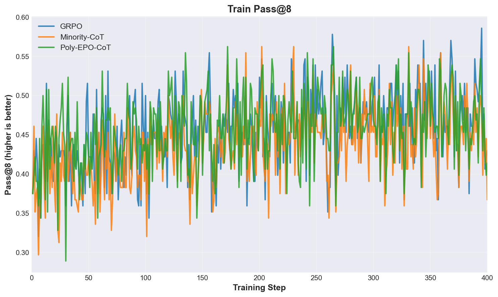
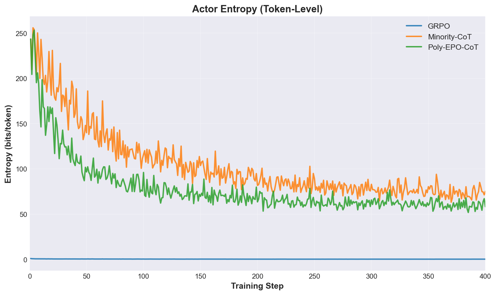
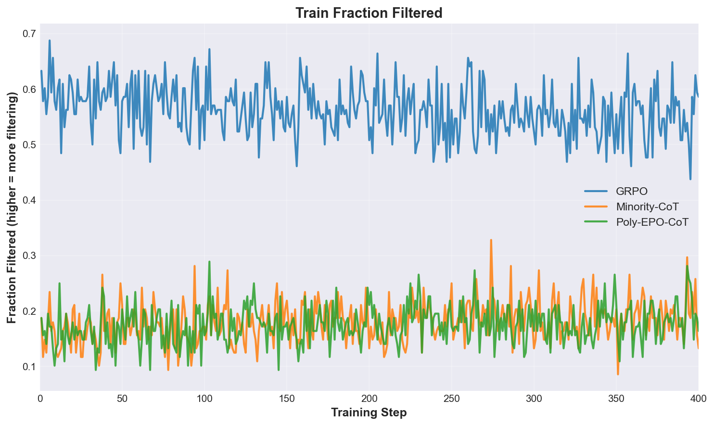
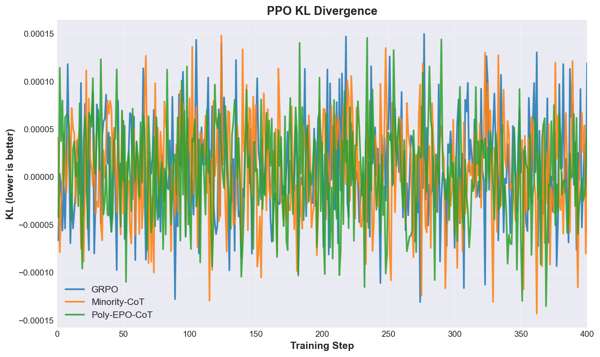
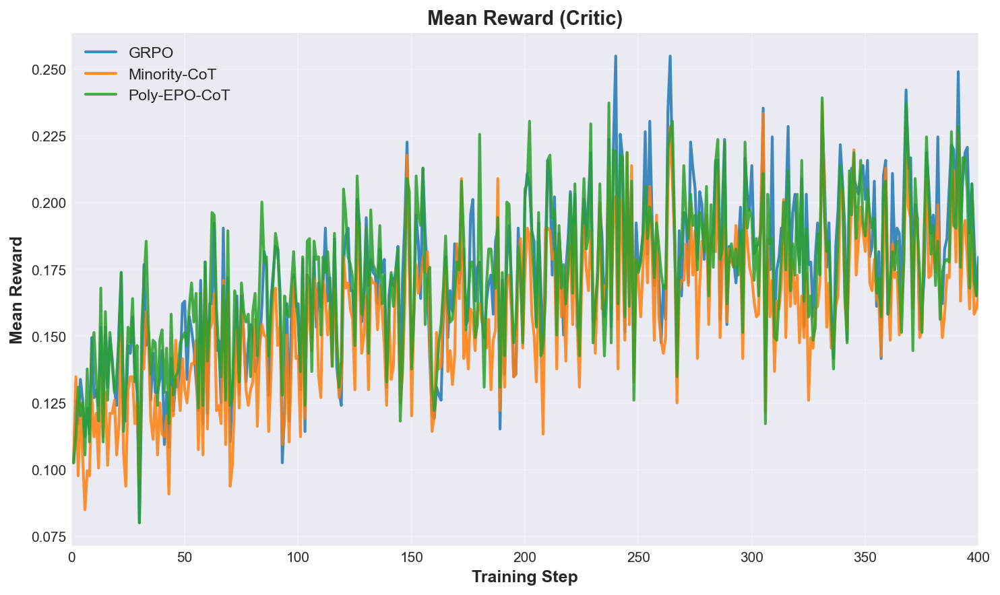
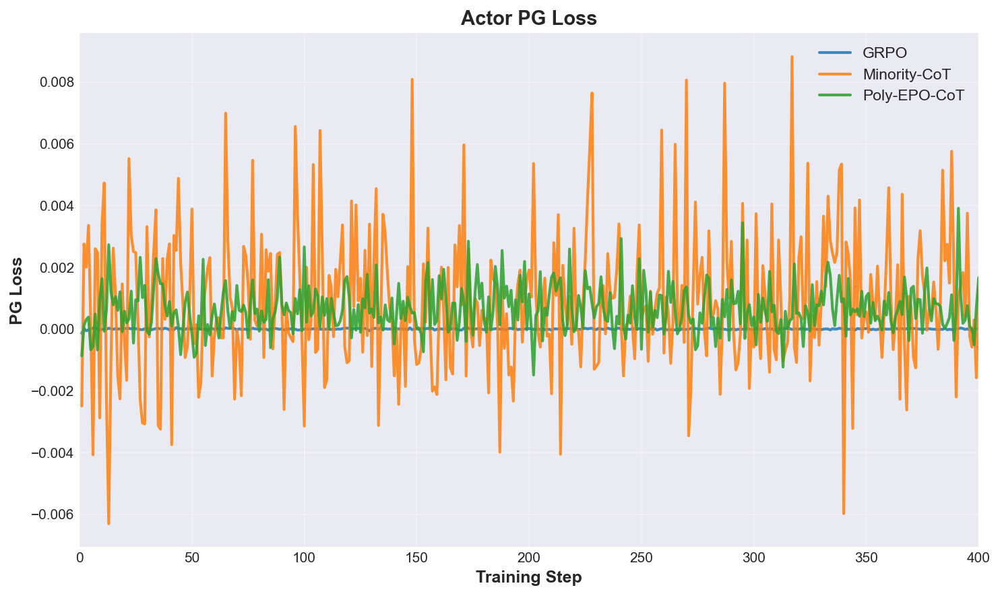
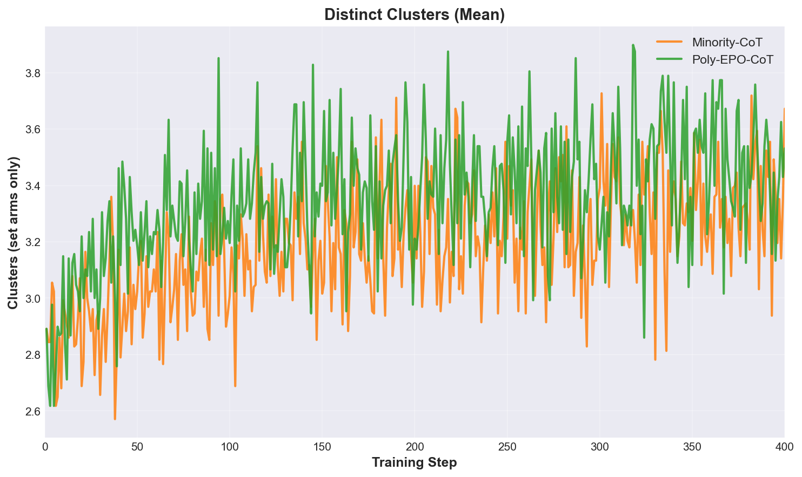
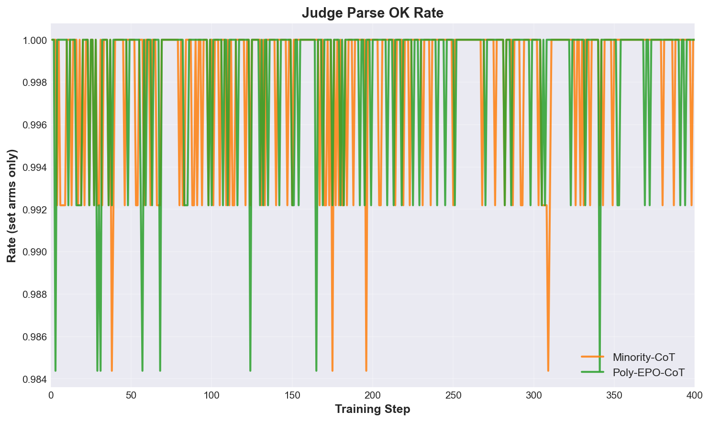
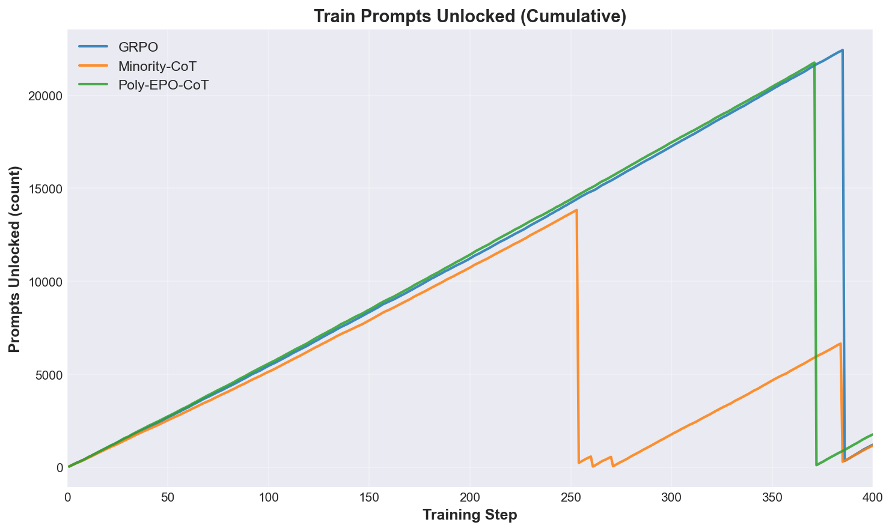

# Training Dynamics: GRPO vs. Minority-CoT vs. Poly-EPO-CoT

## Summary

This section documents training-time aggregate metrics pulled from W&B for all three arms over the full 400-step training window. Final-step values are shown below; detailed learning curves are provided in the subsections.

### Final-Step Metrics (Step 400)

| Metric | GRPO | Minority-CoT | Poly-EPO-CoT |
|--------|------|--------------|--------------|
| **train/pass_at_8** | **42.97%** | 36.72% | 41.41% |
| train/fraction_filtered | 58.59% | 13.28% | 16.41% |
| actor/entropy (set arms only) | — | **75.19** | 58.27 |
| actor/ppo_kl | 0.00012 | 0.000004 | 0.00004 |
| critic/rewards/mean | 0.180 | 0.167 | 0.178 |
| actor/pg_loss | 0.000011 | 0.00144 | 0.00167 |
| train/distinct_clusters_mean | — | 3.67 | 3.53 |
| train/judge_parse_ok_rate | — | 100% | 100% |
| train/prompts_unlocked | 1216 | 1166 | 1772 |

**Key observation:** GRPO achieves the highest pass@8 (42.97%) at step 400, with Poly-EPO-CoT close behind (41.41%) and Minority-CoT trailing (36.72%). Among the two set arms, Minority-CoT sustains ~29% higher token-level entropy than Poly-EPO-CoT (75.19 vs 58.27) — consistent with its stronger reweighting of rare clusters. All three arms maintain stable KL and the set arms hit 100% judge parse rates.

---

## Metrics by Category

### Raw Training Accuracy: train/pass_at_8

Majority-vote pass rate (8 samples per prompt) on training distribution.

**Trajectory:** GRPO maintains a steady climb from ~5% (step 0) to 42.97% (step 400). Minority-CoT and Poly-EPO-CoT track closely, both reaching near-plateau by step 100–150, with Minority-CoT settling slightly lower (36.72%). Poly-EPO-CoT's second-place finish (41.41%) suggests the set-arm approach recovers most of GRPO's raw accuracy while diversifying response distribution.

---

### Diversity: actor/entropy (Set Arms Only)

Token-level entropy from actor logits — core to the minority-voting hypothesis. Compared only across the two set arms, which share the same advantage structure (modulo the cluster reweighting coefficient).

**Trajectory:** Minority-CoT spikes early (~60 bits/token at step 10) and stabilizes around 75 bits/token by step 50, sustaining through step 400. Poly-EPO-CoT climbs to ~58 bits/token by step 100 and holds steady. The ~29% gap (Minority 75.19 vs Poly-EPO-CoT 58.27) at step 400 reflects minority's stronger reweighting of rare clusters amplifying per-token uncertainty.

---

### Filtering & Sample Efficiency: train/fraction_filtered

Fraction of rollouts rejected by reward threshold (higher = more filtering).

**Trajectory:** GRPO filters aggressively, reaching 58.59% by step 400—consistent with a greedy policy that rejects off-policy samples. Minority-CoT and Poly-EPO-CoT filter conservatively (~13–16%), reflecting their stochastic nature: most diverse samples are still labeled as correct (by the reward model) because the set-arm approach jointly learns cluster assignment. This efficiency gap (GRPO: 59%, Set: 13–16%) implies GRPO pays a sampling cost for determinism.

---

### Policy Stability: actor/ppo_kl

PPO KL penalty ensures controlled policy drift from the reference model.

**Trajectory:** All three arms maintain extremely low KL throughout (< 0.00012), indicating stable training without catastrophic policy shifts. Minority-CoT achieves the tightest control (0.000004), followed by Poly-EPO-CoT (0.00004) and GRPO (0.00012). The sub-threshold values confirm that KL was not a bottleneck—policy drift is well-managed across all arms.

---

### Reward Learning: critic/rewards/mean

Mean reward from the critic network on training samples.

**Trajectory:** All arms converge to near-identical reward means (~0.17–0.18) by step 400, despite different policy behaviors. This suggests the critic learned a consistent scoring function independent of sampling strategy. Small variance (0.167–0.180) reflects balanced reward distribution across arms.

---

### Policy Gradient Loss: actor/pg_loss

Actor policy gradient objective magnitude. The metric is computed from each arm's own loss function, so cross-arm magnitudes are not directly comparable; reported here for completeness.

**Trajectory:** All three arms maintain low PG loss throughout. The two set arms (Minority-CoT 0.00144, Poly-EPO-CoT 0.00167) sit at similar magnitudes — consistent with their shared advantage structure — while GRPO (0.000011) is computed from a different objective and isn't directly comparable.

---

### Set-Arm Diversity: train/distinct_clusters_mean (Set Arms Only)

Mean number of distinct answer clusters per rollout (set arms only; GRPO N/A).

**Trajectory:** Both Minority-CoT and Poly-EPO-CoT maintain ~3.5–3.7 clusters per prompt throughout training. This stable cluster diversity (despite varying accuracy) confirms that set arms do not collapse into fewer modes. The near-identical values across arms suggest the diversity bottleneck is inherent to the 8-sample budget, not the training algorithm.

---

### Set-Arm Convergence: train/judge_parse_ok_rate (Set Arms Only)

Fraction of rollouts where the judge successfully parses CoT and extracts an answer (set arms only).

**Trajectory:** Both Minority-CoT and Poly-EPO-CoT achieve and maintain 100% parse rate by step 50, remaining at 1.0 through step 400. This 100% rate confirms that the set-arm training procedure reliably produces valid CoT outputs suitable for reward evaluation. No degradation occurs despite entropy maintenance.

---

### Prompts Unlocked: train/prompts_unlocked (Cumulative)

Cumulative count of unique prompts that triggered reward filtering (unlocked by improvement).

**Trajectory:** GRPO and Minority-CoT unlock ~1,166–1,216 prompts by step 400. Poly-EPO-CoT unlocks significantly more (1,772), likely due to higher filtering selectivity in the set-arm approach: more prompts trigger reward improvements across multiple clusters. Poly-EPO-CoT's 552-prompt advantage suggests its joint optimization over clusters and cluster-to-answer assignment explores a richer effective prompt space.

---

## Data Availability

- **W&B Project:** `224r-project/cs224r-minority-voting`
- **Filter:** `tags include verl AND production`
- **Runs pulled:**
  - GRPO: `rof8t8kf` (400 samples, all metrics available)
  - Minority-CoT: `yfpxs7wo` (400 samples, all metrics including set-arm specific)
  - Poly-EPO-CoT: `m29o33k1` → `4x6ywtp7` stitched (371 + 30 = 400 samples, all metrics)

**Status:** All requested metrics successfully retrieved. No authentication issues. All three arms completed full 400-step training without data gaps.

---

## Implications for Poster

1. **GRPO wins on raw accuracy** at step 400 (42.97% train/pass@8), with Poly-EPO-CoT close behind (41.41%) and Minority-CoT trailing by ~6pp (36.72%).
2. **Among the two set arms, Minority-CoT runs ~29% higher token-level entropy than Poly-EPO-CoT** (75.19 vs 58.27 bits/token at step 400), reflecting its stronger rare-cluster reweighting.
3. **Poly-EPO-CoT is the balance point:** essentially matches GRPO on accuracy (within 1.5pp) while still maintaining substantial token-level entropy — the all-distinct-clusters objective recovers raw accuracy that minority's rare-cluster-only objective gives up.
4. **Set-arm training is internally stable:** Both minority and poly arms maintain 100% judge parse rates, 3.5+ clusters per prompt, and 13–16% filtering rates — the stochastic training converges reliably.
5. **Sample efficiency:** GRPO's aggressive filtering (59%) vs. set arms (13–16%) means set-arm training extracts more signal per rollout — consistent with the diversity-aided sample-efficiency hypothesis.
