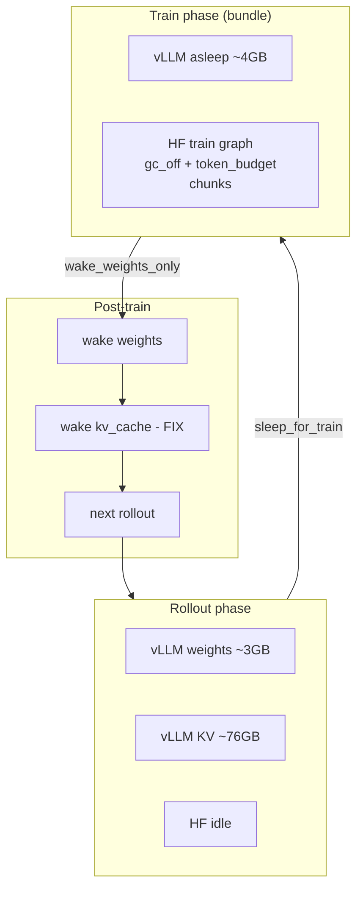

# B200 minority_answer — RAM vs speed model

**As of:** 2026-05-27  
**Baseline:** B200 smoke `wdl3fczm` — `token_budget=105k`, `gradient_checkpointing=true`, `vllm_sleep=0`, `logprob_seq_batch=1`, `n_kept≈512`, Modal usable VRAM **~178–180 GB** (`device_vram_total_gb≈178.35`).

**Target bundle (user plan):** `vllm_sleep=1` + `gradient_checkpointing=false` + raise `token_budget` until HF-train peak **~170–175 GB** (3–8 GB margin below cap).

---

## 1. Binary knobs (sleep × gc)

Assumptions for estimates (not measured unless tagged):

- **Δgc_off** on `t_train_fwd_bwd`: **−80 to −110 s** (mostly `t_backward`; audit range).
- **Δsleep** overhead: **+3–5 s/step** (sleep + staged wakes; `sleep.log`: fall asleep **2.99 s**).
- **Chunk boundary overhead:** **~25–35 s per extra chunk** vs one fewer chunk at same total tokens (timeline / 90k→105k history).
- **VRAM decomposition (estimate):** at collocated peak, `vram_peak ≈ vLLM_resident + HF_train`; vLLM at `gpu_memory_utilization=0.45` reserves **~80 GiB** (weights **~3.2 GiB** + KV **~76 GiB** per `gc_off.log`).

| sleep | gc | Feasible? | vram_peak (GB) | t_train_fwd_bwd | t_backward | t_logprob_fwd | step (roll+train) | Evidence |
|:-----:|:--:|:---------:|:--------------:|:---------------:|:----------:|:-------------:|:-----------------:|----------|
| off | on | **yes** | **148.5** | **208.5** | **197.0** | **11.4** | **~266** (58.5+208.5) | **measured** `wdl3fczm` |
| off | off | **OOM** | **178.3** (at crash) | — | — | — | — | **measured** `sfp0xwag` step0 OOM; 178.31/178.35 GiB in use |
| on | on | **partial** | **~72–85** during HF train *(est.)*; rollout peak ~148 *(est.)* | **~208–212** *(est.)* | **~197** *(est.)* | **~11** *(est.)* | **~269–271** *(est.)* | **measured** sleep freed **83.84 GiB** (`yqlmvnw0`); train ran; **no wandb step metrics**; `wake_up(tags=['weights'])` **0.098 s**; **full `wake_up()` cumem crash** |
| on | off | **yes** *(predicted)* | **~102–120** at low budget; **tune → 170–175** | **~98–128** | **~87–117** | **~11** | **~157–175** | **estimate:** gc_off needs **~+30 GiB** HF vs baseline; sleep frees **~84 GiB** vLLM → net **~+54 GiB** headroom before budget fill |

**Readout**

- **gc off without sleep** does not fit: collocated HF+KV already pins the GPU (**measured OOM**).
- **sleep alone** is a **VRAM gate**, not a speed win: train phase likely similar to baseline; step cost is **+sleep/wake** until wake is fixed.
- **sleep + gc off** is the intended prod bundle: sleep buys the **~30 GiB** gc_off needs; remaining headroom should be spent on **`token_budget`** (fewer chunks + larger activation graphs), not `seqbatch` first.

---

## 2. Token budget sliding scale

**Token accounting anchor** (minority smoke, early steps): `n_kept=512`, mean completion length **~850 tokens** → total completion tokens **T ≈ 435k** per step (435k / 105k ≈ 4.1 → **5 chunks** matches `wdl3fczm`).

**Chunk count model:** `num_chunks = ⌈T / token_budget⌉` (greedy packing; actual ≤ this when lengths are skewed).

**VRAM model (gc on, sleep off):** measured slope **105k→130k**: **+8.5 GB** peak for **−1 chunk** (148.5 → 157 GB, 5 → 4 chunks). Use **~0.34 GB per 1k token_budget** as a local linear fit *(estimate outside measured points)*.

**Step-time model (gc on, sleep off):**

- **Δchunks:** each extra chunk ≈ **+25–35 s** on `t_train_fwd_bwd` *(estimate)*.
- **Δbudget at fixed chunks:** 130k partial shows **~0 s** step delta vs 105k (266s) — chunk drop and larger per-chunk work nearly cancel; do not assume 25% win from budget alone at `n_kept=512`.

| token_budget | num_chunks (T≈435k) | Δvram vs 105k (GB) | Δstep vs 105k (s) | Notes |
|:------------:|:-------------------:|:------------------:|:-----------------:|-------|
| 75k | 6 | **−5 to −8** *(est.)* | **+25–35** *(est.)* | More chunk boundaries |
| 90k | 5 | **−3 to −5** *(est.)* | **0 to +15** *(est.)* | Same chunk count as 105k |
| **105k** | **5** | **0** | **0** | **measured** `wdl3fczm` |
| 120k | 4 | **+5 to +7** *(est.)* | **−15 to −30** *(est.)* | One fewer chunk |
| **130k** | **4** | **+8.5** | **~0** | **partial measured** `au96bwh1`; backward **194s** (−3s) |
| 145k | 3 | **+12 to +14** *(est.)* | **−20 to −40** *(est.)* | Audit range if chunks drop |
| 160k | 3 | **+14 to +17** *(est.)* | **−20 to −35** *(est.)* | Still 3 chunks at T≈435k |

### Recommended “fill RAM” target (sleep + gc off)

| Phase | token_budget | Target vram_peak (HF train) | Rationale |
|-------|--------------|----------------------------|-----------|
| OOM probe | **70–80k** | **< 120 GB** | Confirm gc_off fits with vLLM asleep; expect **6–7 chunks** — slow, safe |
| Ramp 1 | **105k** | **~125–135 GB** *(est.)* | Match baseline chunking; validate timings vs `wdl3fczm` minus gc savings |
| Ramp 2 | **130–145k** | **~150–165 GB** *(est.)* | Reuse **130k** partial as gc-on reference; with gc off + sleep, land under cap |
| **Fill target** | **~145–155k** *(start)* | **170–175 GB** | **3 chunks**, ~3–8 GB margin on **178 GB**; binary-search in 5–10k steps if OOM/underfill |

Do **not** jump straight to 170k+ on first combined smoke: activation memory scales with **max chunk tokens**, and gc_off raises per-token activation cost.

---

## 3. Recommended experiment sequence

Aligned with bundle: **sleep ON + gc OFF + tuned token_budget**.

| Step | Action | Config sketch | Success gate |
|:----:|--------|---------------|--------------|
| **0** | **Fix wake (kv_cache tag)** | `wake_for_rollout()` → staged `wake_up(tags=['kv_cache'])` after `wake_weights_only()`; keep `empty_cache` before wakes | **10/10 steps**, no `cumem_allocator` crash (`yqlmvnw0` failed on untagged full wake) |
| **1** | **sleep + gc_off + low budget** | `vllm_sleep=1`, `gradient_checkpointing: false`, `token_budget: 75000` | Completes step0–9; `vram_peak_gb_step < 140`; logs show sleep free **~65–84 GiB** |
| **2** | **sleep + gc_off + 105k** | budget **105000** | `vram_peak` **125–145 GB**; `t_train_fwd_bwd` **< 130s** *(target)*; `num_chunks` 5 |
| **3** | **sleep + gc_off + 130k** | budget **130000** | `vram_peak` **150–165 GB**; `num_chunks` 4; compare to `au96bwh1` gc-on curve |
| **4** | **Binary-search budget** | e.g. 140k → 150k → 155k | Peak **170–175 GB**, stable 10 steps |
| **5** | **Optional: seqbatch** | `logprob_seq_batch=8` only if **>5 GB** headroom after step 4 | Only if fwd win (**~4s** measured `fpktmpi5`) worth +**~17 GB** VRAM |

### Currently running / launched smokes (`b200_eff_05-27-0025`)

| Label | Run | Verdict |
|-------|-----|---------|
| **gc_off** | `sfp0xwag` | **Keep result, stop re-running** — proves gc_off needs sleep; negative result is done |
| **sleep** | `yqlmvnw0` | **Re-run after wake fix** — gate for all sleep bundles |
| **budget** | `au96bwh1` (130k, gc on) | **Finish if cheap** — informs chunk/VRAM slope; **low priority** for final bundle (wrong gc/sleep combo) |
| **seqbatch** | `fpktmpi5` | **Cancel / ignore for bundle path** until step 4 headroom — **+17 GB VRAM**, **~+5 s** step for **~4s** fwd win at gc on |

---

## 4. Decision criteria — adopt bundle for prod

Adopt **`vllm_sleep=1` + `gradient_checkpointing=false` + tuned `token_budget`** for `minority_answer` B200 prod only if **all** hold for a **10-step smoke** on the same image/vLLM pin as bring-up:

1. **Stability:** zero OOM, zero `cumem` / wake crashes; checkpoint + weight sync still pass (resume smoke optional).
2. **VRAM:** `vram_peak_gb_step` in **[170, 175] GB** with `vram_headroom_gb_step ≥ 3 GB` every step.
3. **Speed:** `step` (rollout + train) **≤ 200 s** sustained *(stretch)* or **≥ 20% faster** than `wdl3fczm` (**≤ ~213 s**) with documented medians — expect most gain from **`t_backward`** (gc off), second from **fewer chunks**.
4. **Overhead budget:** sleep + wakes **≤ 5 s/step** amortized (measured fall-asleep ~3s; weights wake ~0.1s; kv_cache wake TBD).
5. **Science neutrality:** same `n_kept`, grader, arm, and loss weighting — only infra/config knobs change.
6. **$/step:** not worse than baseline B200 at Modal list rate unless wall-clock win is **>25%** (time-first OK per status doc).

**Do not promote to full run** if wake fix is flaky, if peak drifts **>175 GB** on longer completions, or if `fraction_filtered` rises and `n_kept` drops (chunk model changes).

---

## 5. VRAM budget allocation (collocated step)

### ASCII — phase timeline

```
178 GB GPU cap (Modal B200 usable ~178-180)
┌─────────────────────────────────────────────────────────────────────────────┐
│ ROLLOUT (vLLM active)                                                       │
│  ├─ weights ~3 GiB                                                          │
│  ├─ KV cache ~76 GiB  (0.45 × 178 ≈ 80 GiB vLLM budget)                     │
│  └─ HF idle / small                                                           │
│  measured peak (gc on, no sleep): ~148 GiB total ────────────────────────────│
├─────────────────────────────────────────────────────────────────────────────┤
│ TRAIN (bundle: vLLM sleep level=1)                                          │
│  ├─ vLLM resident ~4 GiB  (sleep.log: 4.16 GiB after sleep)                │
│  ├─ HF train activations + optimizer  ◄── spend freed ~84 GiB here          │
│  │     gc OFF (+~30 GiB vs gc ON)                                           │
│  │     token_budget ↑ (larger chunk graphs, fewer chunk passes)             │
│  └─ TARGET peak 170-175 GiB during this phase                               │
├─────────────────────────────────────────────────────────────────────────────┤
│ WEIGHT SYNC + WAKE                                                          │
│  wake_up(weights) ~0.1s  (OK in yqlmvnw0)                                   │
│  wake_up(kv_cache)  ◄── FIX: must not call full wake after partial          │
│  then rollout again                                                         │
└─────────────────────────────────────────────────────────────────────────────┘
```

### Mermaid — memory owners



---

## Appendix — measured run index

| run_id | Knobs | Key metrics |
|--------|-------|-------------|
| `wdl3fczm` | gc on, sleep off, budget 105k | step **266s**, train **208.5s**, bwd **197s**, vram **148.5**, chunks **5** |
| `au96bwh1` | gc on, budget **130k** | step **266s**, vram **157**, chunks **4**, bwd **194s** |
| `fpktmpi5` | gc on, **seq_batch=8** | step **271s**, vram **167**, chunks **4**, logprob_fwd **7s**, bwd **207s** |
| `sfp0xwag` | **gc off** | OOM **178.3/178.4 GB** step0 |
| `yqlmvnw0` | **sleep on**, gc on | sleep freed **83.84 GiB**; weights wake **0.098s**; **full wake cumem crash** |

**Refs:** [B200_efficiency_smoke_plan.md](../reference/efficiency/B200_efficiency_smoke_plan.md), probe logs `main/docs/probes/artifacts/b200_eff_05-27-0025/`, [efficiency/status_2026-05-27T0510Z.md](./status_2026-05-27T0510Z.md).
