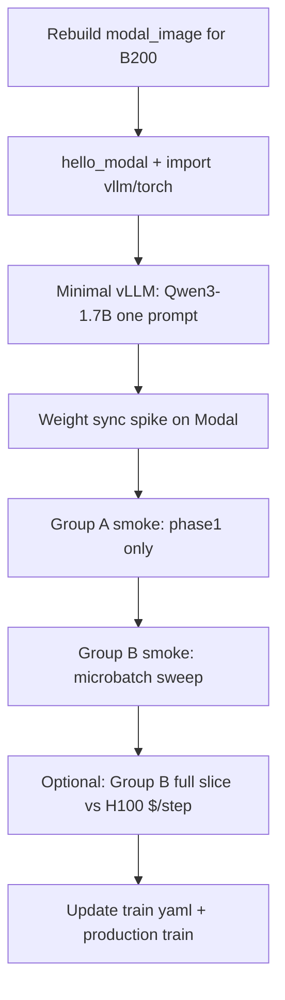

# B200 migration analysis (cs224r_finalproject)

> **Snapshot at commit `b01999fc134329a19e521ce48675d7395cb86419` (`b01999f`) on `2026-05-26T034425Z` (UTC).**  
> **Working tree was dirty** at write time (`probe_step_b`, `group_b_step_probe.py`, PLAN/docs edits unstaged).  
> **Recommendations may be stale** after codebase, Modal stack, or vLLM version changes. Re-stamp or re-run Group B smoke before acting.

**Purpose:** Detailed inventory of what must change to run this repo on **NVIDIA B200 (Blackwell)** on Modal — container stack, Modal GPU selection, config knobs, validation order, and cost framing. Not a generic GPU guide.

**Related docs:** [`group_b_impl.md`](./group_b_impl.md) §1 (SKU ladder out of scope for Group B), [`group_a_results.md`](./group_a_results.md) (H100 baselines), [`PLAN.md`](../PLAN.md) §5/§7.

---

## Table of contents

1. [Executive summary](#1-executive-summary)
2. [Architecture gap: why B200 ≠ H200](#2-architecture-gap-why-b200--h200)
3. [GPU touchpoint inventory](#3-gpu-touchpoint-inventory)
4. [Software stack (`modal_image.py`)](#4-software-stack-modal_imagepy)
5. [Knob inventory and B200 retuning](#5-knob-inventory-and-b200-retuning)
6. [Code change checklist](#6-code-change-checklist)
7. [Validation plan (ordered)](#7-validation-plan-ordered)
8. [Cost and wall-clock framing](#8-cost-and-wall-clock-framing)
9. [Out of scope for initial B200 bring-up](#9-out-of-scope-for-initial-b200-bring-up)
10. [Suggested follow-up doc](#10-suggested-follow-up-doc)

---

## 1. Executive summary

| Area | Verdict |
|------|---------|
| **Training / GRPO logic** | GPU-agnostic today (`torch.cuda`, `bfloat16`, no SM-specific code). No algorithm changes required for B200. |
| **Blocker** | **`infra/modal_image.py`**: `vllm==0.8.5` on `debian_slim` is Hopper-era; B200 needs **CUDA ≥ 12.8** and **Blackwell-capable vLLM/PyTorch wheels** (likely **vLLM ≥ 0.9.x**, cu128+). |
| **Modal plumbing** | Six `@app.function` sites hardcode `gpu="H100"`; nine YAMLs use `gpu_class: H100` + `modal_price_per_sec: 0.001097`. YAML `gpu_class` does **not** select hardware. |
| **Knobs** | `gpu_memory_utilization: 0.45` was sized for **collocated vLLM + HF train on ~80 GB H100**. B200 has **180 GB** — do **not** blindly raise util until stack smoke + Group B headroom logs; util drives KV cache, not just “free RAM.” |
| **Economics** | Modal B200 **~$0.001736/s** vs H100 **~$0.001097/s** (~58% higher). B200 wins on **$/step** only if wall-clock drops below **~63%** of H100 (~37% end-to-end speedup). |

**Recommended path:** (1) new B200 image + vLLM smoke → (2) Group A Phase 1 slice on B200 → (3) weight-sync spike → (4) Group B smoke on B200 → (5) only then tune `gpu_memory_utilization` / microbatch.

---

## 2. Architecture gap: why B200 ≠ H200

| | H100 | H200 | B200 |
|---|------|------|------|
| Architecture | Hopper (SM90) | Hopper (SM90) | Blackwell (SM100) |
| VRAM | 80 GB | 141 GB | 180 GB |
| Modal `gpu=` | `"H100"` / `"H100!"` | `"H200"` | `"B200"` / `"B200+"` |
| Stack change for this repo | Minimal | Minimal (same vLLM 0.8.5 likely OK) | **Image + vLLM upgrade required** |
| Modal $/s (public pricing) | 0.001097 | 0.001261 | 0.001736 |

H200 migration in this repo is mostly **decorator + yaml + optional util bump**. B200 adds a **binary compatibility** layer: prebuilt CUDA kernels must include SM100. Wrong wheels → `no kernel image is available for execution on the device` at vLLM or PyTorch init.

**Modal notes (external):**

- Request B200 with `@app.function(gpu="B200")`.
- `gpu="B200+"` can schedule B200 or B300; B300 may need **CUDA 13.0+** — avoid until explicitly needed.
- `gpu="H100"` may auto-upgrade to H200 at H100 price; use `H100!` when benchmarking SKUs.

---

## 3. GPU touchpoint inventory

### 3.1 Modal `@app.function(gpu=...)` — **hardcoded H100**

| File | Function | Line (approx.) | `gpu` | Notes |
|------|----------|----------------|-------|-------|
| `main/train/trainer.py` | `train_remote` | 689–701 | `"H100"` | 8 hr timeout; full training entry |
| `main/probes/group_a_rollout_judge.py` | `run_phase1` | 312–324 | `"H100"` | Policy vLLM rollouts |
| `main/probes/group_a_rollout_judge.py` | `run_phase2` | 613–625 | `"H100"` | Judge vLLM (4B) |
| `main/probes/group_b_step_probe.py` | `_MODAL_FN_KWARGS` → `run_phase1`, `run_phase1b`, `run_phase2` | 349–361 | `"H100"` | Shared kwargs dict |
| `main/infra/hello_modal.py` | `hello` | 30–41 | *(none)* | CPU/volume check only |

**No GPU:** `group_a_rollout_judge.run_pipeline`, `group_b_step_probe.run_pipeline` (orchestrators only).

### 3.2 YAML: `gpu_class` + `modal_price_per_sec`

All under `main/configs/`:

| File | `gpu_class` | `modal_price_per_sec` |
|------|-------------|------------------------|
| `train_grpo_05-25.yaml` | H100 | 0.001097 |
| `probe_step_b_05-25.yaml` (+ smoke via extends) | H100 | 0.001097 |
| `.probe_b_runtime.yaml` | H100 | 0.001097 |
| `probe_a_05-24.yaml`, `probe_a_05-25_n800.yaml`, `probe_a_05-25_n800_smoke.yaml` | H100 | 0.001097 |
| `probe_b_prompt_05-25_n800.yaml`, `probe_c_prompt_05-25_n800.yaml` | H100 | 0.001097 |

**B200 values to use after validation:** `gpu_class: B200`, `modal_price_per_sec: 0.001736` (Modal [pricing](https://modal.com/pricing), 2026-05).

`gpu_class` is logged to wandb and used in `$` estimates (`wall_clock × modal_price_per_sec`); it does **not** set Modal hardware.

### 3.3 vLLM / memory knobs (by workload)

| Workload | Config path | Key knobs | Current (H100-tuned) |
|----------|-------------|-----------|----------------------|
| **Collocated GRPO** (train + policy vLLM) | `train_grpo_05-25.yaml`, `probe_step_b_*.yaml` | `rollout.gpu_memory_utilization`, `max_model_len`, `max_num_seqs`, `max_response_length` | util **0.45**, `max_model_len` 5120, `max_num_seqs` 128 |
| **Group A Phase 1** (policy only) | `probe_a_05-25_n800.yaml` `phase1.*` | `gpu_memory_utilization`, etc. | util **0.90**, ~71 GB measured alone |
| **Group A Phase 2** (judge only) | `phase2.*` | util **0.88**, `max_model_len` 32768, `max_num_seqs` 4 | ~70 GB judge alone (n800) |
| **HF train** | `train.*` | `microbatch`, `batch_size`, `n_rollouts`, `gradient_checkpointing` | microbatch **4**, batch 64, 8 rollouts |
| **Group B sweep** | `probe_step_b_05-25.yaml` `sweep.*`, `train.starting_microbatch` | OOM ladder | start mb 1, max 12 attempts |

Defaults in code: `RolloutCfg.gpu_memory_utilization = 0.45` (`main/train/rollout.py:21,35`).

### 3.4 VRAM measurement and OOM handling

| Location | Behavior |
|----------|----------|
| `trainer.py` | `_device_vram_total_gb()`, per-phase `torch.cuda.max_memory_allocated()`, `vram_headroom_gb_*` diagnostics |
| `trainer.py` | `run_microbatch_forward_backward` catches `OutOfMemoryError` |
| `group_b_step_probe.py` | Microbatch sweep; records OOM in `microbatch_sweep.jsonl` |
| `group_a_rollout_judge.py` | `nvidia-smi` fallback for judge VRAM (fixed in n800) |

No hardcoded `80` or `H100` in VRAM math — uses `get_device_properties(0).total_memory`.

### 3.5 Environment variables (`modal_image.py`)

| Variable | Purpose | B200 note |
|----------|---------|-----------|
| `PYTORCH_CUDA_ALLOC_CONF=expandable_segments:True` | Fragmentation | Keep; re-check after vLLM upgrade |
| `VLLM_USE_V1=0` | Avoid Modal fork CUDA re-init | **Re-validate** on newer vLLM; may be fixed or behave differently |
| `PYTHONPATH=/root/main` | Package root | Unchanged |
| `CS224R_MAIN_ROOT` | Canonical root | Unchanged |

### 3.6 Launch scripts

`main/scripts/launch_probe_a.sh`, `launch_probe_step_b.sh`, `launch_probe_prompt.sh`, `launch_train.sh` — pass config paths only; **no GPU args**. No script changes required if YAML + Modal decorators are updated.

### 3.7 Tests

| File | GPU dependency |
|------|----------------|
| `tests/test_weight_sync.py` | Skips without CUDA/vLLM; E2E spike TODO on Modal |
| `tests/test_loss.py`, `test_reward.py`, `test_dataset.py` | CPU-only |

### 3.8 Documentation references (not executable)

H100 assumptions appear in: `docs/PLAN.md`, `docs/trainer_skeleton.md`, `docs/probes/group_*`, `docs/timeline.md`, `README.md`. Update after B200 smoke, not before bring-up.

---

## 4. Software stack (`modal_image.py`)

### 4.1 Current stack (at snapshot commit)

```python
# main/infra/modal_image.py (summary)
modal.Image.debian_slim(python_version="3.11")
.pip_install("vllm==0.8.5")
.pip_install("transformers>=4.55.2,<5.0.0")
# + datasets, wandb, pyyaml, pytest
# Env: VLLM_USE_V1=0, PYTORCH_CUDA_ALLOC_CONF=expandable_segments:True
```

- **Qwen3** requires vLLM ≥ 0.8.5 (comment in file) — satisfied on H100.
- **Weight sync** targets vLLM 0.8.5 `load_weights` API (`main/train/weight_sync.py:36–37`).
- **HF training** uses `AutoModelForCausalLM`, `bfloat16`, gradient checkpointing — no `attn_implementation="flash_attention_2"` despite PLAN mentioning FA-2/FA-3.

### 4.2 B200 requirements (ecosystem, not repo-specific)

- NVIDIA: B200/GB200 require **CUDA 12.8 minimum** for supported PyTorch/vLLM wheels.
- vLLM docs: install **cu128/cu129/cu130** wheels explicitly; default pip `vllm` may target wrong CUDA.
- Community reports: vLLM **0.9.0+** with `--torch-backend=cu128` works on B200; **0.8.5 is unlikely** on Blackwell without source build.
- Failure mode: `CUDA error: no kernel image is available for execution on the device`.

### 4.3 Recommended image strategy (for implementer)

**Option A — Modal + official vLLM cu128 wheel (preferred to try first)**

1. Base image with CUDA 12.8+ runtime (Modal may inject driver; use NVIDIA CUDA devel/runtime image or Modal-documented B200 pattern when available).
2. Install vLLM from versioned wheel, e.g. `vllm==<latest-stable>+cu128` per [vLLM GPU install docs](https://docs.vllm.ai/en/stable/getting_started/installation/gpu/).
3. Re-pin `transformers` to range compatible with that vLLM (may need to relax `<5.0.0` constraint — **test Qwen3 tokenizer path**).
4. Log versions in wandb (already done in probes via `_dependency_versions()`).

**Option B — Pin Modal/NVIDIA curated image**

If Modal publishes a B200-tested image tag, prefer that over hand-rolled `debian_slim` + pip.

**Option C — Build vLLM from source on B200**

Fallback if wheels lack SM100 kernels; highest engineering cost.

### 4.4 `VLLM_USE_V1=0`

Set for Modal multiprocessing / fork CUDA issue. On vLLM 0.9+:

1. Run Group A Phase 1 smoke **with** `VLLM_USE_V1=0`.
2. If stable, try unset or `VLLM_USE_V1=1` only if vLLM V1 is required for performance — do not assume parity.

### 4.5 Weight sync API drift

`sync_hf_to_vllm` reaches into `llm_engine.model_executor.driver_worker.model_runner.model` and calls `load_weights`. **Any vLLM major bump requires re-running** `tests/test_weight_sync.py` spike on B200 (currently skipped/TODO).

### 4.6 FlashAttention

Not enabled in `build_hf()`. Optional on B200 for HF forward speed; **not required** for initial bring-up. If added: `attn_implementation="flash_attention_2"` + compatible `flash-attn` wheel for cu128/sm100.

### 4.7 `bitsandbytes` / 8-bit Adam

Logged in dependency probe but not wired in trainer. PLAN mentions 8-bit Adam if VRAM-tight — **less pressing on B200**; defer.

---

## 5. Knob inventory and B200 retuning

**Principle:** On H100, `0.45` util leaves ~44 GB for HF 1.7B + optimizer + activations during collocated steps (Group B measures headroom). On B200, total VRAM is **2.25×** H100, but vLLM util is a **fraction of total device memory for KV/engine**, not “GB left for HF.” Raising util increases rollout throughput until collocated train OOMs.

### 5.1 `rollout.gpu_memory_utilization`

| Mode | H100 value | B200 starting hypothesis | Validate via |
|------|------------|--------------------------|--------------|
| Collocated GRPO | 0.45 | **Keep 0.45** for first B200 Group B smoke | `vram_headroom_gb_after_rollout`, `vram_headroom_gb_step`, OOM sweep |
| After smoke | — | Try **0.55 → 0.65** in steps if headroom > 25 GB at 0.45 | Group B logs; watch `t_rollout` vs `t_backward` |
| Group A policy-only | 0.90 | **0.90–0.92** (plenty of room) | tokens/sec, no OOM |
| Group A judge-only | 0.88 | **0.88** initially | judge VRAM log ~70 GB on H100; 4B fits easily on B200 |

Do **not** jump to 0.90 collocated without sweep — risk silent HF OOM on backward.

### 5.2 `max_model_len` / `max_num_seqs` / `max_response_length`

| Knob | Current | B200 note |
|------|---------|-----------|
| `max_model_len` | 5120 (GRPO), 32768 (judge) | KV memory scales with len × util; higher util on B200 may allow **same** caps with better throughput |
| `max_num_seqs` | 128 (rollout), 4 (judge) | Could raise rollout `max_num_seqs` if batching is throughput-bound — **only after** util/headroom stable |
| `max_response_length` | 4096 | Group A: decode cost ∝ actual tokens, not cap; keep unless changing experiment |

### 5.3 Training microbatch / batch

| Knob | Current | B200 note |
|------|---------|-----------|
| `train.microbatch` | 4 (train yaml) | Group B sweep finds `max_microbatch_ok` on H100 — **re-run entire sweep on B200** |
| `train.batch_size` | 64 | Independent of GPU until VRAM-bound |
| `n_rollouts` | 8 | More rollouts = more vLLM work per step, not just train VRAM |

Expect **higher** `max_microbatch_ok` on B200 if train phase was VRAM-bound; not guaranteed if vLLM footprint grows with util.

### 5.4 Judge hosting (CoT arms)

Group A (H100): policy ~71 GB @ util 0.90; judge ~70 GB @ util 0.88 — **each alone fills one H100**.

On B200 (180 GB): **single-GPU** policy + judge + train **might** fit in theory — **unmeasured**. Initial B200 bring-up should **not** collocate all three; keep sidecar/two-phase pattern until a dedicated VRAM probe says otherwise.

### 5.5 Timeouts

| Function | Timeout | B200 note |
|----------|---------|-----------|
| `train_remote` | 8 h | Likely sufficient; faster steps may reduce need |
| Group A phase1/2 | 4 h / 4 h | Unchanged unless smoke shows faster completion |
| Group B | 3600 s | Unchanged for smoke |

### 5.6 `PYTORCH_CUDA_ALLOC_CONF`

Keep `expandable_segments:True` unless profiling shows regressions on new stack.

---

## 6. Code change checklist

### 6.1 Required (won’t run on B200 without)

| # | Change | Files | Risk |
|---|--------|-------|------|
| R1 | Upgrade container to CUDA 12.8+ and Blackwell-capable vLLM/PyTorch | `main/infra/modal_image.py` | **High** — Qwen3, weight sync, `VLLM_USE_V1` |
| R2 | `gpu="B200"` on all GPU Modal functions | `trainer.py`, `group_a_rollout_judge.py`, `group_b_step_probe.py` | Low |
| R3 | `gpu_class: B200`, `modal_price_per_sec: 0.001736` in active YAMLs | `main/configs/*.yaml` | Low (billing tags only) |
| R4 | Smoke: vLLM `LLM(Qwen3-1.7B)` generate 1 prompt | New tiny Modal function or Group A smoke | Gates everything |

### 6.2 Recommended (performance / correctness)

| # | Change | Files | Risk |
|---|--------|-------|------|
| M1 | Re-validate `sync_hf_to_vllm` after vLLM bump | `weight_sync.py`, Modal spike | Medium |
| M2 | Re-run Group B smoke on B200 before production train | `probe_step_b_05-25_smoke.yaml` | Low |
| M3 | Log `torch.version.cuda`, `vllm.__version__`, device name in wandb | Already partial in probes | Low |
| M4 | Document B200 readout in new timestamped file (like this one) | `docs/probes/` | — |

### 6.3 Optional (DX / maintainability)

| # | Change | Notes |
|---|--------|-------|
| O1 | Single `gpu` field in YAML wired to Modal decorator + wandb | Avoids decorator/yaml drift (today `gpu_class` ≠ Modal `gpu`) |
| O2 | `CS224R_MODAL_GPU=B200` env read by shared `_modal_gpu_kwargs()` | Launch scripts unchanged |
| O3 | Enable FlashAttention in `build_hf()` | Only after B200 HF path stable |
| O4 | 8-bit Adam via bitsandbytes | Less valuable on B200 |
| O5 | `gpu="B200+"` for pool elasticity | Avoid until CUDA 13 / B300 compatibility confirmed |

### 6.4 Explicitly do not change on first B200 bring-up

- GRPO loss, reward parser, prompt variants, dataset paths
- `VLLM_USE_V1` removal without A/B smoke
- Full training `total_steps: 850` until Group B B200 readout
- Collocated train + policy + judge on one B200
- Util sweep **and** SKU change in the same experiment (change one variable)

---

## 7. Validation plan (ordered)



| Step | Command / artifact | Pass criteria |
|------|-------------------|---------------|
| 1 | Rebuild image; `modal run infra/hello_modal.py` | Imports OK, volumes mount |
| 2 | Ad-hoc or `probe_a` smoke: `LLM` init + 1 generation | No kernel image / CUDA errors |
| 3 | Weight sync spike (`Qwen2.5-0.5B` or 1.7B) | Generation changes after `sync_hf_to_vllm` |
| 4 | `launch_probe_a.sh` smoke yaml on B200 | Phase 1 completes; tokens/sec logged |
| 5 | `launch_probe_step_b.sh` smoke on B200 | `max_microbatch_ok`, `vram_headroom_gb_*` sane |
| 6 | Compare $/step vs H100 Group B readout | See §8 |
| 7 | Lock knobs in `train_grpo_05-25.yaml` | Only after 5–6 |

---

## 8. Cost and wall-clock framing

**Modal rates (snapshot):**

- H100: **$0.001097 / s** → **$3.95 / hr**
- B200: **$0.001736 / s** → **$6.25 / hr**

**Break-even on $/step** (same work, ignore fixed overhead):

\[
\frac{\text{cost}_{B200}}{\text{cost}_{H100}} = \frac{0.001736}{0.001097} \approx 1.58
\]

B200 must finish in **≤ 1/1.58 ≈ 63%** of H100 wall-clock ( **≥ ~37% faster** ) to match $/step.

**Examples:**

| H100 step time | B200 time for same $/step | B200 time for 20% cheaper $/step |
|----------------|---------------------------|----------------------------------|
| 60 s | ≤ 37.8 s | ≤ 30.2 s |
| 120 s | ≤ 75.6 s | ≤ 60.5 s |

**H100 baselines from this repo (for planning only):**

- Group A policy: **~4.2k tok/s** mean (H100, 1.7B, standalone vLLM).
- Group A judge: **~1.3 s/call** p50, **~$0.0014/call**.
- Group B collocated $/step: **pending readout** at snapshot (H100 run in flight).

B200 may improve rollout tokens/sec disproportionately (memory bandwidth); backward may gain less. **Re-measure per-phase** (`t_rollout`, `t_backward`, `t_weight_sync`) on B200 — do not scale H100 numbers by marketing FLOPs.

---

## 9. Out of scope for initial B200 bring-up

- H200-only comparison ladder (do H200 first if Hopper upgrade is enough)
- `B200+` / B300 / CUDA 13
- Multi-GPU (`B200:2`, train+vLLM on separate devices) — architecture supports later but no code paths today
- Async rollout/train overlap (PLAN deferred)
- Full prompt probe n800 re-run on B200
- Production Minority-CoT / judge collocated on same GPU
- Changing `max_model_len` or parser/prompt locks concurrent with SKU migration

---

## 10. Suggested follow-up doc

After first successful B200 Group B smoke, add:

`main/docs/probes/B200_readout_<timestamp>_<sha>.md`

with measured: `max_microbatch_ok`, `vram_headroom_gb_step` @ util, phase times, tokens/sec, $/step vs H100 Group B artifact paths — **do not edit this file in place**; keep this analysis as historical snapshot.

---

## Appendix A — File quick reference

```
main/infra/modal_image.py          # Stack pins (primary B200 work)
main/train/trainer.py              # train_remote gpu=, build_hf, VRAM instrumentation
main/train/rollout.py              # RolloutCfg defaults
main/train/weight_sync.py          # vLLM 0.8.5 load_weights path
main/probes/group_a_rollout_judge.py
main/probes/group_b_step_probe.py
main/configs/train_grpo_05-25.yaml
main/configs/probe_step_b_05-25.yaml
main/configs/probe_a_05-25_n800.yaml
main/scripts/launch_*.sh
main/tests/test_weight_sync.py
```

---

## Appendix B — `gpu_class` vs Modal `gpu` drift (today)

```
YAML gpu_class: H100  ──► wandb tags, $/step math only
Modal gpu="H100"      ──► actual hardware (may auto-upgrade to H200 per Modal)
```

For B200 experiments, both must say B200, and image stack must match — otherwise wandb will mis-tag runs and cost panels will lie.

---

*Generated by agent exploration 2026-05-26. Parent commit `b01999f`.*
