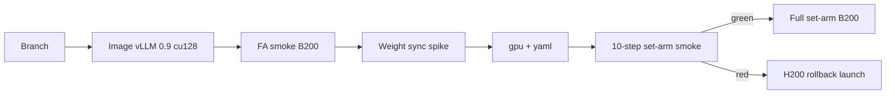

# B200 migration plan (Modal, time-first)

**Created:** 2026-05-27  
**Status:** Plan only — no code changes in this doc.  
**Audience:** Operator running poster / set-arm training on Modal.

**Context docs (read first):**

- [`status_2026-05-27T0510Z.md`](./status_2026-05-27T0510Z.md) — decision tree, 180 GB VRAM budget, phase-time model
- [`b200_05_26_2133`](./b200_05_26_2133) — H200→B200 economics (~×1.38 $/s; ≥27.4% faster to break even on $/step)
- [`B200_migration_analysis_2026-05-26T034425Z_b01999f.md`](./B200_migration_analysis_2026-05-26T034425Z_b01999f.md) — touchpoint inventory (some line refs stale; repo is on **H200** today)

**Product decision (this plan):** **Time-first** poster timeline. Modal B200 at **~$0.001736/s** vs H200 **~$0.001261/s** (~**+38% $/s**) is acceptable if wall-clock per epoch drops enough. Target **~22–30 h saved per set-arm epoch** (380 s/step → **245–280 s/step** realistic). **Do not** bundle `n_kept` subsampling into this migration ([§8](#8-out-of-scope)).

**VRAM budget:** Plan on **180 GB usable** per Modal B200 GPU ([Modal Blackwell post](https://modal.com/blog/nvidia-blackwell); HGX “180 GB varieties”). Do **not** size OOM math against marketing **192 GB**. H200 baseline: **141 GB** usable → **~+39 GB** headroom on B200, not +51.

---

## 1. Objective and success criteria

### 1.1 Objective

Move collocated GRPO training (vLLM rollout + HF train + HF→vLLM weight sync) from **Modal H200** to **Modal B200** with a **single shared image** (`main/infra/modal_image.py`), then run **set-arm** smokes and production if gates pass — **without** changing GRPO math, clustering, prompts, or `n_kept` policy.

### 1.2 “Green” spike (go / no-go for full set-arm on B200)

All must hold on a **10-step** train smoke with production-like config (`train_real.yaml` semantics: `batch_size: 64`, `n_rollouts: 8`, set arm e.g. `minority_answer`, **no** `CS224R_VLLM_SLEEP` unless sleep track is explicitly green separately).

| Gate | Metric / log | Pass |
|------|----------------|------|
| **Stack** | Container boot, `import vllm`, `import flash_attn`, Qwen3 load | No `no kernel image is available`, no CUDA init fork crash |
| **FA2 on HF** | `smoke_flash_attn.py` stages `env`→`collocated` | `ok=true`; `cuda_capability` shows Blackwell (SM **10.0**); collocated peak **&lt; 180 GB** |
| **Weight sync** | `sync_hf_to_vllm` after HF step; wandb `train/weight_sync_s` | Completes without exception; time **≤ 2×** H200 median (~10 s → **≤ 20 s**) |
| **Step time** | wandb `train/t_rollout_s`, `train/t_train_fwd_bwd_s` (or `t_logprob_fwd_s` + `t_backward_s`) over steps 1–9 (skip step 0 cold) | **Median total step** `t_rollout + t_train_fwd_bwd + t_weight_sync + overhead` **≤ 300 s** (stretch **≤ 280 s**); rollout median **≤ 70 s** |
| **OOM** | `train/vram_peak_gb_step`, Modal logs | Peak **&lt; 175 GB** (5 GB margin on 180 GB plan); **zero** `OutOfMemoryError` |
| **Headroom** | `train/vram_headroom_gb_step` | **&gt; 5 GB** at step peak (confirms 180 GB budgeting) |
| **Training health** | `train/loss`, `train/n_kept_sequences`, `train/fraction_filtered` | Loss finite; `n_kept_sequences` &gt; 0 on most steps; no NaN; behavior qualitatively similar to H200 smokes |
| **Leg spawn** | If smoke runs long enough to approach leg budget | Not required for 10-step smoke; note B200 queue in logs for production planning |

**No-go:** Any hard failure above → **stay on H200** for poster arms; capture logs + wandb run id in a timestamped readout (`docs/efficiency/B200_readout_<ts>_<sha>.md`).

### 1.3 “Green” full set-arm (after spike)

- Run **full** `launch_train.sh --mode full --arm minority_answer` (and/or `poly_epo_answer`) on B200.
- First epoch wall-clock **≤ 65 h** (vs ~84 h on H200 at 380 s/step) **or** operator accepts slightly higher $/epoch for calendar win.
- Checkpoint resume + `train_remote.spawn` leg chain works on B200 (watch queue delay per leg).

---

## 2. Ordered phases (time estimates)

Budget: **~1–2 focused days** AI-assisted engineering (image rebuild waits + Modal queue), not 4 blind days.

| Phase | Work | Est. time | Exit artifact |
|-------|------|-----------|----------------|
| **0** | Branch `b200-bringup`; pin baseline H200 wandb run for comparison | 0.5 h | Branch + baseline run URL |
| **1** | **Image:** CUDA 12.8+ stack, vLLM **≥ 0.9.x** cu128 wheel, transformers pin, **Blackwell FA** wheel | 3–8 h | Image builds; `hello_modal` OK |
| **2** | **FA smoke** on B200: `launch_smoke_flash_attn.sh` | 1–2 h | `smoke_flash_attn` `ok=true` |
| **3** | **vLLM + weight sync:** minimal generate + sync spike (new tiny Modal fn or unskip `test_weight_sync` path) | 2–4 h | Sync changes vLLM output / stats logged |
| **4** | **Plumbing:** `gpu="B200"` on train + probe fns; `train_real_b200.yaml` (or env) pricing tags | 0.5 h | Decorators + yaml committed on branch |
| **5** | **Train smoke:** 10-step set-arm on B200 | 2–4 h wall + queue | §1.2 gates |
| **6** | **Production:** full set-arm on B200 if green; else rollback H200 | 0.5 h decision + train time | Poster arms on chosen SKU |

**Parallelism:** Start **Phase 1** image design while **Phase 0** completes. Do **not** change `rollout.gpu_memory_utilization`, `token_budget`, or `gradient_checkpointing` during Phases 1–5 (one variable: SKU + stack).



---

## 3. Exact file change list

Implement on branch `b200-bringup` (or similar). **Do not merge to main** until Phase 5 green.

### 3.1 Required

| Path | Change |
|------|--------|
| `main/infra/modal_image.py` | Bump `_VLLM_VERSION` to **0.9.x** (or latest stable with **cu128** wheel per [vLLM GPU install](https://docs.vllm.ai/en/stable/getting_started/installation/gpu/)). Re-pin `transformers` after compatibility smoke. Replace FA2 wheel URL with **SM100/cu128** build (**FA-3 preferred** on Blackwell; else FA2 wheel compiled for sm100). Re-validate `VLLM_USE_V1=0` (keep until A/B proves V1 safe on Modal). Log versions in smokes. |
| `main/train/weight_sync.py` | After vLLM bump: fix `_vllm_runner_model` / `load_weights` path if 0.9.x moved internals; add defensive logging of resolved object type. |
| `main/train/trainer.py` | `@app.function(..., gpu="B200")` on `train_remote` (currently `gpu="H200"` ~L1310). |
| `main/probes/smoke_flash_attn.py` | `gpu="B200"` on `smoke_flash_attn` (~L135). |
| `main/probes/group_b_step_probe.py` | `_MODAL_FN_KWARGS` / `gpu="B200"` (~L324). |
| `main/probes/checkpoint_rollout_eval.py` | `gpu="B200"` if used during B200 epoch eval. |
| `main/probes/stress_n_kept_probe.py` | `gpu="B200"` only if running VRAM stress on B200 branch. |
| `main/configs/train_real_b200.yaml` | **New:** `extends: configs/train_real.yaml` with `gpu_class: B200`, `modal_price_per_sec: 0.001736`. Keeps rollback = launch with original yaml. |
| `main/configs/checkpoint_eval.yaml`, `checkpoint_eval_2k.yaml` | Optional B200 variants or shared `gpu_class` bump when eval runs on train SKU. |

### 3.2 Recommended (same branch)

| Path | Change |
|------|--------|
| `main/scripts/launch_smoke_flash_attn.sh` | Document `CS224R_APP_NAME` + B200; no logic change if probe gpu set in py. |
| `main/scripts/launch_train.sh` | Optional `--sku b200` → `CFG=main/configs/train_real_b200.yaml` (DX only). |
| `main/probes/group_a_rollout_judge.py` | `gpu="B200"` on phase1/2 (~L282, ~L585) if Group A needed on B200. |
| `main/tests/test_weight_sync.py` | Replace `pytest.skip` with Modal-callable spike or document one-off probe script. |
| `main/docs/efficiency/B200_readout_<timestamp>_<sha>.md` | Post-smoke measurements (do not edit analysis snapshot in place). |
| `main/docs/timeline.md` | One entry when B200 prod locked or deferred. |

### 3.3 Explicitly unchanged in this migration

| Path | Reason |
|------|--------|
| `main/train/objective.py`, `clustering.py`, `reward.py` | Science-neutral |
| `main/configs/train_real.yaml` | Keep H200 as default on `main` until green; use `train_real_b200.yaml` on branch |
| `main/train/trainer.py` `build_hf` | Already `flash_attention_2`; only image wheel changes |
| `main/train/rollout.py` sleep paths | **Separate track** — prod `vllm_sleep=0`; cumem wake bug ([§6](#6-risks-and-mitigations)) |
| `rollout.gpu_memory_utilization`, `token_budget`, `gradient_checkpointing` | Retune only **after** B200 stack green ([status doc](./status_2026-05-27T0510Z.md) §D) |

---

## 4. Smoke test matrix

Run from **repo root** with `main/.venv/bin/modal` and secrets `HUGGINGFACE`, `WANDB_API_KEY`.

### 4.1 Image / import

```bash
export CS224R_APP_NAME="cs224r-b200-hello-$(date +%m-%d-%H%M)"
main/.venv/bin/modal run main/infra/hello_modal.py
```

**Expect:** `/vol` listing prints; no import errors. Optionally add a one-liner Modal fn on the branch that prints `torch.version.cuda`, `vllm.__version__`, `torch.cuda.get_device_name(0)`.

### 4.2 FlashAttention (B200)

```bash
bash main/scripts/launch_smoke_flash_attn.sh
# bash main/scripts/launch_smoke_flash_attn.sh --all   # continue after first failure
```

**Expect logs:**

- `cuda_device` contains `B200` (or Blackwell product string)
- `cuda_capability` = `10.0` (or 10.x)
- `flash_attn` version string, not `IMPORT FAILED`
- `collocated OK` with `vram_gb_after_hf` **&lt; 180**
- `=== SUMMARY ok=True ===`

### 4.3 Weight sync (after vLLM 0.9 spike)

**Option A — implement Modal spike** (preferred): small `main/probes/smoke_weight_sync.py` mirroring `sync_hf_to_vllm` with `Qwen/Qwen2.5-0.5B` or `Qwen3-1.7B-Base`, log `SyncStats`, compare one token logprob before/after noise on HF weights.

**Option B — train smoke only:** rely on `train/weight_sync_s` in 10-step run.

**Expect:** `Synced N tensors` in logs; no `load_weights` / attribute errors; generation or logprob shift after intentional HF perturbation (Option A).

### 4.4 Collocated train smoke (set arm)

```bash
# On b200-bringup branch with train_real_b200.yaml + gpu=B200
bash main/scripts/launch_train.sh --mode smoke --arm minority_answer --config main/configs/train_real_b200.yaml
```

**Expect wandb (project from yaml, group `train_real_minority_answer` or arm profile):**

| Key | H200 reference (~) | B200 pass hint |
|-----|-------------------|----------------|
| `train/t_rollout_s` | ~90 s | **≤ 70 s** median |
| `train/t_train_fwd_bwd_s` | ~280 s | **≤ 220 s** median |
| `train/weight_sync_s` | ~10 s | **≤ 20 s** |
| `train/vram_peak_gb_step` | ~130–140 | **&lt; 175** |
| `train/vram_headroom_gb_step` | ~1–10 | **&gt; 5** |
| `train/n_kept_sequences` | varies (set arm) | &gt; 0 most steps |

**Expect logs:** `Loading HF model (attn_implementation=flash_attention_2...)`, `Synced ... tensors`, no OOM stack traces, step completes in **&lt; 5 min** after warmup.

### 4.5 Optional: Group B microbatch smoke

```bash
bash main/scripts/launch_probe_step_b.sh   # with B200 yaml + gpu in probe
# config: main/configs/probe_step_b_05-25_smoke.yaml
```

**Expect:** `max_microbatch_ok` ≥ H200; `vram_headroom_gb_step` higher at same util **0.45**. Not required for poster go/no-go if §4.4 passes.

---

## 5. Rollback (one launch back to H200)

**Principle:** `main` branch keeps H200 defaults; B200 lives on feature branch + `train_real_b200.yaml`.

1. **Launch:** use production path unchanged:
   ```bash
   bash main/scripts/launch_train.sh --mode full --arm minority_answer
   ```
   (`train_real.yaml` → `gpu_class: H200`, `modal_price_per_sec: 0.001261`; `trainer.py` `gpu="H200"` on `main`.)

2. **If B200 was merged:** revert single commit or set `gpu="H200"` in `trainer.py` + probes; restore `modal_image.py` to vLLM 0.8.5 + Hopper FA2 wheel; delete or ignore `train_real_b200.yaml`.

3. **Wandb:** tag runs `sku=h200` vs `sku=b200` via existing `gpu_class` config field so cost panels stay honest.

4. **No checkpoint migration** needed — same model, same optimizer state format; only re-launch on H200 (resume `auto` if checkpoint dir shared on `/vol`).

---

## 6. Risks and mitigations

| Risk | Symptom | Mitigation |
|------|---------|------------|
| **FA2 wheel SM100** | `no kernel image`, SDPA fallback, slow train | Use **FA-3** or official **cu128 sm100** wheel; run `smoke_flash_attn.py` before train; log `attn_implementation` |
| **vLLM 0.9 `load_weights` API** | `AttributeError` on sync | Spike in `weight_sync.py`; compare `driver_worker.model_runner.model` path; check vLLM changelog |
| **`VLLM_USE_V1=0`** | Fork CUDA re-init on Modal | Keep `0` until smoke with `1`; document in image comments |
| **Modal B200 queue** | Long pending before `train_remote` / each `spawn` leg | Schedule smokes off-peak; pad calendar; do not assume H200 queue times |
| **$/step miss** | ~280 s/step (only ~26% faster) | **Time-first:** may still ship if epoch hours save poster; else stay H200 |
| **VRAM 180 vs 192** | OOM at 178 GB with no margin | Size against **180 GB**; keep util **0.45** until readout |
| **cumem / vLLM sleep wake** | Crash on `wake_up` after sleep | **Out of this plan** — keep `vllm_sleep=0` in prod smokes; sleep is follow-on ([status](./status_2026-05-27T0510Z.md) §C) |
| **`expandable_segments` vs sleep** | Allocator conflict if sleep enabled | `prepare_pytorch_alloc_for_vllm_sleep()` strips expandable segments — only when testing sleep |
| **transformers 5.x** | Qwen tokenizer breaks in vLLM | Keep `transformers>=4.55.2,<5.0.0` pin unless vLLM 0.9 requires bump + smoke |
| **Image build time** | 30–60 min per iteration | Pin versions; use `--no-cache` only when needed |

---

## 7. Knobs — hold constant until B200 green

From `main/configs/train_real.yaml` (production):

- `rollout.gpu_memory_utilization: 0.45`
- `train.token_budget: 105000`
- `train.gradient_checkpointing: true`
- `train.batch_size: 64`, `n_rollouts: 8`
- `weight_sync.every_n_steps: 1`

**Post-green retune** (separate smokes, not this migration): gc off vs higher `token_budget`, util 0.55–0.65 — see [status decision tree](./status_2026-05-27T0510Z.md) §D.

---

## 8. Out of scope

| Item | Notes |
|------|--------|
| **Subsample / cap `n_kept`** | Separate methods decision ([status §5](./status_2026-05-27T0510Z.md)); **not** part of B200 bring-up |
| **Batched logprob forwards** | High ROI on any SKU; refactor `trainer.py` `_completion_logprobs_hf` — do after or parallel on H200 ([status §2](./status_2026-05-27T0510Z.md)) |
| **vLLM sleep in prod** | VRAM expander; wake/cumem bug open — track C in status doc |
| **8-bit AdamW, fused AdamW, ckpt/25** | Efficiency §E/F; not SKU blockers |
| **`B200+` / B300 / CUDA 13** | Avoid until needed |
| **Multi-GPU**, async rollout∥train | No code paths |
| **Changing GRPO / clustering / prompts** | Science lock |
| **Full Group A n800 / prompt probes on B200** | Optional; not gating poster |
| **H100 comparison ladder** | Repo past H100 for prod train |

---

## 9. After green — production checklist

- [ ] Merge `b200-bringup` → `main` with `train_real.yaml` updated **or** documented launch always uses `train_real_b200.yaml`
- [ ] Write `docs/efficiency/B200_readout_<timestamp>_<short_sha>.md` with median phase times, $/epoch, queue notes
- [ ] Update `docs/timeline.md` and `docs/context.md` SKU line
- [ ] Launch `minority_answer` + `poly_epo_answer` full runs on B200
- [ ] Schedule checkpoint eval on same SKU if `checkpoint_eval*.yaml` used

---

## Appendix — H200 baseline (set arm, 2026-05-27)

| Quantity | Value |
|----------|--------|
| Step time | **~380 s** (rollout ~90 + train ~280 + sync ~10) |
| Epoch | **~84 h** (799 steps) |
| $/epoch (H200 rate) | **~$380** |
| Modal `gpu` | `"H200"` in `trainer.py` |
| Image | `vllm==0.8.5`, FA2 cu12 torch2.6 wheel, `VLLM_USE_V1=0` |

**B200 target (realistic):** **~245–280 s/step**, **~54–62 h/epoch**, $/epoch ~flat to +10% at 0.001736/s — acceptable for **time-first** poster.

---

*Plan only. Implementation tracked on branch `b200-bringup`.*
